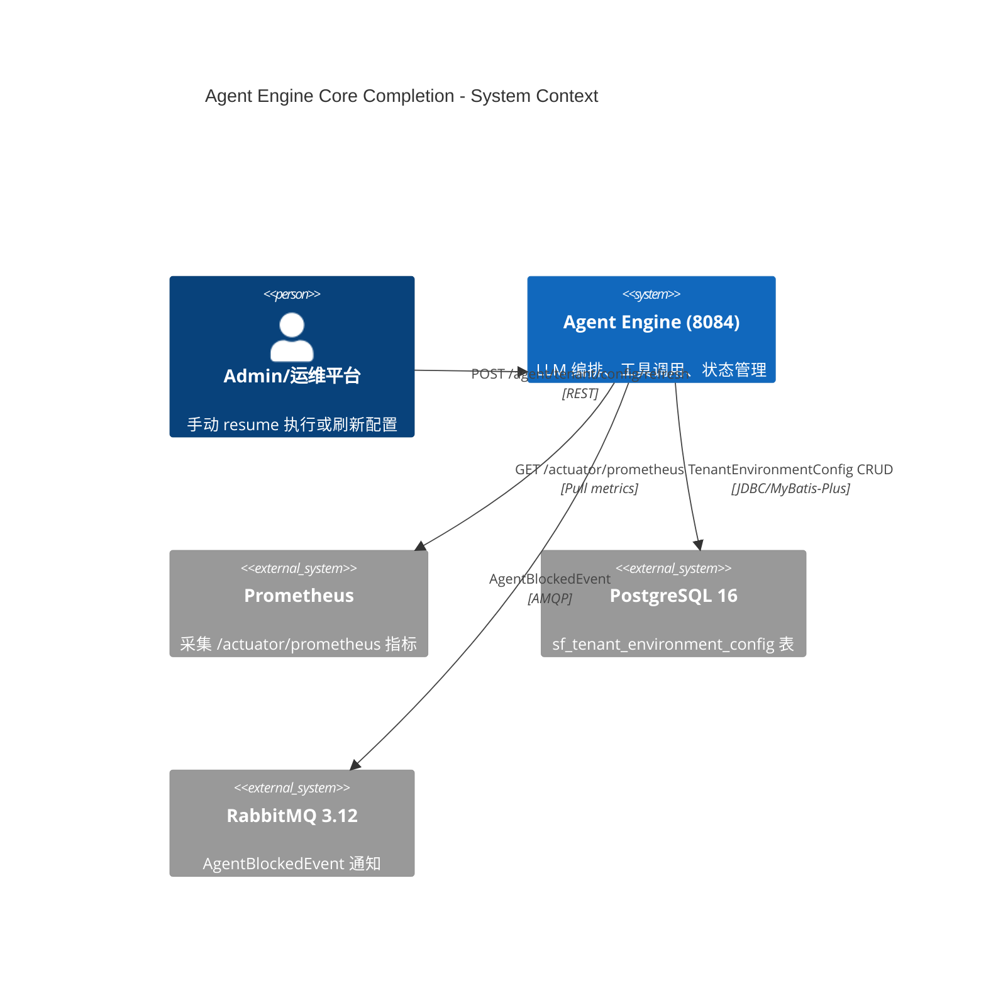
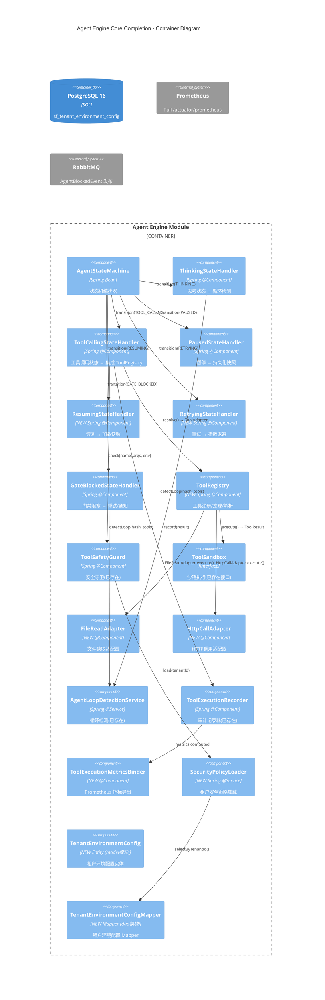

# Design: Agent Engine Core Completion

## 1. C4 Component Diagram





## 2. Module Boundary Decisions

### 2.1 新增文件归属

| 文件 | 模块 | 包路径 | 理由 |
|------|------|--------|------|
| `ToolRegistry.java` | agent-engine | `.tool.registry` | 工具注册/发现属于引擎核心逻辑，依赖 ToolSandbox 接口 |
| `ToolAdapter.java` | agent-engine | `.tool.adapter` | 工具适配器接口，定义统一契约 |
| `ToolCallParser.java` | agent-engine | `.tool.parser` | 统一解析接口 |
| `OpenAiToolCallParser.java` | agent-engine | `.tool.parser` | OpenAI tool_calls JSON 解析 |
| `AnthropicToolCallParser.java` | agent-engine | `.tool.parser` | Anthropic tool_use XML 解析 |
| `FileReadAdapter.java` | agent-engine | `.tool.adapter.file` | 文件读取工具实现 |
| `HttpCallAdapter.java` | agent-engine | `.tool.adapter.http` | HTTP 调用工具实现（含 SSRF 防护） |
| `RetryingStateHandler.java` | agent-engine | `.state` | RETRYING 状态处理器 |
| `ResumingStateHandler.java` | agent-engine | `.state` | RESUMING 状态处理器 |
| `ToolExecutionMetricsBinder.java` | agent-engine | `.metrics` | Prometheus 指标绑定 |
| `SecurityPolicyLoader.java` | agent-engine | `.config` | 租户安全策略加载服务 |
| `TenantEnvironmentConfig.java` | model | `.entity.config` | 租户环境配置实体 |
| `TenantEnvironmentConfigMapper.java` | dao | `.mapper` | 租户环境配置 Mapper |

### 2.2 修改文件归属

| 文件 | 修改类型 | 说明 |
|------|----------|------|
| `ToolCallingStateHandler.java` | 重构 | parseToolCalls() → ToolRegistry.parse()；executeToolStub() → ToolAdapter.execute()；注入 ToolRegistry + AgentLoopDetectionService |
| `PausedStateHandler.java` | 增强 | 添加 Snapshot 持久化 + AgentExecutionLifecycleService 注入 |
| `GateBlockedStateHandler.java` | 增强 | 添加 AdmissionResult 反馈 + 重试倒计时 + MQ 事件发布 |
| `ThinkingStateHandler.java` | 增强 | 注入 AgentLoopDetectionService，transition(TOOL_CALLING) 前调用 detectLoop() |
| `ToolErrorCategory.java` | 扩展 | 添加 securityRelated/retryable 字段 + 3 个新枚举值 |
| `TenantLineInterceptor.java` | 修改 | ignoreTable() 添加 "sf_tenant_environment_config" |
| `pom.xml` (agent-engine) | 无变更 | micrometer-registry-prometheus 和 caffeine 依赖已存在 |

### 2.3 架构边界决策

**决策 1: ToolRegistry 位于 ToolSandbox 上游**
- **理由**: ToolSandbox 负责沙箱执行安全（容器隔离），ToolRegistry 负责工具注册/发现/解析。职责清晰分离。
- **调用链**: ToolCallingStateHandler → ToolRegistry.resolve() → ToolSandbox.execute()
- **安全边界**: ToolRegistry 的每个工具在执行前必须经过 ToolSafetyGuard.check()
- **ADR**: 不创建新 ADR，此决策在 spec.md §2.1 已充分论证

**决策 2: TenantEnvironmentConfig 为全局表**
- **理由**: 跨租户的环境安全策略配置，不应被 TenantLineInterceptor 过滤
- **实现**: 在 TenantLineInterceptor.ignoreTable() 中添加 `"sf_tenant_environment_config"`
- **参考**: 与 `sf_tenant` 表同等处理（已在 ignoreTable 列表中）

**决策 3: 工具调用解析采用统一抽象策略**
- **理由**: 尽管 OpenAI (JSON) 和 Anthropic (XML) 格式不同，统一 ToolCallParser 接口可扩展未来更多模型
- **设计**: `interface ToolCallParser { List<ToolCall> parse(String content, LlmProvider provider); }`
- **实现**: OpenAiToolCallParser + AnthropicToolCallParser，通过 ToolRegistry 按 provider 路由
- **ADR**: 建议创建 `docs/decisions/ADR-004-tool-call-parsing-strategy.md`

**决策 4: AgentLoopDetectionService 为独立 Service，不作为 StateHandler 子组件**
- **理由**: 循环检测需要被多个 StateHandler（Thinking + ToolCalling）共享，独立 Service 更符合单一职责
- **注入点**: ThinkingStateHandler（transition 前检测）+ ToolCallingStateHandler（执行后清理）

## 3. Data Flow

### 3.1 工具调用数据流

```
LLM Response (assistant message with tool_calls)
    │
    ▼
ToolCallingStateHandler.handle()
    │
    ├─(1)─► chatMemoryStore.loadMessages() → List<LlmMessage>
    │
    ├─(2)─► ToolRegistry.parse(content, provider) → List<ToolCall>
    │         │
    │         ├─ OpenAiToolCallParser.parse(json)    (if provider=OpenAi)
    │         └─ AnthropicToolCallParser.parse(xml)   (if provider=Anthropic)
    │
    ├─(3)─► AgentLoopDetectionService.detectLoop(executionId, hash, toolNames)
    │         │
    │         ├─ loopDetected → transition(GATE_BLOCKED)
    │         └─ noLoop → continue
    │
    ├─(4)─► For each ToolCall:
    │         │
    │         ├─ ToolRegistry.resolve(name) → ToolAdapter
    │         ├─ SecurityPolicyLoader.load(tenantId) → TenantEnvironmentConfig
    │         ├─ ToolSafetyGuard.check(name, args, environment)
    │         │    ├─ blocked → ToolExecutionResult.blocked()
    │         │    └─ permitted → continue
    │         ├─ ToolAdapter.execute(call, ctx) → ToolResult
    │         │    ├─ FileReadAdapter: 路径规范化 → 安全检查 → 文件读取
    │         │    └─ HttpCallAdapter: URL验证 → SSRF检查 → HTTP调用
    │         ├─ ToolSandbox.execute(call, config) → ToolResult
    │         └─ ToolExecutionRecorder.record(executionId, result) → DB
    │
    └─(5)─► transition(THINKING) or transition(FAILED) or transition(RETRYING)
```

### 3.2 暂停/恢复数据流

```
┌─────────────────────────────────────────────────────┐
│                     PAUSE FLOW                       │
├─────────────────────────────────────────────────────┤
│ PausedStateHandler.handle():                         │
│   1. AgentExecutionLifecycleService.createSnapshot() │
│      → ExecutionSnapshot (state + context + memory)  │
│   2. SfAgentExecutionSnapshotMapper.insert(snapshot) │
│   3. execution.snapshotId = snapshot.id              │
│   4. saveExecution(execution)  → state=PAUSED        │
│   5. Wait for external Resume signal                 │
└─────────────────────────────────────────────────────┘

┌─────────────────────────────────────────────────────┐
│                    RESUME FLOW                       │
├─────────────────────────────────────────────────────┤
│ POST /agent/execution/{id}/resume                    │
│   → AgentStateMachine.transition(RESUMING)           │
│                                                      │
│ ResumingStateHandler.handle():                       │
│   1. SfAgentExecutionSnapshotMapper.selectById()     │
│   2. Validate snapshot integrity (not null, not corrupt)
│   3. Restore chatMemoryStore from snapshot           │
│   4. Restore execution context (toolCallHistory, etc)│
│   5. transition(THINKING) → agent continues          │
└─────────────────────────────────────────────────────┘
```

### 3.3 指标采集数据流

```
ToolExecutionRecorder.record(result)
    │
    ▼
SfAgentExecutionLogMapper.insert(logEntry) → DB
    │
    ▼ (异步，Prometheus scrape interval ~15-30s)
ToolExecutionMetricsBinder (implements MeterBinder)
    │
    ├─ 注册 Counter: agent_tool_execution_total{status="success|failure|blocked"}
    ├─ 注册 Histogram: agent_tool_execution_latency_seconds
    ├─ 注册 Gauge: agent_tool_keep_rate (计算: success / total)
    ├─ 注册 Gauge: agent_tool_blocked_rate (计算: blocked / total)
    └─ 注册 Counter: agent_tool_error_by_category{errorCategory}
    │
    ▼
MeterRegistry (Micrometer) → /actuator/prometheus
    │
    ▼
Prometheus scrape → Grafana Dashboard
```

**Metrics 计算方式**: 维护内存中 ConcurrentHashMap<toolName, AtomicLong> 计数器，在 record() 调用时原子递增，MeterBinder.bindTo() 注册 Gauge 读取实时值。不轮询 DB（避免 IO 开销影响 P99 延迟）。

### 3.4 租户配置加载流

```
X-Tenant-Id → TenantContextHolder.getTenantId()
    │
    ▼
SecurityPolicyLoader.load(tenantId)
    │
    ├─(cache hit)─► Caffeine Cache → TenantEnvironmentConfig
    │
    └─(cache miss)─► TenantEnvironmentConfigMapper.selectByWrapped(tenantId)
                      │
                      ├─ found → cache.put(tenantId, config) → return
                      └─ not found → return DefaultConfig(environment=dev, securityLevel=LOW)
```

## 4. Deployment Considerations

### 4.1 数据库变更

```sql
-- DDL for sf_tenant_environment_config (由 DBA 执行，不在 scope 内)
CREATE TABLE sf_tenant_environment_config (
    id BIGINT PRIMARY KEY,
    tenant_id VARCHAR(64) NOT NULL,
    environment VARCHAR(16) NOT NULL DEFAULT 'dev',
    allowed_tools TEXT,              -- JSON array of tool names
    security_level VARCHAR(16) DEFAULT 'LOW',
    allow_http_calls BOOLEAN DEFAULT TRUE,
    allow_file_read BOOLEAN DEFAULT TRUE,
    allow_irreversible_ops BOOLEAN DEFAULT FALSE,
    max_concurrent_tool_calls INT DEFAULT 10,
    extra_config TEXT,               -- JSON for extensible config
    created_at TIMESTAMP NOT NULL,
    updated_at TIMESTAMP,
    created_by BIGINT,
    updated_by BIGINT,
    deleted INT DEFAULT 0
);

CREATE INDEX idx_tec_tenant_id ON sf_tenant_environment_config(tenant_id);
```

### 4.2 TenantLineInterceptor 配置变更

```java
// TenantLineInterceptor.java - ignoreTable() 修改
@Override
public boolean ignoreTable(String tableName) {
    // 全局表不进行租户过滤
    return tableName.equals("sf_tenant") 
        || tableName.equals("sf_tenant_environment_config")  // 新增
        || tableName.startsWith("act_");
}
```

### 4.3 应用配置

```yaml
# application.yml 新增配置项
agent:
  loop-detection:
    window-size: 5
    max-same-hash: 3
    max-same-tool-sequence: 3
  retry:
    enabled: true
    max-retries: 3
    base-delay-ms: 100
    max-delay-ms: 30000
  metrics:
    top-n-tools: 10

management:
  endpoints:
    web:
      exposure:
        include: health,info,prometheus  # prometheus 已启用验证
```

### 4.4 无新依赖

pom.xml 无需变更。`micrometer-registry-prometheus`（第20-22行）和 `caffeine`（第16行）已存在于当前 pom.xml 中。

## 5. Error Handling Strategy

```
ToolCallingStateHandler:
  ├─ ToolRegistry.resolve() returns null → ToolExecutionResult.failure(INVALID_ARGUMENT)
  ├─ ToolSafetyGuard.check() returns blocked → ToolExecutionResult.blocked(category, reason)
  ├─ ToolAdapter.execute() throws ToolExecutionException → transition(RETRYING) if retryable
  ├─ ToolAdapter.execute() throws RuntimeException → wrap as failure(INTERNAL_ERROR)
  └─ ToolExecutionRecorder.record() throws ToolExecutionAuditException → transition(FAILED) [security fail-stop]

RetryingStateHandler:
  ├─ non-retryable error → transition(FAILED)
  ├─ max retries exceeded → transition(FAILED)
  └─ circuit breaker open → transition(FAILED)

ResumingStateHandler:
  ├─ snapshot not found → transition(FAILED)
  └─ snapshot corrupt → transition(FAILED)
  
GateBlockedStateHandler:
  ├─ retryable AdmissionResult → set retryCountdown → transition(RETRYING)
  └─ non-retryable → transition(FAILED)
```

## 6. Testing Strategy

| 测试层级 | 覆盖范围 | 工具 |
|---------|---------|------|
| 单元测试 | 每个新/修改类的独立测试 | JUnit 5 + Mockito |
| 集成测试 | ToolRegistry + ToolSandbox 集成 | @SpringBootTest |
| 状态机集成 | 全路径: QUEUED→...→PAUSED→RESUMING→THINKING→...→COMPLETED | TDD |
| 安全测试 | SSRF防护、路径遍历防护的边界用例 | 安全测试用例 |
| 性能测试 | ToolRegistry.resolve() < 1ms 基准测试 | JMH (可选) |

## 7. Related Documents

- Spec: `.claude/changes/agent-engine-core-completion/spec.md`
- Context: `.claude/changes/agent-engine-core-completion/context.md` (待创建)
- Tasks: `.claude/changes/agent-engine-core-completion/tasks.md` (待创建)
- ADR (建议): `docs/decisions/ADR-004-tool-call-parsing-strategy.md`
