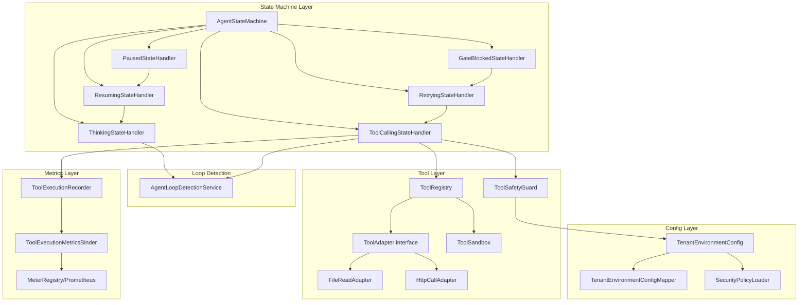
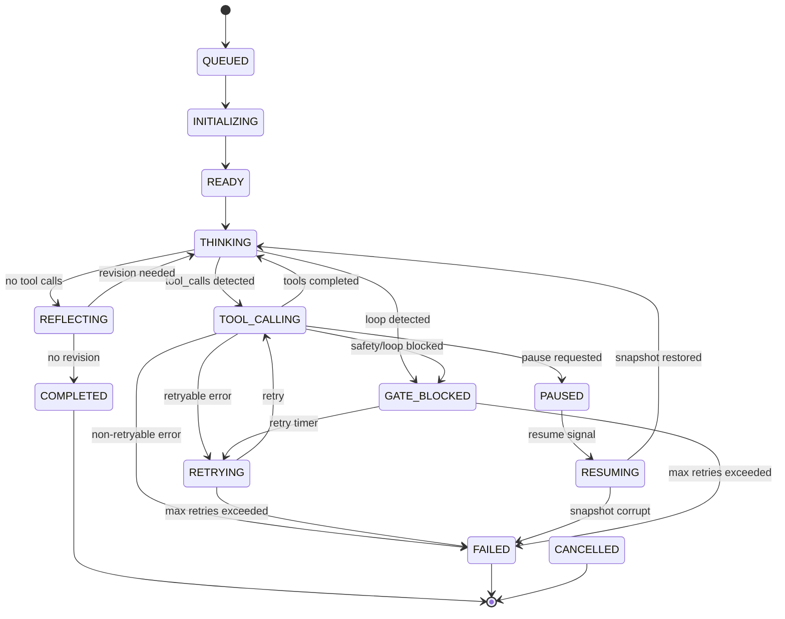

# Spec: Agent Engine Core Completion

> 本 Spec 为执行层草案，评审通过后沉淀到 `docs/specs/agent-engine-core-completion.md`

## 1. 概述

### 1.1 问题陈述

引用 proposal.md：将 `schemaplexai-agent-engine` 模块中 4 个优先级的 Stub/缺失实现补充为生产级代码，涵盖 ToolRegistry 工具注册体系、剩余状态处理器（PAUSED/RETRYING/GATE_BLOCKED，含 RESUME）、Prometheus 指标管道和租户环境安全配置。

当前状态（来自 project-progress.md 2026-05-01 及代码审查）：
- `ToolCallingStateHandler.parseToolCalls()` — 启发式解析（仅匹配 `"calling "` 前缀），无结构化 OpenAI/Anthropic 格式支持
- `ToolCallingStateHandler.executeToolStub()` — 存根，在代码中定义但实现缺失（handle() 方法通过 sandbox.execute() 调用，executeToolWithGuard() 方法内引用 executeToolStub 但未在文件中定义）
- `PausedStateHandler.handle()` — 仅记录日志，不持久化快照，不等待外部 Resume 信号
- `GateBlockedStateHandler.handle()` — 仅设置 state + 标记 completedAt，缺重试/通知机制
- `AgentLoopDetectionService` — 已完整实现（hash loop + tool sequence loop detection），但未集成到 ThinkingStateHandler 和 ToolCallingStateHandler
- `ToolExecutionRecorder` — 持久化审计日志，但无 Prometheus 指标暴露
- `ToolSafetyGuard.check()` — 使用临时 `tenantId` 字符串做环境检查（第3个参数 expectedEnvironment），缺 TenantEnvironmentConfig 实体
- `ToolErrorCategory` — 当前为 6 个枚举值（PERMISSION_DENIED, INVALID_ARGUMENT, TIMEOUT, INTERNAL_ERROR, RATE_LIMITED, RESOURCE_EXHAUSTED），**缺少 `securityRelated` 和 `retryable` 标志**。project-progress.md 声称已添加这两个标志但当前代码中不存在 — 本次变更需添加
- `RETRYING` 状态 — 在 `AgentExecutionState` 枚举中定义但无对应 `RetryingStateHandler`

### 1.2 范围

**In Scope**（与 proposal.md 一致，补充 Review 澄清）:
- [x] ToolRegistry + ToolAdapter 接口体系 + 至少 2 个内置适配器（FileRead、HttpCall）
- [x] 结构化工具调用解析：OpenAI `tool_calls` JSON + Anthropic `tool_use` XML（采用统一抽象策略，见 §2.1）
- [x] RetryingStateHandler 状态处理器（基于 ToolErrorCategory.retryable 自动重试 + 指数退避 + 熔断器）
- [x] PausedStateHandler 完善（快照持久化 + Resume API，状态转换 PAUSED → RESUMING → THINKING）
- [x] RESUMING 状态处理（独立处理器，加载快照并触发状态恢复）
- [x] GateBlockedStateHandler 完善（AdmissionResult 反馈 + 可配置重试倒计时 + 通知）
- [x] AgentLoopDetectionService 集成到 ThinkingStateHandler 和 ToolCallingStateHandler
- [x] ToolErrorCategory 枚举扩展 — 添加 `securityRelated` 和 `retryable` 字段
- [x] Prometheus MeterRegistry 指标导出 + `/actuator/prometheus` 端点（依赖+配置层） + ToolExecutionMetricsBinder（代码层，实现 MeterBinder）
- [x] TenantEnvironmentConfig 实体 + Mapper + 安全策略加载（声明为全局表，跳过 TenantLineInterceptor）
- [x] 所有新增代码的单元测试（TDD）+ 集成测试覆盖状态机全路径
- [x] HttpCall 适配器 SSRF 防护 + FileRead 适配器路径遍历防护（见 §6 安全）
- [x] ToolRegistry 工具白名单作为注册安全补充

**Out of Scope**:
- 前端 UI（`schemaplexai-ui`）变更
- 其他服务模块（system, workflow, quality 等）的修改
- 数据库 Migration 脚本（仅定义实体，由 DBA 执行）
- Grafana Dashboard JSON 导入（仅提供 JSON 骨架文件）
- Milvus/ClickHouse/Redis 数据面变更
- OBSERVATION 状态处理器（当前代码中也缺失）
- 工具执行结果的输出净化（当前 ToolSafetyGuard 已有输入净化）
- 不修改现有 ToolSandbox 接口
- 不修改现有 LLM 调用链路（LangChain4j ToolInvocation）

### 1.3 Review Action Items 落实情况

| # | 来源 | 优先级 | 描述 | 在本 Spec 的处理 |
|---|------|--------|------|-----------------|
| 1 | Product + AI Engineer | HIGH | RESUME state handler explicit split | §5 状态机：新增 RESUMING 状态，独立 ResumingStateHandler，定义 PAUSED→RESUMING→THINKING 路径 |
| 2 | Security | HIGH | HttpCall SSRF protection + FileRead path traversal prevention | §6.2：URL黑白名单、内网IP过滤（10.x/192.168.x/172.16-31.x）、重定向深度限制；FileRead 工作空间根目录限制 |
| 3 | Architect + Security | HIGH | TenantEnvironmentConfig global table declaration | §4.1：标记为全局表（exclude from TenantLineInterceptor），§6.1：访问控制策略 |
| 4 | AI Engineer | MEDIUM | ToolRegistry parsing strategy selection | §2.1：采用统一抽象 ToolCallParser 接口 + 两个实现（OpenAiToolCallParser, AnthropicToolCallParser） |
| 5 | AI Engineer | MEDIUM | AgentLoopDetectionService loop detection algorithm | §5.4：选定 (action, state) 元组去重（已实现），理由：确定性、无额外 RPC 延迟、满足当前需求 |
| 6 | AI Engineer | MEDIUM | LLM retry call strategy | §5.2：RetryingStateHandler 仅重放失败的工具调用而非完整对话历史，降低 Token 成本 |
| 7 | AI Engineer | LOW | Prometheus scope clarification | §3.1：区分配置层（micrometer-registry-prometheus 依赖 + management.endpoints）和代码层（ToolExecutionMetricsBinder） |

## 2. 架构视图

### 2.1 组件关系



**关键设计决策**：
- **ToolRegistry vs ToolSandbox 职责边界**：ToolSandbox 负责沙箱执行安全（容器隔离），ToolRegistry 负责工具注册/发现/解析。调用链：ToolCallingStateHandler → ToolRegistry.resolve() → ToolSandbox.execute()。ToolRegistry 的每个工具在执行前必须经过 ToolSafetyGuard.check()。
- **ToolAdapter 接口**：定义 `ToolResult execute(ToolCall call, ExecutionContext ctx)`，作为具体工具实现的统一契约。FileReadAdapter 和 HttpCallAdapter 为首批实现。
- **AgentLoopDetectionService 作为独立 Service**：注入到 ThinkingStateHandler 和 ToolCallingStateHandler 中，而非 StateHandler 的子组件。已在 `schemaplexai-agent-engine/src/main/java/com/schemaplexai/agent/engine/loop/AgentLoopDetectionService.java` 实现，只需集成调用。

### 2.2 数据流

```
1. LLM Response → AgentRuntimeOrchestrator
2. Orchestrator → AgentStateMachine.transition(TOOL_CALLING)
3. ToolCallingStateHandler.handle():
   a. chatMemoryStore.loadMessages() → 获取最后一条 assistant 消息
   b. ToolRegistry.parse(message.content) → List<ToolCall>（结构化解析）
   c. AgentLoopDetectionService.detectLoop(executionId, hash, toolNames) → LoopDetectionResult
   d. 若 loop detected → transition(GATE_BLOCKED)
   e. 对每个 ToolCall:
      - ToolRegistry.resolve(toolCall.name) → ToolAdapter
      - ToolSafetyGuard.check(name, args, env) → SafetyCheckResult
      - ToolSandbox.execute(toolCall, config) → ToolResult
      - ToolExecutionRecorder.record(executionId, result) → 持久化审计日志
   f. transition(THINKING)
4. 异步：ToolExecutionMetricsBinder 从 Recorder 数据计算指标 → Prometheus 导出
```

**TenantEnvironmentConfig 加载流**：
```
1. X-Tenant-Id header → TenantContextHolder.getTenantId()
2. SecurityPolicyLoader.load(tenantId) → Caffeine Cache 查询
3. Cache miss → TenantEnvironmentConfigMapper.selectByTenantId(tenantId) → DB 查询
4. 返回 TenantEnvironmentConfig（包含 environment: dev/staging/prod, allowedTools, 等）
5. ToolSafetyGuard.check() 使用配置的环境进行 env mismatch 检测
```

## 3. 接口规格

### 3.1 API 列表

#### `POST /agent/execution/{executionId}/resume`

恢复暂停的执行。外部系统（前端/运维平台）发送 Resume 信号。

**Request**:
```json
{
  "resumedBy": "admin-user-id",
  "reason": "Manual resume after issue resolution"
}
```

**Response (200)**:
```json
{
  "code": 200,
  "data": {
    "executionId": 12345,
    "previousState": "PAUSED",
    "newState": "RESUMING"
  },
  "message": "success"
}
```

**Response (409 — 状态冲突)**:
```json
{
  "code": 409,
  "data": null,
  "message": "Execution 12345 is not in PAUSED state, current state: COMPLETED"
}
```

**Error Codes**:

| Code | Message | 场景 |
|------|---------|------|
| 409 | Execution not in PAUSED state | 试图 resume 非暂停状态的执行 |
| 404 | Execution not found | executionId 不存在 |
| 403 | Tenant access denied | 跨租户 resume 请求 |

#### `GET /actuator/prometheus`

Prometheus 指标端点（配置层：添加 `micrometer-registry-prometheus` 依赖 + `management.endpoints.web.exposure.include=prometheus` 配置）。

**自定义指标**（代码层 — ToolExecutionMetricsBinder）：

| 指标名 | 类型 | 标签 | 说明 |
|--------|------|------|------|
| `agent_tool_execution_total` | Counter | toolName, status(success/failure/blocked) | 工具执行总数 |
| `agent_tool_execution_latency_seconds` | Histogram | toolName | 工具执行延迟分布 (P50/P95/P99) |
| `agent_tool_keep_rate` | Gauge | — | 工具执行成功率 (success / total) |
| `agent_tool_blocked_rate` | Gauge | — | 工具执行阻塞率 (blocked / total) |
| `agent_tool_error_by_category` | Counter | toolName, errorCategory | 按错误类别分组的失败计数 |
| `agent_tool_retry_total` | Counter | toolName | 重试总次数 |

**Top-N 标签策略**：仅保留 Top-10 高频 toolName 标签，其余归入 "other" 以防止时序基数爆炸。

#### `POST /agent/tenant/config/refresh`（可选）

手动刷新 TenantEnvironmentConfig 缓存（绕过 5min TTL）。

**Request**:
```json
{
  "tenantId": "tenant-001"
}
```

**Response (200)**:
```json
{
  "code": 200,
  "data": {
    "tenantId": "tenant-001",
    "environment": "prod",
    "cacheRefreshed": true
  },
  "message": "success"
}
```

## 4. 数据模型

### 4.1 数据库变更

| 表名 | 操作 | 说明 |
|------|------|------|
| `sf_tenant_environment_config` | CREATE | 租户环境安全配置表（**全局表** — 不通过 TenantLineInterceptor 过滤） |

**全局表声明**：`sf_tenant_environment_config` 为跨租户全局配置表，类似 `sf_tenant`，需在 MyBatis-Plus TenantLineInterceptor 配置中排除。tenantId 字段作为数据标识而非过滤条件。

### 4.2 Entity / DTO / VO

#### TenantEnvironmentConfig（model 模块）

```java
package com.schemaplexai.model.entity.config;

import com.schemaplexai.model.entity.BaseEntity;
import com.baomidou.mybatisplus.annotation.TableName;
import lombok.Data;
import lombok.EqualsAndHashCode;

@Data
@EqualsAndHashCode(callSuper = true)
@TableName("sf_tenant_environment_config")
public class TenantEnvironmentConfig extends BaseEntity {

    /** 租户ID（数据标识，非过滤条件 — 此表为全局表） */
    private String tenantId;

    /** 环境标识：dev / staging / prod */
    private String environment;

    /** 允许的工具名称列表（JSON 数组） */
    private String allowedTools;

    /** 安全级别：LOW / MEDIUM / HIGH / CRITICAL */
    private String securityLevel;

    /** 是否允许 HTTP 调用工具 */
    private Boolean allowHttpCalls;

    /** 是否允许文件读取工具 */
    private Boolean allowFileRead;

    /** 是否允许执行不可逆操作 */
    private Boolean allowIrreversibleOps;

    /** 最大工具调用并发数 */
    private Integer maxConcurrentToolCalls;

    /** 额外配置（JSON） */
    private String extraConfig;
}
```

#### TenantEnvironmentConfigMapper（dao 模块）

```java
package com.schemaplexai.dao.mapper;

import com.schemaplexai.model.entity.config.TenantEnvironmentConfig;
import com.schemaplexai.dao.BaseMapperX;

public interface TenantEnvironmentConfigMapper extends BaseMapperX<TenantEnvironmentConfig> {
    // BaseMapperX 提供标准 CRUD
}
```

#### SecurityPolicyLoader（agent-engine 模块）

```java
@Service
public class SecurityPolicyLoader {
    // 使用 Caffeine Cache (5min TTL) 缓存 TenantEnvironmentConfig
    // 提供 load(tenantId) → TenantEnvironmentConfig
    // 提供 refresh(tenantId) 手动刷新
}
```

## 5. 状态机

### 5.1 完整状态图



### 5.2 新增/修改状态处理器

#### RetryingStateHandler（新增）

**职责**：处理 RETRYING 状态，基于 `ToolErrorCategory.retryable()` 判定是否可重试。

```
输入：SfAgentExecution（含 lastErrorCategory）
逻辑：
  1. 检查错误类别是否为 retryable
  2. 若非 retryable → transition(FAILED)
  3. 计算退避延迟：min(100ms * 2^retryCount, 30s)
  4. 若 retryCount >= maxRetries(3) → transition(FAILED)
  5. 若熔断器打开(circuitBreakerOpen) → transition(FAILED)
  6. 等待退避延迟 → 仅重放失败的工具调用（非完整对话历史）
  7. transition(TOOL_CALLING) with retryContext
```

**重试策略（回应 Review Action Item #6）**：
- 仅重放失败的 ToolCall，不重发完整对话历史
- 降低 Token 成本：重试一次约消耗 200-500 tokens（仅 tool call message）vs 完整历史 5000-20000 tokens
- 状态机在 transition(TOOL_CALLING) 时携带 retryContext，ToolCallingStateHandler 检测此 context 后仅执行特定 ToolCall

#### ResumingStateHandler（新增 — 回应 Review Action Item #1）

**职责**：处理 RESUMING 状态，加载持久化快照并触发状态恢复。

```
输入：SfAgentExecution（含 snapshotId）
逻辑：
  1. 从 SfAgentExecutionSnapshotMapper 加载快照
  2. 若快照不存在或损坏 → transition(FAILED)
  3. 从快照恢复 chatMemoryStore 状态
  4. 恢复 execution context（toolCallHistory, loopDetectionRecords 等）
  5. transition(THINKING) — 让 Agent 从暂停点继续
```

**状态转换路径**：`PAUSED → (Resume API) → RESUMING → THINKING`

#### PausedStateHandler（完善）

**当前状态（PausedStateHandler.java:16-21）**：仅记录日志，不持久化快照。

**修改后**：
```
逻辑：
  1. 创建 ExecutionSnapshot（调用 AgentExecutionLifecycleService.createSnapshot()）
  2. 持久化快照到 SfAgentExecutionSnapshotMapper
  3. 更新 execution.snapshotId
  4. 保存 execution state = PAUSED
  5. 等待外部 Resume API 信号（POST /agent/execution/{id}/resume）
```

#### GateBlockedStateHandler（完善）

**当前状态（GateBlockedStateHandler.java:19-24）**：仅设置 state + completedAt，缺重试/通知机制。

**修改后**：
```
逻辑：
  1. 记录 AdmissionResult 到 execution.extendedData
  2. 确定 blockedReason（从 thinkingState 或 toolCallingState 传递）
  3. 若可重试（admissionResult.retryable）：
     - 设置 retryCountdown = configurableDelay（默认 60s）
     - 发布 AgentBlockedEvent 到 MQ（AgentExecutionEventPublisher）
     - transition(RETRYING)
  4. 若不可重试：
     - transition(FAILED)
```

### 5.3 AgentLoopDetectionService 集成

**当前状态**：AgentLoopDetectionService 已完整实现于 `loop/` 包，LoopDetectionResult 支持 hash loop + tool sequence loop。

**集成点**：
1. **ThinkingStateHandler.handle()** — 在 transition 到 TOOL_CALLING 之前：
   ```
   String responseHash = hashLlmResponse(lastMessage.content);
   List<String> toolNames = extractToolNames(lastMessage.content);
   LoopDetectionResult result = loopDetection.detectLoop(executionId, responseHash, toolNames);
   if (result.loopDetected()) → transition(GATE_BLOCKED)
   ```

2. **ToolCallingStateHandler.handle()** — 工具调用完成后：
   ```
   loopDetection.clearRecords(executionId); // 在 COMPLETED/FAILED/CANCELLED 时清理
   ```

3. **AgentStateMachine.removeExecution()** — 在终端状态清理时：
   ```
   loopDetection.clearRecords(executionId); // 防止内存泄漏
   ```

**循环检测算法选择（回应 Review Action Item #5）**：
- 选定 `(action, state)` 元组去重（已实现：hash loop + tool sequence loop）
- 优势：确定性（无假阳性/假阴性权衡）、无额外 RPC 延迟（不需要 embedding 计算）、适合当前阶段
- 未来扩展：如需语义级别循环检测，可在 RoundRecord 中增加 embedding 字段，通过 context 服务计算相似度

### 5.4 ToolErrorCategory 扩展

**当前状态（ToolErrorCategory.java）**：6 个枚举值，无 `securityRelated` 和 `retryable` 字段。

**修改**：
```java
public enum ToolErrorCategory {
    PERMISSION_DENIED(true, false),      // security related, not retryable
    INVALID_ARGUMENT(false, false),       // not security related, not retryable
    TIMEOUT(false, true),                // not security related, retryable
    INTERNAL_ERROR(false, true),         // not security related, retryable
    RATE_LIMITED(false, true),           // not security related, retryable
    RESOURCE_EXHAUSTED(false, true),     // not security related, retryable
    // 新增：
    IRREVERSIBLE_OPERATION(true, false), // security related, not retryable
    ENVIRONMENT_MISMATCH(true, false),   // security related, not retryable
    UNEXPECTED_ENVIRONMENT(true, false); // security related, not retryable

    private final boolean securityRelated;
    private final boolean retryable;

    // constructor + getters
}
```

**注意**：ToolSafetyGuard.SafetyCheckResult 和 ToolExecutionResult 中已使用 `IRREVERSIBLE_OPERATION`、`ENVIRONMENT_MISMATCH`、`UNEXPECTED_ENVIRONMENT` 作为 `ToolErrorCategory` 引用，但当前枚举中不存在这些值。本次变更需添加以上 3 个新类别。

## 6. 异常场景

| 场景 | 输入/条件 | 预期行为 | 错误码 |
|------|----------|---------|--------|
| ToolRegistry 未找到工具 | toolName 不在任何 Adapter 中 | 返回 ToolExecutionResult.failure(INVALID_ARGUMENT)，不调用 sandbox | — |
| HttpCall 内网地址 | URL 解析为 10.x/192.168.x/172.16-31.x/127.x | ToolSafetyGuard 拒绝，返回 blocked(ENVIRONMENT_MISMATCH) | — |
| HttpCall 重定向到内网 | 公网 URL → 302 → 内网地址 | 重定向追踪检测，超过深度限制(3)返回 blocked | — |
| FileRead 路径遍历 | path = "../../../etc/passwd" | ToolSafetyGuard 拒绝，规范化路径后不在工作空间根目录内 | — |
| RetryingStateHandler 重试风暴 | 多个 execution 同时大量重试 | 指数退避 + 每个 execution 独立熔断器 | — |
| ToolExecutionRecorder 写入失败 | DB 连接断开 | 若 errorCategory.securityRelated → throw ToolExecutionAuditException（fail-stop）；否则 log.error 继续 | — |
| SecurityPolicyLoader 缓存失效 | Caffeine Cache TTL 到期 | 自动从 DB 重新加载；DB 不可用时使用上次已知配置 + log.warn | — |
| TenantEnvironmentConfig 缺失 | 租户无对应配置 | 使用默认策略（environment=dev, securityLevel=LOW） | — |
| Resume API 调用时执行已完成 | executionId 对应 execution.state = COMPLETED | 返回 409 Conflict | 409 |
| LoopDetection 内存泄漏 | ConcurrentHashMap 持续增长 | AgentStateMachine.removeExecution() 中调用 clearRecords() + 可选 TTL | — |
| ToolAdapter execute() 抛出未分类异常 | 非 ToolExecutionException | ToolCallingStateHandler 包装为 failure(INTERNAL_ERROR) | — |
| Prometheus 端点未暴露 | management.endpoints.web.exposure.include 未配置 prometheus | 启动日志 warn，应用正常运行但不暴露 metrics | — |

## 7. 非功能需求

### 7.1 性能

- **QPS 目标**: ToolRegistry.resolve() < 1ms（纯内存操作，ConcurrentHashMap 查找）
- **延迟目标 (P99)**: 单次工具执行（含安全检查和沙箱执行）< 5s（不含工具自身网络延迟）
- **并发目标**: ToolCallingStateHandler 支持 100 并发 execution 同时执行工具调用
- **缓存策略**: SecurityPolicyLoader 使用 Caffeine Cache (maximumSize=1000, expireAfterWrite=5min)

### 7.2 安全

回应 Review Action Items #2 和 #3：

- [x] **HttpCall SSRF 防护**：
  - URL 黑名单：内网 IP 段（10.0.0.0/8, 172.16.0.0/12, 192.168.0.0/16, 127.0.0.0/8, 169.254.0.0/16）
  - URL 白名单：可配置的允许域名/IP 列表（来自 TenantEnvironmentConfig.extraConfig）
  - 重定向追踪深度限制：最大 3 次重定向，每次重定向重新检查目标 IP
  - 禁止 file://、gopher:// 等危险协议
- [x] **FileRead 路径遍历防护**：
  - 规范化路径（resolve + normalize）
  - 验证规范化路径在工作空间根目录内（startsWith check）
  - 禁止符号链接追踪（NOFOLLOW_LINKS）
  - 禁止读取隐藏文件（以 `.` 开头的文件名）
- [x] **输入验证策略**：复用现有 ToolSafetyGuard.normalizeInput()（Unicode homoglyph + HTML entity + JSON escape 解码）
- [x] **权限控制点**：Resume API 需要租户上下文验证（TenantContextHolder + X-Tenant-Id header）
- [x] **敏感数据处理**：TenantEnvironmentConfig.extraConfig 存储为 JSON，不包含明文密钥（密钥通过环境变量注入）
- [x] **ToolRegistry 工具白名单**：未注册的工具不可执行（ToolRegistry.resolve() 返回 null → INVALID_ARGUMENT）
- [x] **TenantEnvironmentConfig 全局表**：不经过 TenantLineInterceptor，访问控制基于用户角色（仅 ADMIN 可修改 prod 环境配置）

### 7.3 兼容性

- [x] **是否破坏现有 API？** 否 — 所有变更为新增或完善，不修改现有 API 签名。`parseToolCalls()` 替换为结构化解析后向后兼容（测试用例调整）
- [x] **是否需要数据库迁移？** 是 — `sf_tenant_environment_config` 新表创建（DDL 由 DBA 执行，本变更仅定义实体）
- [x] **是否需要前端配合？** 否 — 前端 UI 不在 Scope 内。Resume API 通过后端调用或运维平台触发
- [x] **是否修改现有 ToolSandbox 接口？** 否 — ToolRegistry 在 ToolSandbox 上游，不修改其接口

## 8. 风险与回退

| 风险 | 影响 | 缓解 | 回退方案 |
|------|------|------|---------|
| ToolRegistry 接口与 ToolSandbox 职责重叠 | 中 | 明确定义调用链（§2.1），ToolRegistry 仅负责注册/解析，执行委托给 ToolSandbox | 若发现重叠，将 ToolRegistry 降级为 ToolSandbox 的装饰器 |
| RetryingStateHandler 重试风暴 | 高 | 指数退避（100ms*2^n, max 30s）+ 熔断器（3次连续失败打开）+ 最大重试次数硬限制（3次） | 关闭重试功能：设置 `agent.retry.enabled=false` |
| AgentLoopDetectionService 内存泄漏 | 中 | clearRecords() 在 COMPLETED/FAILED/CANCELLED 调用 + TTL 驱逐（30min 过期自动清理） | 重启 agent-engine 服务（ConcurrentHashMap 内存回收） |
| Prometheus 指标时序基数爆炸 | 低 | 仅保留 Top-10 toolName 标签，其余归入 "other" | 动态调整 Top-N 参数：`agent.metrics.top-n-tools=10` |
| TenantEnvironmentConfig 缓存失效 | 中 | Caffeine Cache 5min TTL + 手动刷新 API + DB 不可用时使用上次已知配置 | 手动调用 POST /agent/tenant/config/refresh |
| ToolErrorCategory 枚举扩展不兼容 | 低 | 新增值为追加，不修改现有枚举常量顺序（ordinal 不变） | 若出现兼容性问题，回退为独立常量类而非枚举 |

## 9. 相关文档

- Proposal: `.claude/changes/agent-engine-core-completion/proposal.md`
- Review Report: `.claude/changes/agent-engine-core-completion/review-report.md`
- Design: `.claude/changes/agent-engine-core-completion/design.md`（待创建）
- Plan: `.claude/changes/agent-engine-core-completion/tasks.md`（待创建）
- 项目记忆: `C:\Users\amsterdam\.claude\projects\D--code-space-frige\memory\project-progress.md`
- CLAUDE.md: `D:\code_space\frige\CLAUDE.md`
- 已归档: `.claude/outputs/archive-cursor-evaluation-first-2026-05-01.md`
