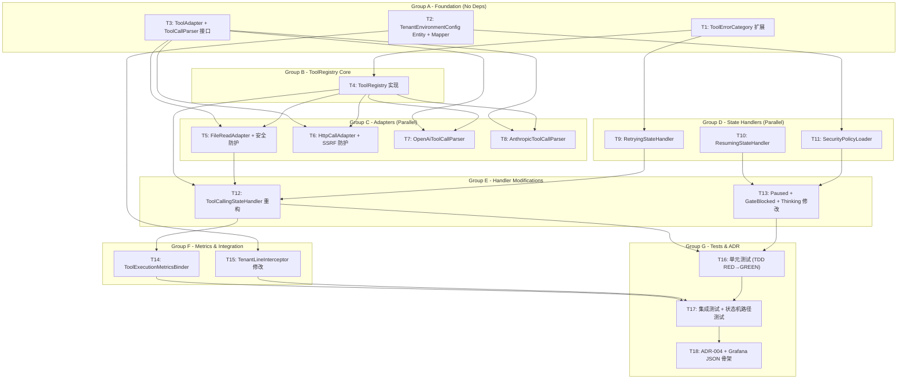

# Plan: Agent Engine Core Completion

## 任务图（Graphify）



## 可并行执行组

> 同一组内的任务无依赖，可并行执行（多 agent / worktree）

| 组 | 任务 | 依赖前置 | 预估总工时 |
|----|------|---------|-----------|
| Group A | T1, T2, T3 | 无 | 5h |
| Group B | T4 | T1, T3 | 3h |
| Group C | T5, T6, T7, T8 | T3, T4 | 8h |
| Group D | T9, T10, T11 | T1, T2 | 7h |
| Group E | T12, T13 | T4, T5, T9-T11 | 6h |
| Group F | T14, T15 | T12, T2 | 3h |
| Group G | T16, T17, T18 | T12-T15 | 8h |

## 任务清单

### Task 1: ToolErrorCategory 枚举扩展
- **ID**: T1
- **文件**: `schemaplexai-agent-engine/src/main/java/com/schemaplexai/agent/engine/tool/ToolErrorCategory.java`
- **类型**: 修改
- **描述**: 为现有 6 个枚举值添加 `securityRelated` 和 `retryable` 字段，新增 3 个枚举值（IRREVERSIBLE_OPERATION, ENVIRONMENT_MISMATCH, UNEXPECTED_ENVIRONMENT）。保持现有 ordinal 不变，仅追加。
- **验收标准**:
  - [ ] 6 个现有枚举值各有 securityRelated/retryable 标志（PERMISSION_DENIED=true,false; INVALID_ARGUMENT=false,false; TIMEOUT=false,true; INTERNAL_ERROR=false,true; RATE_LIMITED=false,true; RESOURCE_EXHAUSTED=false,true）
  - [ ] 3 个新枚举值追加：IRREVERSIBLE_OPERATION(true,false), ENVIRONMENT_MISMATCH(true,false), UNEXPECTED_ENVIRONMENT(true,false)
  - [ ] 提供 getter 方法 isSecurityRelated() 和 isRetryable()
  - [ ] `mvn test -pl schemaplexai-agent-engine` 通过（无破坏性变更）
- **预估工时**: 1h
- **依赖**: 无
- **状态**: ⬜

### Task 2: TenantEnvironmentConfig Entity + Mapper
- **ID**: T2
- **文件**: 
  - `schemaplexai-model/src/main/java/com/schemaplexai/model/entity/config/TenantEnvironmentConfig.java`
  - `schemaplexai-dao/src/main/java/com/schemaplexai/dao/mapper/TenantEnvironmentConfigMapper.java`
- **类型**: 新增
- **描述**: 创建租户环境安全配置实体（继承 BaseEntity）+ MyBatis-Plus Mapper 接口（继承 BaseMapperX）。Entity 含 tenantId/environment/allowedTools/securityLevel/allowHttpCalls/allowFileRead/allowIrreversibleOps/maxConcurrentToolCalls/extraConfig 字段。此表声明为全局表（在 T15 中配置 TenantLineInterceptor 排除）。
- **验收标准**:
  - [ ] TenantEnvironmentConfig extends BaseEntity，@TableName("sf_tenant_environment_config")
  - [ ] 字段类型正确：String tenantId, String environment, String allowedTools(JSON), String securityLevel, Boolean allowHttpCalls, Boolean allowFileRead, Boolean allowIrreversibleOps, Integer maxConcurrentToolCalls, String extraConfig(JSON)
  - [ ] TenantEnvironmentConfigMapper extends BaseMapperX<TenantEnvironmentConfig>
  - [ ] 编译通过：`mvn compile -pl schemaplexai-model,schemaplexai-dao`
- **预估工时**: 1.5h
- **依赖**: 无
- **状态**: ⬜

### Task 3: ToolAdapter + ToolCallParser 接口定义
- **ID**: T3
- **文件**:
  - `schemaplexai-agent-engine/src/main/java/com/schemaplexai/agent/engine/tool/adapter/ToolAdapter.java`
  - `schemaplexai-agent-engine/src/main/java/com/schemaplexai/agent/engine/tool/parser/ToolCallParser.java`
- **类型**: 新增
- **描述**: 定义工具适配器统一接口 ToolAdapter（execute 方法 + 返回 ToolResult）和工具调用解析器统一接口 ToolCallParser（parse 方法 + 返回 List<ToolCall>）。ToolAdapter 作为所有具体工具实现的契约，ToolCallParser 支持按 LlmProvider 路由。
- **验收标准**:
  - [ ] ToolAdapter 接口定义：`ToolResult execute(ToolCall call, ExecutionContext ctx)` + `String getToolName()`
  - [ ] ToolCallParser 接口定义：`List<ToolCall> parse(String content, LlmProvider provider)`
  - [ ] ExecutionContext 包含 tenantId, executionId, workspaceRoot 等上下文信息
  - [ ] 编译通过：`mvn compile -pl schemaplexai-agent-engine`
- **预估工时**: 1.5h
- **依赖**: 无
- **状态**: ⬜

### Task 4: ToolRegistry 核心实现
- **ID**: T4
- **文件**: `schemaplexai-agent-engine/src/main/java/com/schemaplexai/agent/engine/tool/registry/ToolRegistry.java`
- **类型**: 新增
- **描述**: 实现工具注册/发现/解析中心。使用 ConcurrentHashMap 存储 toolName→ToolAdapter 映射。自动发现所有 ToolAdapter Spring Bean 并注册。提供 resolve(toolName)→ToolAdapter 和 parse(content, provider)→List<ToolCall> 方法。按 LlmProvider 路由到对应的 ToolCallParser。
- **验收标准**:
  - [ ] @Component 注解，构造函数注入 List<ToolAdapter> + List<ToolCallParser>
  - [ ] register(ToolAdapter) 方法注册适配器
  - [ ] resolve(toolName) 返回 ToolAdapter 或 null（工具未注册）
  - [ ] resolve() < 1ms（ConcurrentHashMap 纯内存查找）
  - [ ] parse(content, provider) 按 provider 路由到对应 Parser（OpenAi→OpenAiToolCallParser, Anthropic→AnthropicToolCallParser）
  - [ ] 注册白名单检查：resolve 返回 null 时工具不可执行
  - [ ] 单元测试：verify(mockAdapter).execute() 被调用
- **预估工时**: 3h
- **依赖**: T1, T3
- **状态**: ⬜

### Task 5: FileReadAdapter + 路径遍历防护
- **ID**: T5
- **文件**: `schemaplexai-agent-engine/src/main/java/com/schemaplexai/agent/engine/tool/adapter/file/FileReadAdapter.java`
- **类型**: 新增
- **描述**: 实现文件读取工具适配器。执行路径规范化（resolve + normalize），验证规范化路径在工作空间根目录内（startsWith check），禁止符号链接追踪（NOFOLLOW_LINKS），禁止读取隐藏文件（以 `.` 开头），读取文件内容并返回 ToolResult。
- **验收标准**:
  - [ ] implements ToolAdapter, getToolName() 返回 "file_read"
  - [ ] execute() 实现：path.resolve(workspaceRoot, inputPath) → normalize() → startsWith(workspaceRoot) 验证
  - [ ] 禁止符号链接：Files.readAttributes(path, BasicFileAttributes.class, LinkOption.NOFOLLOW_LINKS)
  - [ ] 禁止隐藏文件：!path.getFileName().toString().startsWith(".")
  - [ ] 路径遍历测试用例：`../../../etc/passwd` → blocked
  - [ ] 正常文件读取测试用例：workspace/sample.txt → success with content
  - [ ] 不存在的文件 → failure(INVALID_ARGUMENT)
- **预估工时**: 2h
- **依赖**: T3, T4
- **状态**: ⬜

### Task 6: HttpCallAdapter + SSRF 防护
- **ID**: T6
- **文件**: `schemaplexai-agent-engine/src/main/java/com/schemaplexai/agent/engine/tool/adapter/http/HttpCallAdapter.java`
- **类型**: 新增
- **描述**: 实现 HTTP 调用工具适配器。含 SSRF 防护：URL 黑名单（内网 IP 段 10.0.0.0/8, 172.16.0.0/12, 192.168.0.0/16, 127.0.0.0/8, 169.254.0.0/16），URL 白名单（可配置），重定向追踪深度限制（最大 3 次），禁止 file:///gopher:// 等危险协议。使用 java.net.http.HttpClient 发送请求。
- **验收标准**:
  - [ ] implements ToolAdapter, getToolName() 返回 "http_call"
  - [ ] SSRF 检查：解析 URL → 验证协议(http/https) → DNS 解析 → 验证 IP 不在黑名单
  - [ ] 黑名单覆盖全部 5 个私有 IP 段（10.x, 172.16-31.x, 192.168.x, 127.x, 169.254.x）
  - [ ] 重定向追踪：最多 3 次，每次重新检查目标 IP
  - [ ] 白名单支持：从 TenantEnvironmentConfig.extraConfig 读取允许的域名列表
  - [ ] 测试用例：公网 URL → success；内网 URL(127.0.0.1) → blocked；公网→302→内网 → blocked
  - [ ] 超时设置：连接超时 5s，读取超时 30s
- **预估工时**: 3h
- **依赖**: T3, T4
- **状态**: ⬜

### Task 7: OpenAiToolCallParser 实现
- **ID**: T7
- **文件**: `schemaplexai-agent-engine/src/main/java/com/schemaplexai/agent/engine/tool/parser/OpenAiToolCallParser.java`
- **类型**: 新增
- **描述**: 解析 OpenAI tool_calls JSON 格式：从 assistant message content 中提取 `tool_calls` 数组，解析 `function.name` 和 `function.arguments`，返回 `List<ToolCall>`。使用 Jackson ObjectMapper 解析。
- **验收标准**:
  - [ ] implements ToolCallParser, supports LlmProvider.OPENAI
  - [ ] 解析标准 OpenAI tool_calls 格式：`{"tool_calls":[{"id":"...","type":"function","function":{"name":"...","arguments":"..."}}]}`
  - [ ] 解析多个 tool_calls（并行调用）
  - [ ] 异常 JSON → 返回空 List（不抛异常）
  - [ ] 测试用例：单 tool_call、多 tool_calls、空 tool_calls、非法 JSON
- **预估工时**: 1.5h
- **依赖**: T3, T4
- **状态**: ⬜

### Task 8: AnthropicToolCallParser 实现
- **ID**: T8
- **文件**: `schemaplexai-agent-engine/src/main/java/com/schemaplexai/agent/engine/tool/parser/AnthropicToolCallParser.java`
- **类型**: 新增
- **描述**: 解析 Anthropic tool_use XML 格式：从 assistant message content 中提取 `<tool_use>` 标签，解析 `name` 属性和嵌套 `<parameter>` 子标签，返回 `List<ToolCall>`。
- **验收标准**:
  - [ ] implements ToolCallParser, supports LlmProvider.ANTHROPIC
  - [ ] 解析 Anthropic tool_use 格式：`<tool_use><name>...</name><parameter name="...">...</parameter></tool_use>`
  - [ ] 解析多个 tool_use 块
  - [ ] 异常 XML → 返回空 List（不抛异常）
  - [ ] 测试用例：单 tool_use、多 tool_use、空 content、非法 XML
- **预估工时**: 1.5h
- **依赖**: T3, T4
- **状态**: ⬜

### Task 9: RetryingStateHandler 实现
- **ID**: T9
- **文件**: `schemaplexai-agent-engine/src/main/java/com/schemaplexai/agent/engine/state/RetryingStateHandler.java`
- **类型**: 新增
- **描述**: 实现 RETRYING 状态处理器。基于 ToolErrorCategory.retryable() 判定是否可重试，指数退避（100ms * 2^retryCount, max 30s），最大重试次数硬限制（3 次），熔断器（3 次连续失败打开）。仅重放失败的工具调用（非完整对话历史），通过 retryContext 传递。配置项从 application.yml 读取。
- **验收标准**:
  - [ ] implements AgentStateHandler, getState() 返回 RETRYING
  - [ ] 非 retryable 错误 → transition(FAILED)
  - [ ] retryCount >= maxRetries(3) → transition(FAILED)
  - [ ] 熔断器打开（连续 3 次失败）→ transition(FAILED)
  - [ ] 退避延迟计算：Thread.sleep(min(100 * 2^retryCount, 30000))
  - [ ] retryContext 仅含失败 ToolCall（不含完整对话历史）
  - [ ] transition(TOOL_CALLING) 时携带 retryContext
  - [ ] 配置项 `agent.retry.enabled/max-retries/base-delay-ms/max-delay-ms` 可被 @Value 注入
  - [ ] 单元测试：mock 状态机验证 transition 路径
- **预估工时**: 2.5h
- **依赖**: T1
- **状态**: ⬜

### Task 10: ResumingStateHandler 实现
- **ID**: T10
- **文件**: `schemaplexai-agent-engine/src/main/java/com/schemaplexai/agent/engine/state/ResumingStateHandler.java`
- **类型**: 新增
- **描述**: 实现 RESUMING 状态处理器。从 SfAgentExecutionSnapshotMapper 加载持久化快照，验证快照完整性，恢复 chatMemoryStore 状态和执行上下文，然后 transition(THINKING)。快照不存在或损坏 → transition(FAILED)。
- **验收标准**:
  - [ ] implements AgentStateHandler, getState() 返回 RESUMING（需先在 AgentExecutionState 枚举中添加）
  - [ ] 加载快照：snapshotMapper.selectById(execution.getSnapshotId())
  - [ ] 快照验证：非 null + 必要字段完整性检查
  - [ ] 恢复 chatMemoryStore：从快照重放消息
  - [ ] 恢复 execution context（toolCallHistory, loopDetectionRecords）
  - [ ] 成功恢复 → transition(THINKING)
  - [ ] 快照不存在/损坏 → transition(FAILED) + log.error
  - [ ] AgentExecutionState 枚举需添加 RESUMING 值（非终端状态）
- **预估工时**: 2.5h
- **依赖**: 无（AgentExecutionLifecycleService + SnapshotMapper 已存在）
- **状态**: ⬜

### Task 11: SecurityPolicyLoader 实现
- **ID**: T11
- **文件**: `schemaplexai-agent-engine/src/main/java/com/schemaplexai/agent/engine/config/SecurityPolicyLoader.java`
- **类型**: 新增
- **描述**: 实现租户安全策略加载服务。使用 Caffeine Cache (maximumSize=1000, expireAfterWrite=5min) 缓存 TenantEnvironmentConfig。提供 load(tenantId)→TenantEnvironmentConfig 方法（cache miss 时从 DB 加载），提供 refresh(tenantId) 手动刷新方法。租户无对应配置时返回默认策略（environment=dev, securityLevel=LOW）。
- **验收标准**:
  - [ ] @Service 注解，注入 TenantEnvironmentConfigMapper
  - [ ] Caffeine Cache 配置：maximumSize(1000), expireAfterWrite(5, TimeUnit.MINUTES)
  - [ ] load(tenantId)：cache hit → 返回缓存值；cache miss → DB 查询 → 缓存 → 返回
  - [ ] refresh(tenantId)：清除缓存中指定租户条目
  - [ ] 默认策略：租户无配置时返回 DefaultConfig(environment="dev", securityLevel="LOW")
  - [ ] DB 不可用时返回上次已知配置 + log.warn（不回退到默认值）
  - [ ] 单元测试：mock Mapper 验证缓存行为
- **预估工时**: 2h
- **依赖**: T2
- **状态**: ⬜

### Task 12: ToolCallingStateHandler 重构
- **ID**: T12
- **文件**: `schemaplexai-agent-engine/src/main/java/com/schemaplexai/agent/engine/state/ToolCallingStateHandler.java`
- **类型**: 修改
- **描述**: 重构 parseToolCalls() 和 executeToolStub() 方法。parseToolCalls() → ToolRegistry.parse()（结构化解析），executeToolStub() → ToolAdapter.execute()（真实工具执行）。注入 ToolRegistry + AgentLoopDetectionService + ToolExecutionRecorder + SecurityPolicyLoader。在 handle() 中集成循环检测和工具白名单检查。
- **验收标准**:
  - [ ] 移除 parseToolCalls() 启发式解析，替换为 toolRegistry.parse(content, provider)
  - [ ] 移除 executeToolStub()，替换为 toolAdapter.execute(toolCall, ctx)
  - [ ] 注入 ToolRegistry + AgentLoopDetectionService + ToolExecutionRecorder + SecurityPolicyLoader + ToolSafetyGuard
  - [ ] handle() 流程：loadMessages → parse → detectLoop → resolve → safetyGuard → execute → record → transition
  - [ ] 循环检测：detectLoop(executionId, hash, toolNames) → loopDetected → transition(GATE_BLOCKED)
  - [ ] 工具未注册：resolve() 返回 null → ToolExecutionResult.failure(INVALID_ARGUMENT)
  - [ ] 安全检查失败 → ToolExecutionResult.blocked(category, reason)
  - [ ] 重试上下文支持：检测 retryContext 后仅执行特定 ToolCall
  - [ ] 现有测试（38 个）需调整适配新接口，确保全部通过
- **预估工时**: 3.5h
- **依赖**: T4, T5, T9
- **状态**: ⬜

### Task 13: PausedStateHandler + GateBlockedStateHandler + ThinkingStateHandler 修改
- **ID**: T13
- **文件**:
  - `schemaplexai-agent-engine/src/main/java/com/schemaplexai/agent/engine/state/PausedStateHandler.java`
  - `schemaplexai-agent-engine/src/main/java/com/schemaplexai/agent/engine/state/GateBlockedStateHandler.java`
  - `schemaplexai-agent-engine/src/main/java/com/schemaplexai/agent/engine/state/ThinkingStateHandler.java`
- **类型**: 修改
- **描述**: (a) PausedStateHandler：添加 AgentExecutionLifecycleService.createSnapshot() 调用 + 快照持久化 + Resume API 端点；(b) GateBlockedStateHandler：添加 AdmissionResult 反馈 + 可配置重试倒计时(60s) + AgentExecutionEventPublisher 发布 AgentBlockedEvent；(c) ThinkingStateHandler：注入 AgentLoopDetectionService，在 transition(TOOL_CALLING) 前调用 detectLoop()。
- **验收标准**:
  - [ ] PausedStateHandler：createSnapshot → insert(snapshot) → execution.setSnapshotId → saveExecution → wait
  - [ ] PausedStateHandler：不自动 transition，等待外部 Resume API
  - [ ] Resume API：POST /agent/execution/{executionId}/resume → 409(非PAUSED) / 404(不存在) / 403(跨租户)
  - [ ] GateBlockedStateHandler：retryable AdmissionResult → retryCountdown(60s) + publish(AgentBlockedEvent) → transition(RETRYING)
  - [ ] GateBlockedStateHandler：non-retryable → transition(FAILED)
  - [ ] ThinkingStateHandler：注入 AgentLoopDetectionService → detectLoop() 在 transition(TOOL_CALLING) 前
  - [ ] 所有修改的 handler 保持现有 getState() 返回值不变
- **预估工时**: 2.5h
- **依赖**: T10, T11
- **状态**: ⬜

### Task 14: ToolExecutionMetricsBinder 实现
- **ID**: T14
- **文件**: `schemaplexai-agent-engine/src/main/java/com/schemaplexai/agent/engine/metrics/ToolExecutionMetricsBinder.java`
- **类型**: 新增
- **描述**: 实现 Prometheus 指标绑定器。从 ToolExecutionRecorder 的数据计算指标，使用内存 ConcurrentHashMap 计数器（非 DB 轮询）。注册 6 个指标：agent_tool_execution_total(Counter), agent_tool_execution_latency_seconds(Histogram), agent_tool_keep_rate(Gauge), agent_tool_blocked_rate(Gauge), agent_tool_error_by_category(Counter), agent_tool_retry_total(Counter)。Top-N 标签策略（Top-10 toolName，其余归入 "other"）。
- **验收标准**:
  - [ ] implements MeterBinder，在 bindTo() 中注册所有指标
  - [ ] ConcurrentHashMap<String, AtomicLong> 内存计数器（toolName → count）
  - [ ] agent_tool_execution_total{status="success|failure|blocked"} Counter
  - [ ] agent_tool_execution_latency_seconds Histogram（buckets: 0.01, 0.05, 0.1, 0.5, 1, 5, 10, 30）
  - [ ] agent_tool_keep_rate Gauge（计算：success / total，total=0 时返回 1.0）
  - [ ] agent_tool_blocked_rate Gauge（计算：blocked / total）
  - [ ] agent_tool_error_by_category{errorCategory} Counter
  - [ ] agent_tool_retry_total{toolName} Counter
  - [ ] Top-10 标签：仅保留 count 最高的 10 个 toolName，其余 → "other"
  - [ ] 集成测试：HTTP GET /actuator/prometheus 返回所有 6 个指标
- **预估工时**: 2h
- **依赖**: T12
- **状态**: ⬜

### Task 15: TenantLineInterceptor 修改
- **ID**: T15
- **文件**: `schemaplexai-dao/src/main/java/com/schemaplexai/dao/config/TenantLineInterceptor.java`
- **类型**: 修改
- **描述**: 在 ignoreTable() 方法中添加 "sf_tenant_environment_config"，使其成为全局表（不经过租户过滤）。
- **验收标准**:
  - [ ] ignoreTable() 返回 true 当 tableName 等于 "sf_tenant_environment_config"
  - [ ] 不影响现有 "sf_tenant" 和 "act_" 前缀的排除逻辑
  - [ ] 编译通过 + 现有测试未破坏
- **预估工时**: 0.5h
- **依赖**: T2
- **状态**: ⬜

### Task 16: 单元测试 (TDD RED→GREEN)
- **ID**: T16
- **文件**: 
  - `schemaplexai-agent-engine/src/test/java/com/schemaplexai/agent/engine/tool/ToolErrorCategoryTest.java`（扩展）
  - `schemaplexai-agent-engine/src/test/java/com/schemaplexai/agent/engine/tool/registry/ToolRegistryTest.java`
  - `schemaplexai-agent-engine/src/test/java/com/schemaplexai/agent/engine/tool/adapter/FileReadAdapterTest.java`
  - `schemaplexai-agent-engine/src/test/java/com/schemaplexai/agent/engine/tool/adapter/HttpCallAdapterTest.java`
  - `schemaplexai-agent-engine/src/test/java/com/schemaplexai/agent/engine/tool/parser/OpenAiToolCallParserTest.java`
  - `schemaplexai-agent-engine/src/test/java/com/schemaplexai/agent/engine/tool/parser/AnthropicToolCallParserTest.java`
  - `schemaplexai-agent-engine/src/test/java/com/schemaplexai/agent/engine/state/RetryingStateHandlerTest.java`
  - `schemaplexai-agent-engine/src/test/java/com/schemaplexai/agent/engine/state/ResumingStateHandlerTest.java`
  - `schemaplexai-agent-engine/src/test/java/com/schemaplexai/agent/engine/config/SecurityPolicyLoaderTest.java`
  - `schemaplexai-agent-engine/src/test/java/com/schemaplexai/agent/engine/state/ToolCallingStateHandlerRefactoredTest.java`
- **类型**: 测试
- **描述**: 按 TDD 流程（RED→GREEN→REFACTOR）为 T1-T15 中的所有新/修改代码编写单元测试。每个测试类覆盖正常路径 + 边界条件 + 异常场景。目标覆盖率 ≥ 80%。
- **验收标准**:
  - [ ] ToolErrorCategory 测试：验证 9 个枚举值的 securityRelated/retryable 标志
  - [ ] ToolRegistry 测试：注册成功、resolve 命中/未命中、parse 按 provider 路由、白名单检查
  - [ ] FileReadAdapter 测试：正常读取、路径遍历阻止（../../etc/passwd）、不存在文件、隐藏文件
  - [ ] HttpCallAdapter 测试：公网 URL 成功、内网 IP 阻止（127.0.0.1/10.x/192.168.x）、重定向到内网阻止、危险协议阻止
  - [ ] OpenAiToolCallParser 测试：单 tool_call、多 tool_calls、空数组、非法 JSON
  - [ ] AnthropicToolCallParser 测试：单 tool_use、多 tool_use、空 content、非法 XML
  - [ ] RetryingStateHandler 测试：retryable 错误重试、非 retryable 错误失败、超过 maxRetries 失败、熔断器打开
  - [ ] ResumingStateHandler 测试：快照恢复成功、快照不存在、快照损坏
  - [ ] SecurityPolicyLoader 测试：缓存命中、缓存缺失→DB加载、默认策略、refresh 清除
  - [ ] ToolCallingStateHandler 重构测试：适配现有 38 个测试（调整 mock），新增结构化解析 + 循环检测 + 白名单检查测试
  - [ ] `mvn test -pl schemaplexai-agent-engine` 全部通过，jacoco 覆盖率 ≥ 80%
- **预估工时**: 4h
- **依赖**: T12, T13
- **状态**: ⬜

### Task 17: 集成测试 + 状态机路径测试
- **ID**: T17
- **文件**: 
  - `schemaplexai-agent-engine/src/test/java/com/schemaplexai/agent/engine/state/AgentStateMachineIntegrationTest.java`
  - `schemaplexai-agent-engine/src/test/java/com/schemaplexai/agent/engine/metrics/ToolExecutionMetricsBinderTest.java`
- **类型**: 测试
- **描述**: 集成测试覆盖状态机全路径（QUEUED→INITIALIZING→READY→THINKING→TOOL_CALLING→THINKING→COMPLETED + PAUSED→RESUMING→THINKING + GATE_BLOCKED→RETRYING→TOOL_CALLING）。Prometheus 端点集成测试。TenantLineInterceptor 排除测试。
- **验收标准**:
  - [ ] 状态机全路径测试：正常执行路径（QUEUED→...→COMPLETED）
  - [ ] 暂停恢复路径：TOOL_CALLING→PAUSED→RESUMING→THINKING→...→COMPLETED
  - [ ] GATE_BLOCKED 可重试路径：THINKING→GATE_BLOCKED→RETRYING→TOOL_CALLING→THINKING→COMPLETED
  - [ ] GATE_BLOCKED 不可重试路径：THINKING→GATE_BLOCKED→FAILED
  - [ ] RETRYING 超限路径：RETRYING→TOOL_CALLING→RETRYING→TOOL_CALLING→RETRYING→TOOL_CALLING→RETRYING→FAILED
  - [ ] Prometheus 指标端点：GET /actuator/prometheus 返回 200 + 包含 agent_tool_ 前缀指标
  - [ ] TenantLineInterceptor：sf_tenant_environment_config 表查询不自动注入 tenant_id 过滤
  - [ ] `mvn test -pl schemaplexai-agent-engine` 全部通过
- **预估工时**: 2.5h
- **依赖**: T14, T15, T16
- **状态**: ⬜

### Task 18: ADR-004 + Grafana Dashboard JSON 骨架
- **ID**: T18
- **文件**:
  - `docs/decisions/ADR-004-tool-call-parsing-strategy.md`
  - `schemaplexai-agent-engine/src/main/resources/grafana/agent-tool-metrics-dashboard.json`
- **类型**: 文档
- **描述**: 创建 ADR-004 记录统一 ToolCallParser 抽象策略的决策过程和 trade-off（OpenAI JSON vs Anthropic XML，统一接口 vs 独立解析器）。创建 Grafana Dashboard JSON 骨架文件，基于 6 个 Prometheus 指标设计面板（Tool Execution Rate, Latency Heatmap, Keep Rate Gauge, Blocked Rate, Error by Category, Retry Count）。
- **验收标准**:
  - [ ] ADR-004 包含：标题、状态(accepted)、日期、决策背景、选项分析(选项A: 统一抽象 / 选项B: 独立解析器)、决策结果、trade-off、后果
  - [ ] Grafana JSON 骨架：包含 6 个 panel（2 row），title/description/targets/datasource 字段完整
  - [ ] JSON 可被 Grafana 9+ 导入（不含 datasource uid 硬编码，使用 ${DS_PROMETHEUS}）
- **预估工时**: 1.5h
- **依赖**: T17
- **状态**: ⬜

## 关键路径

```
T1 → T4 → T12 → T16 → T17 → T18
         ↘ T5 ↗

关键路径（最短完成序列）：
T1(1h) → T4(3h) → T5(2h) → T12(3.5h) → T16(4h) → T17(2.5h) → T18(1.5h)
```

**关键路径总时长**: 17.5h
**理论最短时长**（全并行）: 8h（Group C 为最长瓶颈）

## 风险与缓冲

| 风险任务 | 风险描述 | 缓冲策略 |
|---------|---------|---------|
| T12 (ToolCallingStateHandler 重构) | 现有 38 个测试可能需要大量调整 | 保留原有测试辅助方法，逐步迁移，额外 1h 缓冲 |
| T6 (HttpCallAdapter) | SSRF 防护的 DNS 重绑定攻击检测复杂 | 第一版仅做 IP 黑名单过滤，后续版本增加 DNS 重绑定检测 |
| T16 (单元测试) | 4h 可能低估，取决于 Mock 复杂度 | 优先覆盖核心路径（ToolRegistry+Adapters+Handlers），metrics/parser 测试可简化 |
| T17 (集成测试) | @SpringBootTest 启动耗时 | 使用 @TestConfiguration + @MockBean 限制 Spring 上下文加载范围 |

## 回退方案

如果延期或失败：
1. 按优先级回退：P4(TenantEnvironmentConfig) → P3(Metrics) → P2(State Handlers) → P1(ToolRegistry)
2. 每个优先级独立可交付，部分完成不影响已实现功能
3. 回退后重启 agent-engine 服务（无状态变更，仅新增类）

## 质量门禁

- [ ] 每个任务完成后自测
- [ ] 代码变更 > 30 行触发 /verify-change
- [ ] 代码变更 > 30 行触发 /verify-quality
- [ ] 涉及安全敏感代码触发 /verify-security（T5 FileReadAdapter, T6 HttpCallAdapter, T11 SecurityPolicyLoader）
- [ ] 最终 Code Review（code-reviewer agent）
- [ ] 后端变更：目标模块 pom.xml 已包含 schemaplexai-dao 及必要依赖（已验证 micrometer-registry-prometheus + caffeine 已存在）
- [ ] `mvn test -pl schemaplexai-agent-engine` 全部通过
- [ ] jacoco 覆盖率 ≥ 80%

## 文档同步任务

- [x] 更新 `docs/specs/agent-engine-core-completion.md`（spec.md 沉淀后）
- [ ] 更新 `wiki/tool/` — 新增 ToolRegistry + ToolAdapter 相关页面
- [ ] 更新 `wiki/log.md` — 记录本次变更
- [ ] ADR-004 写入 `docs/decisions/`
