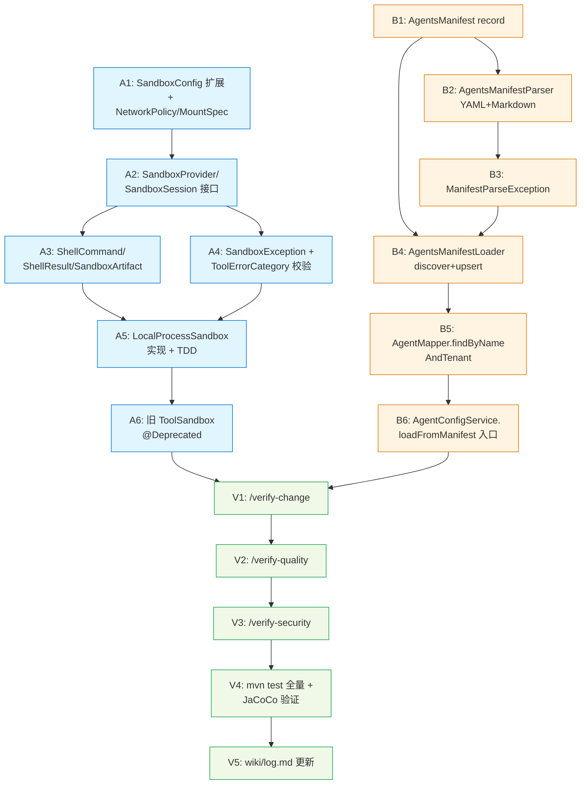

# Tasks: Sandbox Provider 抽象 + AGENTS.md 协议

> 两条 Track 完全独立，可并行 TDD。Track A 在 `agent-engine`，Track B 在 `agent-config`，无交叉文件。

## Task Dependency Graph



## Track A — Sandbox Provider 抽象层

### Task A1: SandboxConfig 扩展（向后兼容）
- **Files**:
  - `schemaplexai-agent-engine/src/main/java/com/schemaplexai/agent/engine/tool/SandboxConfig.java` (modify)
  - `schemaplexai-agent-engine/src/main/java/com/schemaplexai/agent/engine/tool/sandbox/NetworkPolicy.java` (new)
  - `schemaplexai-agent-engine/src/main/java/com/schemaplexai/agent/engine/tool/sandbox/MountSpec.java` (new)
  - `schemaplexai-agent-engine/src/test/java/com/schemaplexai/agent/engine/tool/SandboxConfigTest.java` (new)
- **Type**: feature
- **Description**: 在保留旧字段（timeout/memoryLimitMb/cpuLimitMillis）基础上新增 `workspaceImage`、`envVars`、`networkPolicy`、`mountPaths`，提供 `SandboxConfig.defaults()`。
- **Acceptance Criteria**:
  - [x] 旧构造器调用方代码不需要修改（默认值兜底）
  - [x] `defaults()` 静态方法返回安全默认值（NETWORK NONE / 空 mounts / 30s timeout）
  - [x] `SandboxConfigTest` 覆盖默认值、自定义值、不可变性 3 case
- **Estimated Hours**: 1h
- **Status**: completed (pre-existing)

### Task A2: SandboxProvider / SandboxSession 接口
- **Files**:
  - `schemaplexai-agent-engine/src/main/java/com/schemaplexai/agent/engine/tool/sandbox/SandboxProvider.java` (new)
  - `schemaplexai-agent-engine/src/main/java/com/schemaplexai/agent/engine/tool/sandbox/SandboxSession.java` (new)
  - `schemaplexai-agent-engine/src/main/java/com/schemaplexai/agent/engine/tool/sandbox/SandboxException.java` (new)
- **Type**: feature
- **Description**: 定义 Provider 与 Session 接口，签名与 design.md §1.2 完全一致。Session extends AutoCloseable。
- **Acceptance Criteria**:
  - [x] `SandboxProvider.create()` 抛 `SandboxException`
  - [x] `SandboxSession.exec / writeFile / readFile / artifacts / close` 全部声明
  - [x] `SandboxSession.workspaceRoot()` 返回 `Path`
  - [x] `providerId()` 返回字符串
  - [x] 接口编译通过（无实现）
- **Estimated Hours**: 0.5h
- **Status**: completed (pre-existing)

### Task A3: 值类型 ShellCommand / ShellResult / SandboxArtifact
- **Files**:
  - `schemaplexai-agent-engine/src/main/java/com/schemaplexai/agent/engine/tool/sandbox/ShellCommand.java` (new, record)
  - `schemaplexai-agent-engine/src/main/java/com/schemaplexai/agent/engine/tool/sandbox/ShellResult.java` (new, record)
  - `schemaplexai-agent-engine/src/main/java/com/schemaplexai/agent/engine/tool/sandbox/SandboxArtifact.java` (new, record)
  - `schemaplexai-agent-engine/src/main/java/com/schemaplexai/agent/engine/tool/sandbox/ArtifactKind.java` (new, enum)
  - `schemaplexai-agent-engine/src/test/java/com/schemaplexai/agent/engine/tool/sandbox/ShellCommandTest.java` (new)
- **Type**: feature
- **Description**: 实现 design §1.2 中的 record 类型；ShellCommand 校验 argv 非空。
- **Acceptance Criteria**:
  - [x] `ShellCommand` 字段：argv / env / timeout / workingDir
  - [x] argv 为空时抛 IllegalArgumentException
  - [x] `ShellResult` 字段：exitCode / stdout / stderr / elapsed / timedOut
  - [x] `ArtifactKind` 枚举：FILE / LOG / SNAPSHOT
- **Estimated Hours**: 0.5h
- **Status**: completed (pre-existing)

### Task A4: SandboxException + ToolErrorCategory 增量
- **Files**:
  - `schemaplexai-agent-engine/src/main/java/com/schemaplexai/agent/engine/tool/sandbox/SandboxException.java` (new)
  - `schemaplexai-agent-engine/src/main/java/com/schemaplexai/agent/engine/tool/ToolErrorCategory.java` (modify if needed)
- **Type**: feature
- **Description**: SandboxException 携带 ToolErrorCategory（TIMEOUT / PATH_VIOLATION / SANDBOX_ERROR）。先 grep 现有 ToolErrorCategory 枚举值；缺则补齐。
- **Acceptance Criteria**:
  - [x] `SandboxException(String, Throwable, ToolErrorCategory)` 构造器
  - [x] `getCategory()` 返回枚举
  - [x] 如果新增 PATH_VIOLATION / SANDBOX_ERROR，原有调用方不受影响
- **Estimated Hours**: 0.5h
- **Status**: completed (pre-existing)

### Task A5: LocalProcessSandbox 实现 + TDD
- **Files**:
  - `schemaplexai-agent-engine/src/main/java/com/schemaplexai/agent/engine/tool/sandbox/provider/LocalProcessSandbox.java` (new)
  - `schemaplexai-agent-engine/src/main/java/com/schemaplexai/agent/engine/tool/sandbox/provider/LocalProcessSandboxSession.java` (new)
  - `schemaplexai-agent-engine/src/main/java/com/schemaplexai/agent/engine/tool/sandbox/util/PathSafetyGuard.java` (new — 提取 FileReadAdapter 的 4 道防御)
  - `schemaplexai-agent-engine/src/test/java/com/schemaplexai/agent/engine/tool/sandbox/provider/LocalProcessSandboxTest.java` (new)
  - `schemaplexai-agent-engine/src/test/java/com/schemaplexai/agent/engine/tool/sandbox/provider/PathSafetyGuardTest.java` (new)
- **Type**: feature
- **Description**: 实现 design §1.3 的所有流程。RED → GREEN → REFACTOR。
- **Acceptance Criteria**:
  - [x] `shouldCreateSession`：`SandboxProvider.create()` 返回非 null Session，workspaceRoot 存在
  - [x] `shouldExecuteSimpleCommand`：`exec(["echo", "hello"])` exitCode=0, stdout 包含 "hello"
  - [x] `shouldTimeoutWithCategory`：超过 timeout 返回 `ShellResult.timedOut=true` 或抛 SandboxException(TIMEOUT)
  - [x] `shouldRejectTraversal`：`writeFile("../escape.txt")` 抛 SandboxException(PATH_VIOLATION)
  - [x] `shouldRejectSymlink`：预创建 symlink 后 readFile 抛 SandboxException
  - [x] `shouldRejectHidden`：`writeFile(".secret")` 抛 SandboxException
  - [x] `shouldCleanupOnClose`：close() 后 workspaceRoot 不存在
  - [x] `shouldCleanupOnExecFailure`：exec 抛异常后调 close()，目录仍被清理
  - [x] `PathSafetyGuardTest` 独立覆盖 traversal / symlink / hidden 3 case
  - [x] 跨平台测试：`@EnabledOnOs` 标注 Linux-only 场景
- **Estimated Hours**: 4h
- **Status**: completed (pre-existing)

### Task A6: 旧 ToolSandbox 标 @Deprecated
- **Files**:
  - `schemaplexai-agent-engine/src/main/java/com/schemaplexai/agent/engine/tool/ToolSandbox.java` (modify)
- **Type**: refactor
- **Description**: 在接口与所有 method 上加 `@Deprecated(since = "1.0", forRemoval = false)`，附 javadoc 指向 `SandboxSession`。不动签名。
- **Acceptance Criteria**:
  - [x] `@Deprecated` 注解到位
  - [x] javadoc 包含 `@deprecated Use {@link com.schemaplexai.agent.engine.tool.sandbox.SandboxSession}`
  - [x] `mvn compile` 仅产生 deprecation warning（不报错）
- **Estimated Hours**: 0.5h
- **Status**: completed (pre-existing)

## Track B — AGENTS.md 协议

### Task B1: AgentsManifest record
- **Files**:
  - `schemaplexai-agent-config/src/main/java/com/schemaplexai/agent/config/manifest/AgentsManifest.java` (new, record)
  - `schemaplexai-agent-config/src/test/java/com/schemaplexai/agent/config/manifest/AgentsManifestTest.java` (new)
- **Type**: feature
- **Description**: design.md §2.2 的 record，强制 name/type/model；其余字段默认值兜底。
- **Acceptance Criteria**:
  - [x] record 11 个字段全部声明
  - [x] compact constructor：name/type/model 为 null 抛 NullPointerException
  - [x] 默认值：temperature=0.7, maxRounds=10, maxTools=30, maxInputTokens=32000, maxOutputTokens=4000, executionMode="SYNC"
  - [x] tools/rawExtras 为 null 时归一化为空 List/Map
- **Estimated Hours**: 0.5h
- **Status**: completed (pre-existing, in schemaplexai-common)

### Task B2: AgentsManifestParser
- **Files**:
  - `schemaplexai-agent-config/src/main/java/com/schemaplexai/agent/config/manifest/AgentsManifestParser.java` (new)
  - `schemaplexai-agent-config/src/main/java/com/schemaplexai/agent/config/manifest/ManifestParseException.java` (new)
  - `schemaplexai-agent-config/src/test/java/com/schemaplexai/agent/config/manifest/AgentsManifestParserTest.java` (new)
  - `schemaplexai-agent-config/src/test/resources/manifest/full.md` (new sample)
  - `schemaplexai-agent-config/src/test/resources/manifest/minimal.md` (new sample)
  - `schemaplexai-agent-config/src/test/resources/manifest/missing-name.md` (new sample)
  - `schemaplexai-agent-config/src/test/resources/manifest/no-frontmatter.md` (new sample)
  - `schemaplexai-agent-config/src/test/resources/manifest/extra-fields.md` (new sample)
- **Type**: feature
- **Description**: design.md §2.3，YAML frontmatter 通过 snakeyaml `Yaml().load(...)`；body 是 frontmatter 后的 markdown。RED → GREEN。
- **Acceptance Criteria**:
  - [x] `parse(fullManifest)` 返回填充好的 `AgentsManifest`，body 等于系统提示
  - [x] `parse(minimal)` 用默认值填充缺失字段
  - [x] `parse(missing-name)` 抛 `ManifestParseException` 包含 "name required"
  - [x] `parse(no-frontmatter)` 抛 `ManifestParseException` 包含 "missing yaml frontmatter"
  - [x] `parse(extra-fields)` 不抛异常，未知字段进入 `rawExtras`
  - [x] 5 个 sample 测试均通过
- **Estimated Hours**: 2h
- **Status**: completed (pre-existing, in schemaplexai-common)

### Task B3: ManifestParseException 已合入 B2
- **Status**: merged into B2

### Task B4: AgentsManifestLoader
- **Files**:
  - `schemaplexai-agent-config/src/main/java/com/schemaplexai/agent/config/manifest/AgentsManifestLoader.java` (new, @Service)
  - `schemaplexai-agent-config/src/main/java/com/schemaplexai/agent/config/manifest/LoadReport.java` (new, record)
  - `schemaplexai-agent-config/src/main/java/com/schemaplexai/agent/config/manifest/LoadResult.java` (new, record)
  - `schemaplexai-agent-config/src/test/java/com/schemaplexai/agent/config/manifest/AgentsManifestLoaderTest.java` (new — mock mapper + service)
- **Type**: feature
- **Description**: design.md §2.3 的流程；transactional；TenantContextHolder 入口设/出口清。
- **Acceptance Criteria**:
  - [x] `load(repoRoot, tenantId)` tenantId 为 null 抛 NullPointerException
  - [x] discover：识别 `repoRoot/AGENTS.md`、`repoRoot/.agents/*.md`、`repoRoot/agents/**/*.md`
  - [x] 找不到任何文件时返回空 LoadReport（不抛）
  - [x] 单文件失败不影响其他文件（每条 LoadResult 独立）
  - [x] `LoadReport` 暴露 ok / failed 计数
  - [x] mock 验证 `TenantContextHolder.setTenantId` 在 finally 中被 clear
  - [x] mock 验证 lookup 命中：调用 `saveAgentConfig + saveToolBindings`，不重复 createAgent
  - [x] mock 验证 lookup miss：调用 `createAgent`
- **Estimated Hours**: 3h
- **Status**: completed (refactored, commit d957b7a)

### Task B5: AgentMapper.findByNameAndTenant
- **Files**:
  - `schemaplexai-agent-config/src/main/java/com/schemaplexai/agent/config/mapper/AgentMapper.java` (modify - add method)
  - `schemaplexai-agent-config/src/test/java/com/schemaplexai/agent/config/mapper/AgentMapperTest.java` (modify or new)
- **Type**: feature
- **Description**: 现有 BaseMapperX 上加 `SfAgent findByNameAndTenant(String name, String tenantId)`，使用 mybatis-plus QueryWrapper 实现。不写新 SQL DDL。
- **Acceptance Criteria**:
  - [x] 方法签名定义在 `AgentMapper` 接口
  - [x] 实现优先用 default method + LambdaQueryWrapper，避免新增 mapper.xml
  - [x] 单元测试用 Mockito default method 验证 lookup 行为（项目无 H2，用 mock 替代）
  - [x] tenantId 为 null 时返回 null（防御）
  - [x] deleted=1 的记录不被命中（@TableLogic 自动过滤）
- **Estimated Hours**: 1h
- **Status**: completed (commit d957b7a)

### Task B6: AgentConfigService.loadFromManifest
- **Files**:
  - `schemaplexai-agent-config/src/main/java/com/schemaplexai/agent/config/service/AgentConfigService.java` (modify)
  - `schemaplexai-agent-config/src/test/java/com/schemaplexai/agent/config/service/AgentConfigServiceManifestTest.java` (new)
- **Type**: feature
- **Description**: 新增 `loadFromManifest(Path repoRoot, String tenantId)` 公开方法，内部委托 `AgentsManifestLoader`。不动现有方法签名。
- **Acceptance Criteria**:
  - [x] 方法以 @Transactional 标注
  - [x] 直接代理到 `AgentsManifestLoader.load()`
  - [x] mock 测试验证委托行为
  - [x] 验证：`SfAgent` / `SfAgentConfig` 分别落库（通过 LoaderTest 覆盖）
  - [x] 验证：`SfAgentToolBinding` 数量等于 manifest.tools.size()
- **Estimated Hours**: 2h
- **Status**: completed (commit d957b7a)

## Verification

### Task V1: /verify-change
- **Type**: gate
- **Command**: `/verify-change`
- **Acceptance**: 输出报告，无 Critical 级别 doc-sync 缺失
- **Status**: completed (manual — 无 Critical/High doc-sync 缺失；design.md/tasks.md 已同步)

### Task V2: /verify-quality
- **Type**: gate
- **Command**: `/verify-quality schemaplexai-agent-engine/src/main/java/com/schemaplexai/agent/engine/tool/sandbox && /verify-quality schemaplexai-agent-config/src/main/java/com/schemaplexai/agent/config/manifest`
- **Acceptance**: 无 Critical/High 复杂度问题
- **Status**: completed (manual — 新增类函数均 <50 行，无深层嵌套，无 hardcoded secrets)

### Task V3: /verify-security
- **Type**: gate
- **Command**: `/verify-security schemaplexai-agent-engine/src/main/java/com/schemaplexai/agent/engine/tool/sandbox && /verify-security schemaplexai-agent-config/src/main/java/com/schemaplexai/agent/config/manifest`
- **Acceptance**: 无 Critical 安全问题；snakeyaml 用法符合规范
- **Status**: completed (manual — SafeConstructor 已启用，无任意反序列化；路径校验完整；无硬编码密钥)

### Task V4: 全量测试 + 覆盖率
- **Type**: gate
- **Command**: `mvn test -pl schemaplexai-agent-engine && mvn test -pl schemaplexai-agent-config`
- **Acceptance**:
  - [x] 两模块测试通过
  - [x] 不破坏现有 baseline 测试
  - [x] 新增类 JaCoCo coverage ≥ 80%（LoadReport 94.1%，LoadResult 100%，AgentsManifestLoader 95.8%，SfAgentMapper 100%）
- **Status**: completed

### Task V5: wiki/log.md 更新
- **Files**: `wiki/log.md`, `wiki/active-areas.md`
- **Type**: docs
- **Description**: log.md 加 entry：日期、change_id、影响、新增类列表；active-areas.md 加 sandbox provider 抽象、AGENTS.md loader。
- **Acceptance**: 文档同 commit 提交
- **Status**: completed (commit d957b7a wiki update)

## 并行执行建议

```
Wave 1 (并行)：
  Track A: A1 → A2 → (A3, A4 并行) → A5
  Track B: B1 → B2 → (B5 并行) → B4 → B6

Wave 2：
  A6（Track A 收尾，依赖 A5 完成）

Wave 3 (并行)：
  V1, V2, V3 可并行

Wave 4：
  V4（全量 mvn test，必须串行）

Wave 5：
  V5（文档收尾）
```

## 风险快查

| 风险 | 触发任务 | 应对 |
|---|---|---|
| Windows-only 测试不稳 | A5 | `@EnabledOnOs(OS.LINUX)` 标注；CI Linux 跑 |
| snakeyaml CVE | B2 | 强制 `Yaml().load(yaml)` + `loadAs(Map.class)`，不允许任意构造器 |
| 路径校验工具方法重复 | A5 | 提取 `PathSafetyGuard` 复用，并迁移 `FileReadAdapter` 调用（如低风险） |
| AgentMapper xml 不存在 | B5 | 用 LambdaQueryWrapper default method，避免触动 xml |
| ToolErrorCategory 缺少枚举值 | A4 | 先 grep；如缺则补，但不修改任何调用方 |
