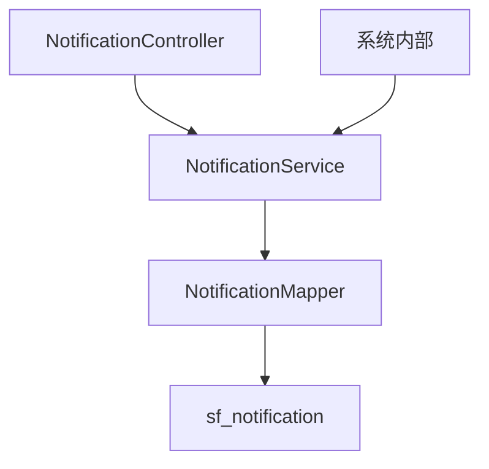

# Spec: System Notification Module

> 本 Spec 为执行层草稿，评审通过后沉淀到 `docs/specs/notification.md`

## 1. 概述

### 1.1 问题陈述

用户目前无法接收系统级消息（如任务完成提醒、工作流审批通知、系统维护公告），关键事件容易被遗漏，降低用户参与度和操作效率。

### 1.2 范围

- Notification 实体、数据库表、Mapper、Service、Controller
- REST API：查询列表、标记已读、全部已读
- 前端 TypeScript 类型定义
- 基础单元测试和集成测试

### 1.3 非目标

- 实时推送（WebSocket/SSE）
- 邮件/短信渠道
- 通知模板管理
- 管理员发通知的 UI

## 2. 架构视图

### 2.1 组件关系



### 2.2 数据流

1. 前端调用 `/web/notification/page` 获取通知列表
2. Controller 调用 Service，Service 调用 Mapper 查询
3. `TenantLineInterceptor` 自动注入 `tenant_id` 过滤
4. 返回分页结果给前端

## 3. 接口规格

### 3.1 API 列表

#### `GET /web/notification/page`

查询当前用户的通知列表（分页）。

**Query Parameters**:
| 参数 | 类型 | 必填 | 说明 |
|------|------|------|------|
| page | int | 否 | 页码，默认 1 |
| size | int | 否 | 每页大小，默认 20 |
| read | boolean | 否 | 筛选已读/未读，不传则全部 |

**Response (200)**:
```json
{
  "code": 200,
  "data": {
    "records": [
      {
        "id": 1,
        "title": "任务已完成",
        "content": "您提交的数据处理任务已完成",
        "type": "TASK",
        "read": false,
        "createdAt": "2026-05-01T10:00:00"
      }
    ],
    "total": 100,
    "size": 20,
    "current": 1,
    "pages": 5
  },
  "message": "success"
}
```

#### `PUT /web/notification/{id}/read`

将单条通知标记为已读。

**Path Variables**:
| 参数 | 类型 | 说明 |
|------|------|------|
| id | long | 通知 ID |

**Response (200)**:
```json
{
  "code": 200,
  "data": true,
  "message": "success"
}
```

#### `PUT /web/notification/read-all`

将当前用户所有未读通知标记为已读。

**Response (200)**:
```json
{
  "code": 200,
  "data": 5,
  "message": "success"
}
```

**Error Codes**:

| Code | Message | 场景 |
|------|---------|------|
| 404 | 通知不存在 | 标记已读时 ID 不存在或无权访问 |
| 500 | 系统错误 | 数据库异常 |

## 4. 数据模型

### 4.1 数据库变更

| 表名 | 操作 | 说明 |
|------|------|------|
| sf_notification | 新增 | 通知表，含租户、用户、标题、内容、类型、已读状态 |

### 4.2 Entity / DTO / VO

```java
// Entity
@TableName("sf_notification")
public class Notification extends BaseEntity {
    private Long tenantId;
    private Long userId;
    private String title;
    private String content;
    private String type;      // SYSTEM, TASK, WORKFLOW
    private Boolean read;     // false = 未读
}

// VO (返回给前端)
public class NotificationVO {
    private Long id;
    private String title;
    private String content;
    private String type;
    private Boolean read;
    private LocalDateTime createdAt;
}
```

## 5. 状态机

无复杂状态机。通知只有 `read = false / true` 两种状态。

## 6. 异常场景

| 场景 | 输入/条件 | 预期行为 | 错误码 |
|------|----------|---------|--------|
| 标记不存在的通知 | id = 999999 | 返回 404 | 404 |
| 标记其他用户的通知 | 当前用户A操作用户B的通知 | 返回 404（避免信息泄露） | 404 |
| 标记其他租户的通知 | 当前租户T1操作租户T2的通知 | TenantLineInterceptor 过滤，返回 404 | 404 |

## 7. 非功能需求

### 7.1 性能

- QPS 目标: 500
- 延迟目标 (P99): 100ms
- 分页上限: 100 条/页

### 7.2 安全

- [x] 输入验证: page/size 参数校验
- [x] 权限控制: 只能操作自己的通知，租户隔离由 TenantLineInterceptor 保证
- [x] 敏感数据: 通知内容不过滤，假设由系统生成

### 7.3 兼容性

- [x] 不破坏现有 API（全新模块）
- [x] 需要数据库迁移（新增表）
- [x] 需要前端配合（新增类型和 API 调用）

## 8. 风险与回退

| 风险 | 影响 | 缓解 | 回退方案 |
|------|------|------|---------|
| 表数据量增长快 | 查询变慢 | 索引 + 定期归档 | 增加归档任务，删除 90 天前数据 |

## 9. 相关文档

- Proposal: `.claude/changes/system-notification/proposal.md`
- Plan: `.claude/changes/system-notification/tasks.md`
