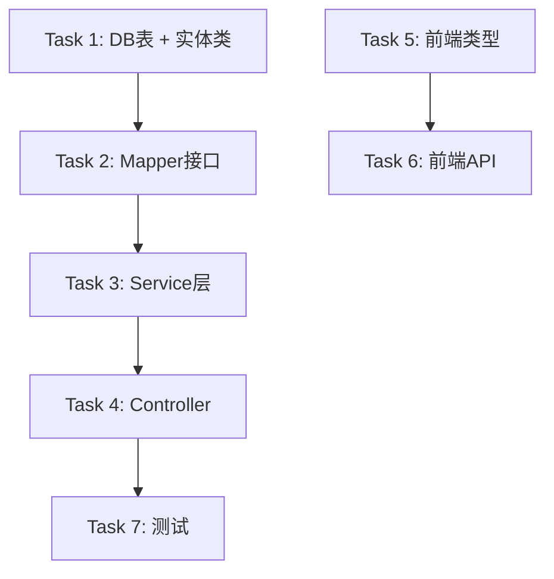

# Plan: System Notification Module

## 任务图（Graphify）



## 可并行执行组

| 组 | 任务 | 依赖前置 | 说明 |
|----|------|---------|------|
| Group A | Task 1, Task 5 | 无 | 后端实体与前端类型独立 |
| Group B | Task 2 | Task 1 | Mapper 依赖实体 |
| Group C | Task 3 | Task 2 | Service 依赖 Mapper |
| Group D | Task 4 | Task 3 | Controller 依赖 Service |
| Group E | Task 6 | Task 5 | API 层依赖类型 |
| Group F | Task 7 | Task 4 | 测试依赖 Controller |

## 任务清单

### Task 1: 数据库表 + 实体类
- **ID**: T1
- **文件**:
  - `docker/postgres/init/04-notification.sql`
  - `schemaplexai-model/src/main/java/com/schemaplexai/model/entity/notification/Notification.java`
- **类型**: 新增
- **描述**: 创建 `sf_notification` 表，字段：id, tenant_id, user_id, title, content, type, read, created_at, updated_at, created_by, updated_by, deleted。创建 Notification 实体类，继承 BaseEntity，添加 @TableName("sf_notification")。
- **验收标准**:
  - [ ] SQL 脚本可执行，表结构正确
  - [ ] 实体类继承 BaseEntity，所有字段与表一致
  - [ ] type 字段使用枚举或字符串常量（SYSTEM, TASK, WORKFLOW）
  - [ ] 通过 `mvn compile` 无错误
- **预估工时**: 30min
- **依赖**: 无
- **状态**: ⬜

### Task 2: Mapper 接口
- **ID**: T2
- **文件**: `schemaplexai-dao/src/main/java/com/schemaplexai/dao/mapper/notification/NotificationMapper.java`
- **类型**: 新增
- **描述**: 创建 NotificationMapper，继承 BaseMapperX<Notification>。添加自定义方法：markAsRead(id, userId)、markAllAsRead(userId)、countUnread(userId)。
- **验收标准**:
  - [ ] 继承 BaseMapperX<Notification>
  - [ ] 自定义方法有对应的 XML 或 @Update 注解
  - [ ] 方法考虑租户隔离（TenantLineInterceptor 自动处理）
  - [ ] 通过 `mvn compile` 无错误
- **预估工时**: 30min
- **依赖**: T1
- **状态**: ⬜

### Task 3: Service 层
- **ID**: T3
- **文件**:
  - `schemaplexai-web/src/main/java/com/schemaplexai/web/service/notification/NotificationService.java`
  - `schemaplexai-web/src/main/java/com/schemaplexai/web/service/notification/NotificationServiceImpl.java`
- **类型**: 新增
- **描述**: 实现业务逻辑：pageQuery（分页查询，支持 read 筛选）、markAsRead（单条已读，校验归属）、markAllAsRead（全部已读）、sendNotification（系统内部发送通知）。
- **验收标准**:
  - [ ] pageQuery 返回 IPage<NotificationVO>
  - [ ] markAsRead 校验通知属于当前用户，否则抛 NOT_FOUND
  - [ ] markAllAsRead 返回影响的行数
  - [ ] sendNotification 支持系统内部调用
  - [ ] 通过 `mvn compile` 无错误
- **预估工时**: 45min
- **依赖**: T2
- **状态**: ⬜

### Task 4: Controller
- **ID**: T4
- **文件**: `schemaplexai-web/src/main/java/com/schemaplexai/web/controller/notification/NotificationController.java`
- **类型**: 新增
- **描述**: 实现 3 个 REST 端点：GET /web/notification/page、PUT /web/notification/{id}/read、PUT /web/notification/read-all。继承 BaseController，返回 Result<T>。从 SecurityContext 获取当前 userId。
- **验收标准**:
  - [ ] 3 个端点与 spec.md 定义一致
  - [ ] 继承 BaseController，使用 success()/error()
  - [ ] 参数校验（@Valid, @Min 等）
  - [ ] Swagger/Knife4j 注解完整
  - [ ] 通过 `mvn compile` 无错误
- **预估工时**: 30min
- **依赖**: T3
- **状态**: ⬜

### Task 5: 前端 TypeScript 类型
- **ID**: T5
- **文件**: `schemaplexai-ui/src/types/notification.ts`
- **类型**: 新增
- **描述**: 定义 Notification 类型接口，匹配后端 VO 字段。
- **验收标准**:
  - [ ] 类型字段与后端 VO 一一对应
  - [ ] 导出 Notification, NotificationPageResult, NotificationType 等类型
  - [ ] 通过 `npm run lint` 无错误
- **预估工时**: 15min
- **依赖**: 无
- **状态**: ⬜

### Task 6: 前端 API 层
- **ID**: T6
- **文件**: `schemaplexai-ui/src/api/notification.ts`
- **类型**: 新增
- **描述**: 创建 notification API 模块，封装 3 个接口：getNotificationPage、markAsRead、markAllAsRead。使用现有 axios 实例。
- **验收标准**:
  - [ ] 3 个函数与后端端点对应
  - [ ] 返回类型使用 Task 5 中定义的类型
  - [ ] 使用统一的 Result<T> 包装器
  - [ ] 通过 `npm run lint` 无错误
- **预估工时**: 20min
- **依赖**: T5
- **状态**: ⬜

### Task 7: 测试
- **ID**: T7
- **文件**:
  - `schemaplexai-web/src/test/java/com/schemaplexai/web/controller/notification/NotificationControllerTest.java`
  - `schemaplexai-web/src/test/java/com/schemaplexai/web/service/notification/NotificationServiceTest.java`
- **类型**: 新增
- **描述**: 编写 Controller 集成测试和 Service 单元测试。Controller 测试使用 @SpringBootTest + MockMvc。Service 测试使用 Mockito。
- **验收标准**:
  - [ ] Service 单元测试覆盖核心逻辑（pageQuery, markAsRead, markAllAsRead）
  - [ ] Controller 集成测试覆盖 3 个端点
  - [ ] 测试覆盖率 >= 80%
  - [ ] `mvn test` 通过
- **预估工时**: 45min
- **依赖**: T4
- **状态**: ⬜

## 关键路径

```
Task 1 → Task 2 → Task 3 → Task 4 → Task 7
     [30m]  [30m]   [45m]   [30m]   [45m]

Task 5 → Task 6
 [15m]   [20m]
```

**关键路径总时长**: 2h 40min
**理论最短时长**（全并行）: 2h 40min（Task 1-7 串行部分无法进一步并行）

## 风险与缓冲

| 风险任务 | 风险描述 | 缓冲策略 |
|---------|---------|---------|
| T3 Service | 用户归属校验逻辑复杂 | 提前设计边界用例，TDD 驱动 |
| T7 测试 | 测试环境数据库初始化 | 使用 @TestConfiguration 准备测试数据 |

## 回退方案

如果延期或失败：
1. 砍掉 Task 5-6（前端部分），仅保留后端 API
2. 砍掉 Task 7 集成测试，仅保留 Service 单元测试

## 质量门禁

- [ ] 每个任务完成后自测（compile / lint）
- [ ] Task 4 完成后触发 /verify-change
- [ ] Task 4 完成后触发 /verify-quality
- [ ] 最终 Code Review（code-reviewer agent）

## 文档同步任务

- [ ] 更新 `docs/specs/notification.md`（评审通过后）
- [ ] 更新 `wiki/entities/notification.md`（新实体）
- [ ] 更新 `wiki/log.md`
