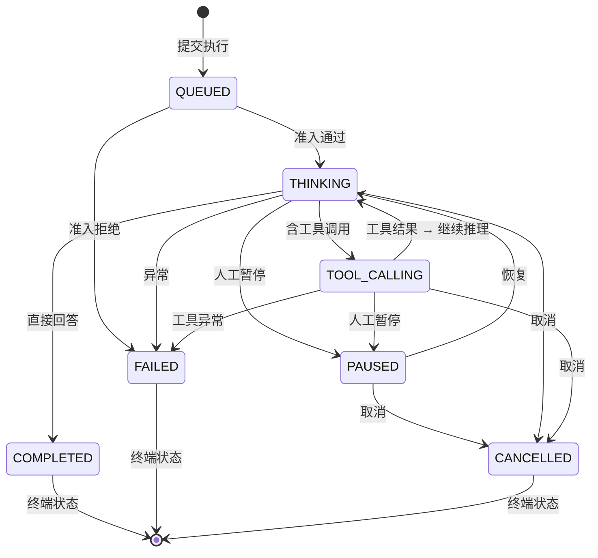

# Spec: Core AI Engine (Phase 2)

> 本 Spec 为 Phase 2 执行层草稿，评审通过后沉淀到 `docs/specs/core-ai-engine.md`。
> 基础规格见已批准的 `docs/specs/2026-04-30-v1.0-agent-execution-engine.md`。

## 1. 概述

### 1.1 问题陈述

Phase 1 已完成可观测性数据模型、Prompt 版本管理、Skill Markdown 规范和统一消息格式。Phase 2 的核心问题是：**将 `schemaplexai-agent-engine` 从 scaffolding/stubs 推进到可运行的异步执行引擎**，实现 Agent 的完整生命周期管理。

当前代码状态（2026-05-01）：
- `AgentExecutionEngine` — 同步调用 orchestrator，无异步支持
- `AgentRuntimeOrchestrator` — 有循环框架和准入控制，但缺少具体 StateHandler 实现
- `AgentExecutionLifecycleService` — pause/resume/cancel + snapshot 骨架完成
- `AgentExecutionController` — REST API 定义完成
- `AgentExecuteDispatcher` — RabbitMQ 消费完成
- **缺失**: ThinkingHandler、ToolCallingHandler、LlmProvider 防腐层、Async 执行线程池

### 1.2 范围

- Agent 异步执行（@Async + 线程池隔离）
- StateHandler 完整实现（THINKING → TOOL_CALLING → COMPLETED/FAILED）
- LangChain4j 集成（AiModelRouter 防腐层）
- TokenBudget 运行时管理（预检 + 后扣 + 超限处理）
- CompositeChatMemoryStore 完整实现（L1 Redis + L2 PostgreSQL + 压缩）
- AgentLoopDetectionService 循环检测
- SSE 事件流集成（UnifiedMessage 格式）

### 1.3 非目标

- 多 Agent 协作编排（Phase 3 Workflow Engine 负责）
- 完整的沙箱执行（Phase 3 zeroboot 集成）
- 前端 Agent Canvas 沉浸式 UI（Abyss Hive 独立计划）
- 自动模型选择/路由（保留简单 fallback 即可）

## 2. 架构视图

```
┌─────────────────────────────────────────────────────────────┐
│              AgentRuntimeOrchestrator                        │
│                    (编排入口)                                 │
└──────────────────────┬──────────────────────────────────────┘
                       │
    ┌──────────────────┼──────────────────┐
    │                  │                  │
    ▼                  ▼                  ▼
┌────────────┐  ┌──────────────┐  ┌──────────────┐
│ Execution  │  │ AgentState   │  │ AgentLoop    │
│ Admission  │  │   Machine    │  │  Detection   │
│  Service   │  │              │  │   Service    │
└────────────┘  └──────┬───────┘  └──────────────┘
                       │
        ┌──────────────┼──────────────┐
        ▼              ▼              ▼
┌──────────────┐ ┌──────────┐ ┌──────────────┐
│  Thinking    │ │  Tool    │ │  Completed   │
│   Handler    │ │ Calling  │ │   Handler    │
│              │ │ Handler  │ │              │
└──────┬───────┘ └────┬─────┘ └──────────────┘
       │              │
       ▼              ▼
┌─────────────────────────────────────────────┐
│           LlmProvider (防腐层)               │
│    ┌──────────────┐  ┌──────────────────┐   │
│    │ LangChain4j  │  │  Direct SDK      │   │
│    │  (primary)   │  │  (fallback)      │   │
│    └──────────────┘  └──────────────────┘   │
└─────────────────────────────────────────────┘
```

## 3. 接口规格

### 3.1 执行启动（已存在，需增强为异步）

```http
POST /agents/{id}/execute
Content-Type: application/json

{
  "input": "分析这段代码的性能问题",
  "contextId": 123,
  "conversationId": "conv_456"
}

Response: Result<Long>  // 返回 executionId，实际执行异步进行
```

**变更点**:
- `AgentExecutionEngine.startExecution()` 标记 `@Async("agentExecutionExecutor")`
- 返回时 `execution.state = QUEUED`，实际状态转换由 orchestrator 驱动

### 3.2 SSE 事件流（集成 UnifiedMessage）

```http
GET /agents/execute/stream?executionId={id}
Authorization: Bearer {token}
```

**事件类型**（使用 `UnifiedMessage` + `MessageType.SSE_EVENT`）:

| eventName | 说明 |
|-----------|------|
| `THINKING_STARTED` | 开始推理 |
| `THINKING_CHUNK` | 流式输出片段 |
| `TOOL_CALLING` | 调用工具 |
| `TOOL_RESULT` | 工具执行结果 |
| `PAUSED` | 执行暂停（等待人工） |
| `COMPLETED` | 执行完成 |
| `FAILED` | 执行失败 |
| `ERROR` | 错误信息 |

### 3.3 执行控制（已存在，需增强状态校验）

```http
POST /agents/execution/{id}/pause    // 仅 RUNNING/THINKING/TOOL_CALLING 可暂停
POST /agents/execution/{id}/resume   // 仅 PAUSED 可恢复
POST /agents/execution/{id}/cancel   // 非终端状态均可取消
GET  /agents/execution/{id}          // 查询完整状态 + 当前 token 消耗
```

## 4. 数据模型

### 4.1 现有实体（已存在）

**`sf_agent_execution`**:

| 字段 | 类型 | 说明 |
|------|------|------|
| id | BIGINT PK | 主键 |
| agent_id | BIGINT | 关联 Agent |
| tenant_id | BIGINT | 租户隔离 |
| state | VARCHAR | 执行状态 |
| user_input | TEXT | 用户输入 |
| last_response | TEXT | 最后 LLM 响应 |
| model_config | JSONB | 模型配置 |
| token_used_input | BIGINT | 已用输入 Token |
| token_used_output | BIGINT | 已用输出 Token |
| token_budget_json | VARCHAR | 预算序列化 |
| start_time | TIMESTAMP | 开始时间 |
| end_time | TIMESTAMP | 结束时间 |
| conversation_id | VARCHAR | 对话 ID |

**`sf_agent_execution_snapshot`**:

| 字段 | 类型 | 说明 |
|------|------|------|
| id | BIGINT PK | 主键 |
| execution_id | BIGINT | 关联执行 |
| snapshot_json | JSONB | 上下文数据 |
| created_at | TIMESTAMP | 快照时间 |

### 4.2 新增/变更

- `sf_agent_execution.state` 枚举值扩展: `QUEUED` → `THINKING` → `TOOL_CALLING` → `COMPLETED` / `FAILED` / `CANCELLED` / `PAUSED`
- `token_budget_json` 从简单字符串改为结构化 JSON: `{"maxInput":8192,"maxOutput":4096,"consumedInput":100,"consumedOutput":50}`

## 5. 状态机



**关键约束**:
- 终端状态（COMPLETED/FAILED/CANCELLED）不可再转换
- 终端状态触发 `AgentStateMachine.removeExecution()` 内存清理
- 状态转换必须由 `AgentStateMachine.transition()` 统一入口执行

## 6. 核心组件待实现清单

| 组件 | 当前状态 | 需完成工作 | 优先级 |
|------|----------|-----------|--------|
| `ThinkingStateHandler` | 不存在 | LLM 调用、Prompt 构建、Token 预检/后扣、响应解析 | P0 |
| `ToolCallingStateHandler` | 不存在 | 工具注册表、并行读/串行写策略、超时控制 | P0 |
| `LlmProvider` / `AiModelRouter` | 不存在 | LangChain4j 封装、generateWithFallback、流式输出 | P0 |
| `AgentLoopDetectionService` | 不存在 | 哈希检测、工具序列检测 | P1 |
| `@Async` 线程池 | 不存在 | `agentExecutionExecutor` bean，隔离队列+拒绝策略 | P0 |
| `CompositeChatMemoryStore` | 骨架 | L1 Redis List、L2 PostgreSQL、压缩策略 | P1 |
| `ExecutionAdmissionService` | 骨架 | 四维并发限制实现 | P1 |
| `TokenBudget` | 骨架 | CAS 消费、超限处理链 | P1 |

## 7. 异常场景

| 场景 | 输入/条件 | 预期行为 | 错误码 |
|------|----------|---------|--------|
| 准入拒绝 | 租户/Agent/模型并发超限 | 状态转 GATE_BLOCKED，返回 admission.reason | 429 |
| Token 预算不足 | 预检时 input token > 剩余预算 | 触发记忆压缩 → 截断 → 终止 | 507 |
| LLM 调用超时 | 30s 无响应 | 标记失败，状态转 FAILED，释放并发 | 504 |
| 工具执行失败 | 单工具异常 | 记录错误，继续其他工具；全失败则转 FAILED | 500 |
| 循环检测触发 | 5 轮内哈希或工具序列重复 | 强制转 COMPLETED，reason = LOOP_DETECTED | 200 |
| 状态非法转换 | PAUSED → TOOL_CALLING（不允许） | 抛出 IllegalStateException，不改变状态 | 400 |
| 执行被外部取消 | CANCELLED 信号 | 当前轮完成后转 CANCELLED，清理资源 | 200 |

## 8. 非功能需求

| 指标 | 目标 | 验证方式 |
|------|------|----------|
| 单执行延迟 | P99 < 30s | 压测 |
| 并发执行数 | 单实例 100+ | 压测 |
| 状态机内存泄漏 | 0 | 终端状态清理验证 |
| Token 预算精度 | 误差 < 5% | 单元测试 |
| 循环检测准确率 | > 95% | 集成测试 |
| Async 线程池利用率 | < 80% 时无拒绝 | 监控 |

## 9. 相关文档

- `docs/specs/2026-04-30-v1.0-agent-execution-engine.md` — 已批准的基础规格
- `docs/decisions/ADR-002-cursor-sdk-to-opensandbox.md`
- `docs/decisions/ADR-003-langchain4j-selection.md`
- `wiki/services/AgentRuntimeOrchestrator.md`
- `wiki/services/AgentExecutionLifecycleService.md`
- `wiki/ideas/2026-04-30-zeroboot-architecture.md`
