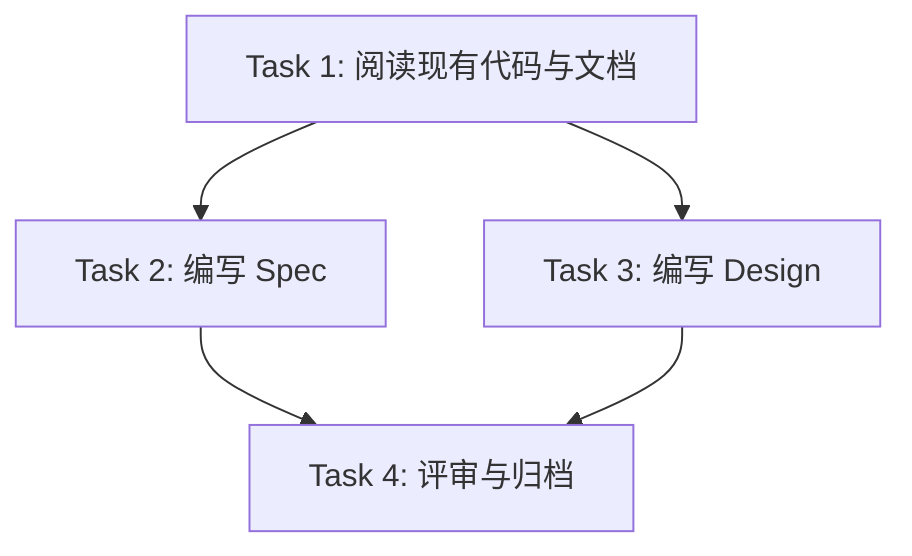

# Plan: Core AI Engine Design (Phase 2)

## 任务图（Graphify）



## 任务清单

### Task 1: 调研与阅读
- **ID**: T1
- **文件**: `wiki/roadmap.md`, `wiki/active-areas.md`, `docs/specs/2026-04-30-v1.0-agent-execution-engine.md`, `wiki/ideas/2026-04-30-zeroboot-architecture.md`
- **类型**: 调研
- **描述**: 阅读所有相关文档和现有代码 stubs，理解当前实现状态和差距
- **验收标准**:
  - [x] 已读 roadmap Phase 2
  - [x] 已读 active-areas Agent Engine 部分
  - [x] 已读已批准的 agent-execution-engine spec
  - [x] 已读 zeroboot 架构研究
  - [x] 已读现有代码 stubs（AgentExecutionEngine, AgentRuntimeOrchestrator, AgentExecutionLifecycleService, AgentExecutionController, AgentExecuteDispatcher）
- **状态**: ✅ completed

### Task 2: 编写技术规格
- **ID**: T2
- **文件**: `.claude/changes/core-ai-engine-design/spec.md`
- **类型**: 文档
- **描述**: 编写 Phase 2 Core AI Engine 技术规格，包含概述、架构视图、接口规格、数据模型、状态机、组件待实现清单、异常场景、非功能需求
- **验收标准**:
  - [x] 概述包含当前代码状态分析和差距清单
  - [x] 架构视图引用并扩展已批准规格
  - [x] API 接口标注已存在 vs 需增强
  - [x] 数据模型标注新增/变更字段
  - [x] 状态机完整（7 状态 + 转换矩阵）
  - [x] 核心组件待实现清单（8 项，含优先级）
- **状态**: ✅ completed

### Task 3: 编写架构设计
- **ID**: T3
- **文件**: `.claude/changes/core-ai-engine-design/design.md`
- **类型**: 文档
- **描述**: 编写架构设计文档，包含 C4 图（Context/Container/Component）、模块边界、数据流、关键技术决策、Token Budget 架构、Chat Memory 架构、部署运维、zeroboot 集成点
- **验收标准**:
  - [x] C4 Context/Container/Component 三级图完整
  - [x] 正常执行流 + 暂停恢复流 sequence diagram
  - [x] 5 项关键技术决策表
  - [x] Token Budget 流程图
  - [x] Chat Memory 双层架构图
  - [x] 部署配置 + 监控指标
  - [x] zeroboot Phase 3 集成点
- **状态**: ✅ completed

### Task 4: 归档
- **ID**: T4
- **文件**: `docs/specs/core-ai-engine.md`, `docs/designs/core-ai-engine.md`
- **类型**: 文档同步
- **描述**: 评审通过后沉淀到 docs/ 目录
- **验收标准**:
  - [ ] 通过 code-reviewer / architect review
  - [ ] 同步到 `docs/specs/` 和 `docs/designs/`
  - [ ] 更新 `wiki/log.md`
- **状态**: ⬜ pending

## 关键路径

```
T1 (调研) → T2 (Spec) → T4 (归档)
       └→ T3 (Design) ──┘
```

## 质量门禁

- [x] 引用已批准规格，不重复定义
- [x] 基于实际代码 stubs，不凭空设计
- [x] 包含具体实现差距和优先级
- [ ] 评审通过

## 文档同步任务

- [ ] 评审通过后同步到 `docs/specs/core-ai-engine.md`
- [ ] 评审通过后同步到 `docs/designs/core-ai-engine.md`
- [ ] 更新 `wiki/log.md`
