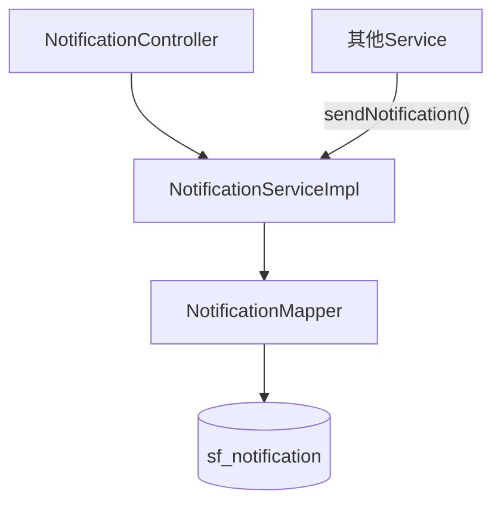
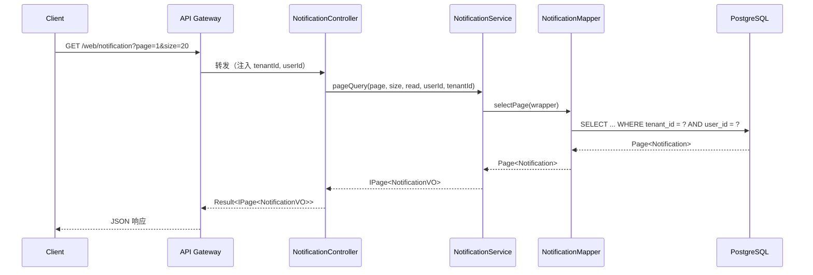
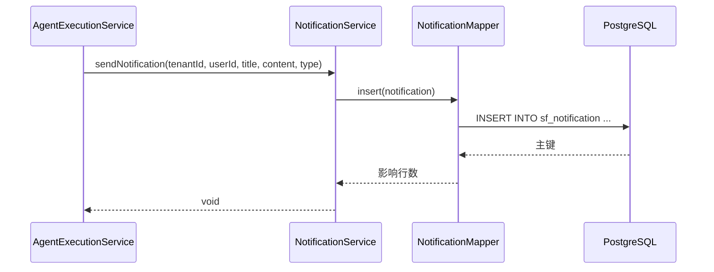

# Design: System Notification Module

> 本 Design 为执行层草稿，评审通过后沉淀到 `docs/designs/2026-05-01-system-notification.md`。

---

## 1. 设计目标

构建系统通知中心，为平台内所有用户事件（任务完成、工作流审批、系统公告）提供统一的通知存储与查询能力。

## 2. 架构视图

### 2.1 C4 Context

```
[用户] --(查询/标记已读)--> [schemaplexai-web]
[系统内部服务] --(发送通知)--> [schemaplexai-web]
```

### 2.2 C4 Container

Notification 模块属于 `schemaplexai-web` 服务内的一个垂直功能域：
- `NotificationController` — REST API
- `NotificationService` / `NotificationServiceImpl` — 业务逻辑
- `NotificationMapper` — 数据访问
- `sf_notification` — PostgreSQL 表

### 2.3 C4 Component



## 3. 模块边界

| 模块 | 职责 | 暴露接口 | 依赖 |
|------|------|---------|------|
| Controller | REST 端点、参数校验、权限检查 | `GET /web/notification/page`, `PUT /web/notification/{id}/read`, `PUT /web/notification/read-all` | Service |
| Service | 业务逻辑、分页查询、已读标记 | `pageQuery(...)`, `markAsRead(...)`, `markAllAsRead(...)`, `sendNotification(...)` | Mapper |
| Mapper | SQL 映射、自定义更新 | `markAsRead(Long id, Long userId)`, `markAllAsRead(Long userId)`, `countUnread(Long userId)` | MyBatis-Plus |
| Entity | 数据模型 | — | BaseEntity |

## 4. 数据流

### 4.1 查询通知列表



### 4.2 系统发送通知（内部调用）



## 5. 关键技术决策

| 决策 | 选项 A | 选项 B | 选择 | 原因 |
|------|--------|--------|------|------|
| 通知发送方式 | 同步写入 | 异步 MQ | A（当前阶段） | 简化实现，后续量大了再切 MQ |
| 未读数统计 | 实时 COUNT | 计数器缓存 | A | 表有索引，COUNT 性能可接受 |
| 已读标记 | 乐观锁（version） | 直接 UPDATE | B | 已读幂等，无需乐观锁 |
| 用户归属校验 | Service 层校验 | SQL 中校验 | A | 避免信息泄露，统一返回 404 |

## 6. 部署与运维

- [x] 无新增服务，复用 `schemaplexai-web`
- [x] 新增 1 张表，通过 `docker/postgres/init/04-notification.sql` 初始化
- [x] 无需新增环境变量
- [x] 无需更新 docker-compose
- [x] 无需新增 Gateway 路由（复用 `/web/**`）

## 7. 相关文档

- Spec: `.claude/changes/system-notification/spec.md`
- Plan: `.claude/changes/system-notification/tasks.md`
- 关联 wiki: `wiki/entities/notification.md`（待创建）
