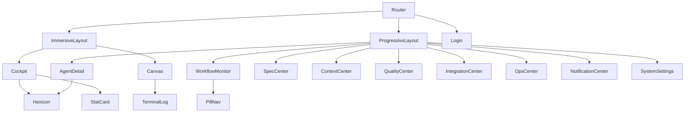

# UI/UE 对齐 — Design

## C4 Component View



## Layout 路由映射

| 路由 | Layout 模式 | 页面组件 | 状态 |
|---|---|---|---|
| `/login` | — | Login | 已有 |
| `/cockpit` | Immersive | Cockpit | **新增** |
| `/canvas` | Immersive | AgentCanvas | **新增** |
| `/agents` | Progressive | AgentDetail | **重构**（原 AgentManager） |
| `/agents/executor` | Progressive | AgentExecutor | 已有 |
| `/workflows` | Progressive | WorkflowMonitor | **重构**（原 WorkflowCenter） |
| `/specs` | Progressive | SpecCenter | 已有，需 API 对接 |
| `/contexts` | Progressive | ContextCenter | 已有，需 API 对接 |
| `/quality` | Progressive | QualityCenter | 已有，需 API 对接 |
| `/integrations` | Progressive | IntegrationCenter | 已有，需 API 对接 |
| `/ops` | Progressive | OpsCenter | 已有，需 API 对接 |
| `/notifications` | Progressive | NotificationCenter | 已有，需 API 对接 |
| `/settings` | Progressive | SystemSettings | 已有 |

## 组件架构

### Hive 组件（新增）

```
src/components/Hive/
  HexIcon.tsx      — 六边形图标，size/color/variant
  StatCard.tsx     — 左侧3px色条 + 大数字 + sparkline
  PillNav.tsx      — 胶囊形视图切换器
  TerminalLog.tsx  — 彩色编码日志流 + 自动滚动 + 闪烁光标
```

### Layout 接入

- 修改 `router/index.tsx`：按路由选择 Layout wrapper
- ImmersiveLayout: 52px icon-only sidebar, 无 header
- ProgressiveLayout: 200px 展开 sidebar + 48px header
- 删除旧的 `Layout/index.tsx` 传统布局，改为 re-export ProgressiveLayout

### 主题

- 已有 `abyssHiveTheme` in `theme/index.ts`
- 确保 `main.tsx` ConfigProvider 使用 theme
- `index.css` 已覆盖全局样式，保持不变

## 数据流

```
Page Component
  → API Hook (src/api/*.ts)
    → Axios Instance (request.ts)
      → Backend Service
  → Zustand Store (src/stores/*.ts)
    → localStorage (auth/tenant)
```

## 部署考虑

- 无后端变更
- 纯前端变更，Vite build 后部署静态资源即可
- 截图基线需更新（Playwright）

---
> 参考: `docs/designs/2026-04-29-v1.0-system-architecture.md`
