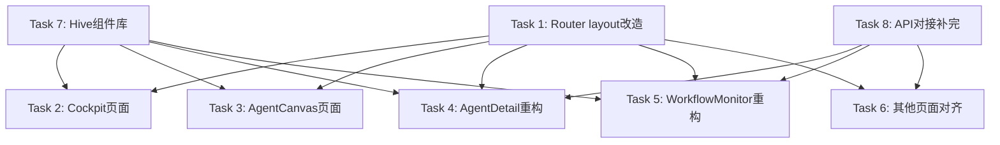

# UI/UE 对齐 — Task Graph

## Parallel Groups

- **Group 1**: Task 1 (Router), Task 7 (Hive组件) — 独立，可并行
- **Group 2**: Task 2-6 (页面) — 依赖 Task 1 和 Task 7
- **Group 3**: Task 8 (API对接) — 依赖各页面组件就绪

## Task List

### Task 1: Router Layout 改造
- **Duration**: ≤ 2h
- **Acceptance**:
  - [ ] Router 按路由选择 ImmersiveLayout / ProgressiveLayout / 无 Layout
  - [ ] `/cockpit`, `/canvas` 路由添加
  - [ ] `/dashboard` 重定向到 `/cockpit`
  - [ ] 删除旧 Layout，index.tsx re-export ProgressiveLayout
- **Files**: `src/router/index.tsx`, `src/components/Layout/index.tsx`

### Task 2: Cockpit 驾驶舱页面
- **Duration**: ≤ 4h
- **Acceptance**:
  - [ ] `/cockpit` 渲染 ImmersiveLayout
  - [ ] 中央统计卡片（Agent数/执行数/Token/待审批）
  - [ ] 底部 Agent 状态轨道图（简化版）
  - [ ] 对接 `getAgentStats()`
- **Files**: `src/pages/Cockpit/index.tsx`, `src/api/agent.ts`

### Task 3: AgentCanvas DAG 编辑器页面
- **Duration**: ≤ 4h
- **Acceptance**:
  - [ ] `/canvas` 渲染 ImmersiveLayout
  - [ ] 占位 DAG 画布（@antv/x6 已依赖）
  - [ ] 底部工具栏（拓扑/列表/代码视图切换）
  - [ ] TerminalLog 组件展示执行日志
- **Files**: `src/pages/AgentCanvas/index.tsx`, `src/components/Hive/TerminalLog.tsx`

### Task 4: AgentDetail 重构
- **Duration**: ≤ 4h
- **Acceptance**:
  - [ ] `/agents` 从表格列表改为身份卡片+标签页
  - [ ] 标签页：metrics / logs / charts / config
  - [ ] 对接 `getAgentDetail()`, `getAgentList()`
  - [ ] 保留 `/agents/executor` 子路由
- **Files**: `src/pages/AgentDetail/index.tsx`, `src/pages/AgentManager/index.tsx`（迁移或删除）

### Task 5: WorkflowMonitor 重构
- **Duration**: ≤ 4h
- **Acceptance**:
  - [ ] `/workflows` 改为 Gantt 时间线视图
  - [ ] PillNav 筛选器（状态/时间范围）
  - [ ] 详情表格
  - [ ] 对接 Workflow API
- **Files**: `src/pages/WorkflowMonitor/index.tsx`, `src/components/Hive/PillNav.tsx`

### Task 6: 其他页面对齐
- **Duration**: ≤ 4h
- **Acceptance**:
  - [ ] SpecCenter / ContextCenter / QualityCenter / IntegrationCenter / OpsCenter / NotificationCenter
  - [ ] 使用 ProgressiveLayout
  - [ ] 替换硬编码 mockData 为真实 API 调用
  - [ ] 页面样式统一为 Abyss Hive（卡片/表格/按钮）
- **Files**: `src/pages/*/*/index.tsx`, `src/api/*.ts`

### Task 7: Hive 组件库
- **Duration**: ≤ 3h
- **Acceptance**:
  - [ ] HexIcon — 六边形 SVG，size/color props
  - [ ] StatCard — 左侧色条+数字+趋势图
  - [ ] PillNav — 胶囊切换，active 状态
  - [ ] TerminalLog — 日志流+颜色编码+自动滚动
- **Files**: `src/components/Hive/*.tsx`

### Task 8: API 对接补完
- **Duration**: ≤ 3h
- **Acceptance**:
  - [ ] 所有页面调用真实 API，无硬编码 mockData
  - [ ] 错误处理：401跳转/500提示/网络断开提示
  - [ ] Loading 状态（Spin）
- **Files**: `src/pages/**/*.tsx`, `src/api/*.ts`

## Quality Gate

- [ ] `npm run lint` passes
- [ ] `npm run test:run` passes
- [ ] `npm run test:e2e` captures all routes
- [ ] Playwright screenshots show Abyss Hive dark theme
