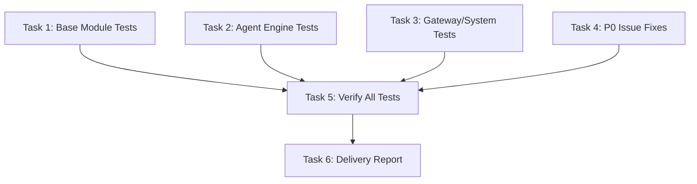

# Tasks: v1.0 Release Readiness

## Task Dependency Graph

## Parallel Execution Groups

- **Group A** (parallel): T1, T2, T3, T4

## Tasks

### Task 1: Base Module Tests
- **ID**: T1
- **Files**: `schemaplexai-common/src/test/java/**`, `schemaplexai-model/src/test/java/**`, `schemaplexai-dao/src/test/java/**`
- **Type**: test
- **Description**: Write unit tests for common, model, and dao modules
- **Acceptance Criteria**:
  - [x] Result, ResultCode, BaseException tested
  - [x] PageParam tested
  - [x] TenantContextHolder tested
  - [x] BaseEntity tested
  - [x] All tests pass with `mvn test -pl schemaplexai-common,schemaplexai-model,schemaplexai-dao`
- **Estimated Hours**: 3h
- **Dependencies**: None
- **Status**: completed

### Task 2: Agent Engine Tests
- **ID**: T2
- **Files**: `schemaplexai-agent-engine/src/test/java/**`
- **Type**: test
- **Description**: Write comprehensive tests for agent-engine core components
- **Acceptance Criteria**:
  - [x] ToolRegistry tested (register, resolve, parse, whitelist)
  - [x] ToolSafetyGuard tested (all 4 dimensions)
  - [x] TokenBudget tested (consume, exceed, remaining)
  - [x] AgentLoopDetectionService tested (hash loop, tool sequence)
  - [x] SecurityPolicyLoader tested (cache, default policy)
  - [x] State machine transitions tested
  - [x] All tests pass with `mvn test -pl schemaplexai-agent-engine`
- **Estimated Hours**: 4h
- **Dependencies**: None
- **Status**: completed

### Task 3: Gateway/System Tests
- **ID**: T3
- **Files**: `schemaplexai-gateway/src/test/java/**`, `schemaplexai-system/src/test/java/**`
- **Type**: test
- **Description**: Write tests for gateway filters and system services
- **Acceptance Criteria**:
  - [x] JWT filter tested
  - [x] Tenant filter tested
  - [x] Rate limiter tested
  - [x] Auth service tested
  - [x] All tests pass with `mvn test -pl schemaplexai-gateway,schemaplexai-system`
- **Estimated Hours**: 3h
- **Dependencies**: None
- **Status**: completed

### Task 4: P0 Issue Fixes
- **ID**: T4
- **Files**: Various per CODE_REVIEW_REPORT.md
- **Type**: fix
- **Description**: Fix all P0 blocking issues from code review
- **Acceptance Criteria**:
  - [x] All P0 issues resolved
  - [x] `mvn clean compile` passes
  - [x] No regression in existing functionality
- **Estimated Hours**: 4h
- **Dependencies**: None
- **Status**: completed

### Task 5: Verify All Tests
- **ID**: T5
- **Files**: All modules
- **Type**: verify
- **Description**: Run full test suite and verify coverage
- **Acceptance Criteria**:
  - [x] `mvn clean test` passes (0 failures)
  - [x] Coverage >= 80% for core modules
- **Estimated Hours**: 1h
- **Dependencies**: T1, T2, T3, T4
- **Status**: completed

### Task 6: Delivery Report
- **ID**: T6
- **Files**: `.claude/changes/v1-release-readiness/delivery-report.md`
- **Type**: docs
- **Description**: Write delivery report with test results and coverage
- **Acceptance Criteria**:
  - [x] delivery-report.md written
  - [x] Test pass/fail counts documented
  - [x] Coverage percentages documented
- **Estimated Hours**: 0.5h
- **Dependencies**: T5
- **Status**: completed
