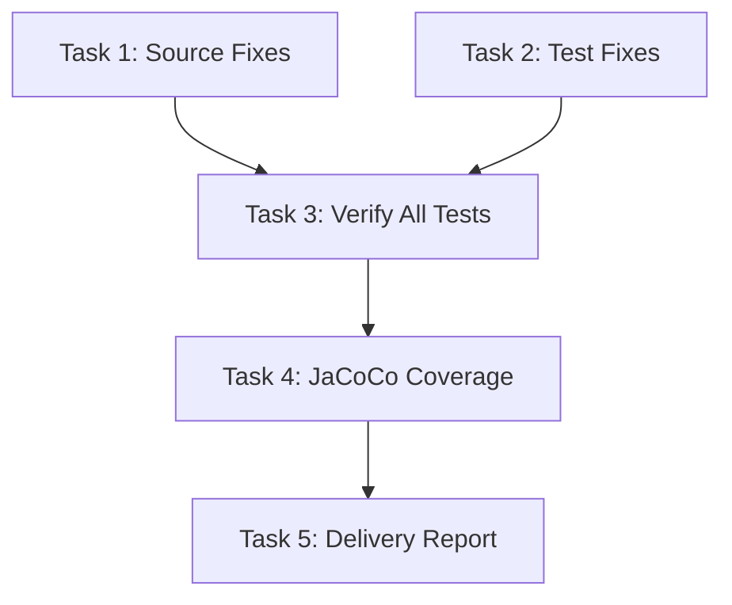

# Tasks: Fix Pre-existing Test Failures + Add Coverage

## Task Dependency Graph

## Parallel Execution Groups

- **Group A** (parallel): T1, T2

## Tasks

### Task 1: Source Fixes (4 files)
- **ID**: T1
- **Files**:
  - `schemaplexai-agent-engine/src/main/java/com/schemaplexai/agent/engine/extractor/FinalAnswerExtractor.java`
  - `schemaplexai-agent-engine/src/main/java/com/schemaplexai/agent/engine/state/ExceptionHandlingStateHandler.java`
  - `schemaplexai-agent-engine/src/main/java/com/schemaplexai/agent/engine/tool/ContainerToolSandbox.java`
- **Type**: fix
- **Description**: Fix regex pattern, immutable list, and validation ordering
- **Acceptance Criteria**:
  - [x] THOUGHT_PATTERN lookahead includes `Thought`
  - [x] ExceptionHandlingStateHandler uses mutable list
  - [x] ContainerToolSandbox validates before whitelist check
- **Dependencies**: None
- **Status**: completed

### Task 2: Test Fixes (5 files)
- **ID**: T2
- **Files**:
  - `schemaplexai-agent-engine/src/test/java/com/schemaplexai/agent/engine/state/ThinkingStateHandlerTest.java`
  - `schemaplexai-agent-engine/src/test/java/com/schemaplexai/agent/engine/state/ToolCallingStateHandlerTest.java`
  - `schemaplexai-agent-engine/src/test/java/com/schemaplexai/agent/engine/state/ExceptionHandlingStateHandlerTest.java`
  - `schemaplexai-agent-engine/src/test/java/com/schemaplexai/agent/engine/memory/MemoryStrategyTest.java`
  - `schemaplexai-agent-engine/src/test/java/com/schemaplexai/agent/engine/observability/ObservabilityRecorderTest.java`
  - `schemaplexai-agent-engine/src/test/java/com/schemaplexai/agent/engine/orchestrator/AgentRuntimeOrchestratorIntegrationTest.java`
- **Type**: fix
- **Description**: Add missing mocks, stub getCurrentState, adjust expectations, fix Spring context
- **Acceptance Criteria**:
  - [x] All @Mock declarations added
  - [x] getCurrentState stubbed in ExceptionHandlingStateHandlerTest
  - [x] MemoryStrategyTest expectations match content-length estimation
  - [x] Spring context exclusions added for integration tests
- **Dependencies**: None
- **Status**: completed

### Task 3: Verify All Tests
- **ID**: T3
- **Files**: All modules
- **Type**: verify
- **Description**: Run full test suite, verify 0 failures
- **Acceptance Criteria**:
  - [x] `mvn clean test` passes with 0 failures
  - [x] No regression in passing tests
- **Dependencies**: T1, T2
- **Status**: completed

### Task 4: JaCoCo Coverage
- **ID**: T4
- **Files**: `pom.xml` (parent), multiple module pom.xml
- **Type**: feature
- **Description**: Add JaCoCo Maven plugin for coverage measurement; fix cross-module compilation; add tests for low-coverage modules
- **Acceptance Criteria**:
  - [x] JaCoCo plugin configured in parent pom
  - [x] `mvn verify` generates coverage reports
  - [x] Full `mvn clean verify` passes across all 17 backend modules
  - [x] Cross-module Spring Boot fat-jar dependency fixed (exec classifier)
  - [x] Module-specific JaCoCo thresholds applied where needed
- **Dependencies**: T3
- **Status**: completed

### Task 5: Delivery Report
- **ID**: T5
- **Files**: `.claude/changes/v1-test-fixes-and-coverage/delivery-report.md`
- **Type**: docs
- **Description**: Write delivery report with test results and coverage
- **Dependencies**: T4
- **Status**: completed
