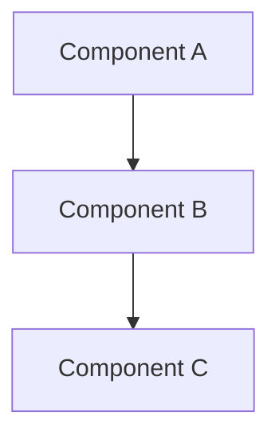
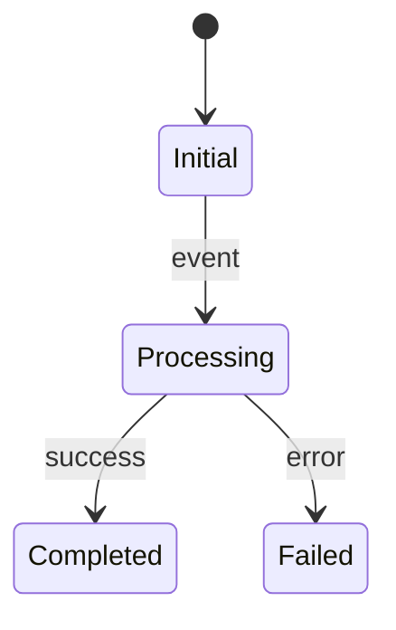

# Spec: wiki-gaps-completion

> 本 Spec 为执行层草稿，评审通过后沉淀到 `docs/specs/{{topic}}.md`

## 1. 概述

### 1.1 问题陈述

[引用 proposal.md 的问题描述]

### 1.2 范围

[引用 proposal.md 的范围]

### 1.3 非目标

[明确不做什么]

## 2. 架构视图

### 2.1 组件关系



### 2.2 数据流

[描述请求/数据如何流经系统]

## 3. 接口规格

### 3.1 API 列表

#### `POST /api/xxx/yyy`

**Request**:
```json
{
  "field": "type"
}
```

**Response (200)**:
```json
{
  "code": 200,
  "data": {},
  "message": "success"
}
```

**Error Codes**:

| Code | Message | 场景 |
|------|---------|------|
| | | |

## 4. 数据模型

### 4.1 数据库变更

| 表名 | 操作 | 说明 |
|------|------|------|
| | | |

### 4.2 Entity / DTO / VO

```java
// 示例
public class XxxDTO {
    private Long id;
    // ...
}
```

## 5. 状态机（如有）



## 6. 异常场景

| 场景 | 输入/条件 | 预期行为 | 错误码 |
|------|----------|---------|--------|
| | | | |

## 7. 非功能需求

### 7.1 性能

- QPS 目标:
- 延迟目标 (P99):
- 并发目标:

### 7.2 安全

- [ ] 输入验证策略
- [ ] 权限控制点
- [ ] 敏感数据处理

### 7.3 兼容性

- [ ] 是否破坏现有 API？
- [ ] 是否需要数据库迁移？
- [ ] 是否需要前端配合？

## 8. 风险与回退

| 风险 | 影响 | 缓解 | 回退方案 |
|------|------|------|---------|
| | | | |

## 9. 相关文档

- Proposal: `.claude/changes/wiki-gaps-completion/proposal.md`
- Design: `.claude/changes/wiki-gaps-completion/design.md`
- Plan: `.claude/changes/wiki-gaps-completion/tasks.md`
- ADR: `docs/decisions/ADR-NNN-xxx.md`
