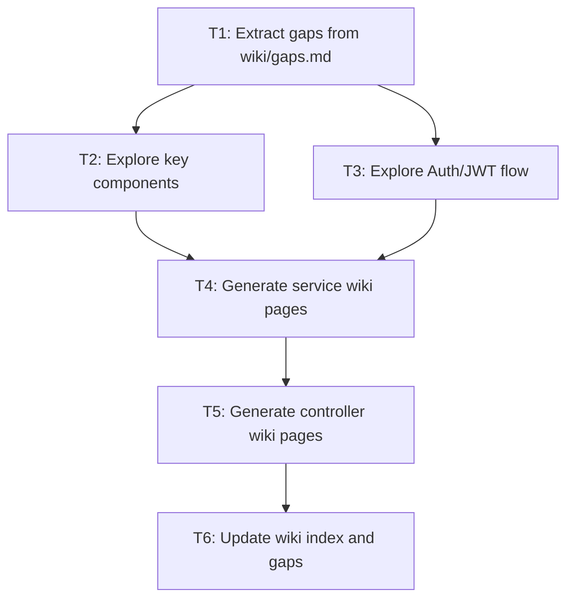

# Plan: wiki-gaps-completion

## 任务图（Graphify）



## 可并行执行组

> 同一组内的任务无依赖，可并行执行（多 agent / worktree）

| 组 | 任务 | 依赖前置 |
|----|------|---------|
| Group A | T1, T2, T3 | 无 |
| Group B | T4, T5 | T1, T2, T3 |
| Group C | T6 | T4, T5 |

## 任务清单

### Task 1: Extract gaps from wiki/gaps.md
- **ID**: T1
- **文件**: `wiki/gaps.md`
- **类型**: 文档 / 探索
- **描述**: 读取 wiki/gaps.md，提取所有 Undocumented Schema Elements、Controllers、Services 和 Open Questions
- **验收标准**:
  - [x] 提取所有 Undocumented Schema Elements（5 项）
  - [x] 提取所有 Undocumented Controllers（30+ 项）
  - [x] 提取所有 Undocumented Services（4+ 项）
  - [x] 提取所有 Open Questions（9 项）
- **预估工时**: 0.5h
- **依赖**: 无
- **状态**: ✅ completed

### Task 2: Explore core agent components
- **ID**: T2
- **文件**:
  - `schemaplexai-agent-engine/.../AgentRuntimeOrchestrator.java`
  - `schemaplexai-agent-engine/.../AgentExecutionLifecycleService.java`
  - `schemaplexai-agent-engine/.../AgentStateMachine.java`
  - `schemaplexai-agent-engine/.../ExecutionAdmissionService.java`
- **类型**: 探索
- **描述**: 读取核心 Agent 引擎源代码，理解编排逻辑、生命周期管理、状态机和准入控制
- **验收标准**:
  - [x] AgentRuntimeOrchestrator 执行流程已梳理
  - [x] AgentExecutionLifecycleService 方法签名已提取
  - [x] AgentStateMachine 状态和转换规则已记录
  - [x] ExecutionAdmissionService 准入维度已提取
- **预估工时**: 1h
- **依赖**: T1
- **状态**: ✅ completed

### Task 3: Explore Auth/JWT flow
- **ID**: T3
- **文件**:
  - `schemaplexai-gateway/.../JwtAuthFilter.java`
  - `schemaplexai-system/.../AuthController.java`
  - `schemaplexai-system/.../AuthService.java`
  - `schemaplexai-dao/.../TenantLineInterceptor.java`
- **类型**: 探索
- **描述**: 读取认证授权相关源代码，理解 JWT 验证流程、登录逻辑和多租户隔离机制
- **验收标准**:
  - [x] JwtAuthFilter 白名单和验证逻辑已提取
  - [x] AuthService 登录/刷新/登出/黑名单逻辑已提取
  - [x] TenantLineInterceptor 租户隔离机制已记录
  - [x] CommonConstants 中相关常量已提取
- **预估工时**: 1h
- **依赖**: T1
- **状态**: ✅ completed

### Task 4: Generate service wiki pages
- **ID**: T4
- **文件**:
  - `wiki/services/agent-runtime-orchestrator.md` ✅
  - `wiki/services/agent-execution-lifecycle-service.md` ✅
  - `wiki/services/agent-state-machine.md` ✅
  - `wiki/services/execution-admission-service.md` ✅
  - `wiki/services/jwt-auth-filter.md` ✅
  - `wiki/services/auth-service.md` ✅
  - `wiki/services/tenant-line-interceptor.md` ✅
- **类型**: 文档
- **描述**: 基于源代码探索结果，生成 YAML front-matter 格式的 service wiki 页面
- **验收标准**:
  - [x] 所有 7 个 service wiki 页面已生成
  - [x] 每个页面包含：职责、关键代码、依赖、Backlinks
  - [x] YAML front-matter 格式正确
- **预估工时**: 1.5h
- **依赖**: T2, T3
- **状态**: ✅ completed

### Task 5: Generate controller wiki pages
- **ID**: T5
- **文件**:
  - `wiki/controllers/auth-controller.md` ✅
- **类型**: 文档
- **描述**: 基于源代码探索结果，生成 YAML front-matter 格式的 controller wiki 页面（AuthController 已存在 stub，需要补充）
- **验收标准**:
  - [x] AuthController wiki 页面已补充完整
  - [x] 包含端点表格、请求/响应示例、依赖、Backlinks
- **预估工时**: 0.5h
- **依赖**: T3
- **状态**: ✅ completed

### Task 6: Update wiki index and gaps
- **ID**: T6
- **文件**:
  - `wiki/index.md`
  - `wiki/gaps.md`
- **类型**: 文档
- **描述**: 更新 wiki 索引，添加新页面链接；更新 gaps.md，标记已补全的项
- **验收标准**:
  - [ ] wiki/index.md 添加新 service 和 controller 链接
  - [ ] wiki/gaps.md 标记已补全的项
  - [ ] wiki/log.md 记录本次更新
- **预估工时**: 0.5h
- **依赖**: T4, T5
- **状态**: ✅ completed

## 关键路径

```
T1 → T2 → T4 → T6
  └→ T3 ─┘     ↑
         └→ T5 ─┘
```

**关键路径总时长**: 3.5h
**理论最短时长**（全并行）: 2.5h

## 风险与缓冲

| 风险任务 | 风险描述 | 缓冲策略 |
|---------|---------|---------|
| T2 | Agent 引擎代码复杂，可能遗漏细节 | 与现有 wiki/services/agent-execution-engine.md 交叉验证 |
| T3 | JWT 相关类分散在多个模块 | 按调用链顺序读取（Filter → Controller → Service） |
| T6 | 索引更新可能遗漏 backlink | 使用 grep 验证所有新页面被引用 |

## 回退方案

如果延期或失败：
1. 优先完成 T4（service 页面），controller 页面可延后
2. 简化 wiki 页面内容，保留核心信息即可
3. 将剩余 gaps 标记为 "deferred" 并记录原因

## 质量门禁

- [x] 每个任务完成后自测
- [ ] 代码变更 > 30 行触发 /verify-change（N/A，纯文档）
- [ ] 代码变更 > 30 行触发 /verify-quality（N/A，纯文档）
- [ ] 涉及安全敏感代码触发 /verify-security（N/A，纯文档）
- [ ] 最终 Code Review（code-reviewer agent）
- [ ] 后端变更：目标模块 pom.xml 已包含 schemaplexai-dao 及必要依赖（N/A）
- [ ] 前端变更：cd schemaplexai-ui && npm run lint 通过（N/A）

## 文档同步任务

- [x] 更新 `wiki/services/`（新增 7 个 service 页面）
- [x] 更新 `wiki/controllers/`（补充 AuthController）
- [x] 更新 `wiki/index.md`（添加新页面链接）
- [x] 更新 `wiki/gaps.md`（标记已补全项）
- [x] 更新 `wiki/log.md`（记录本次更新）
