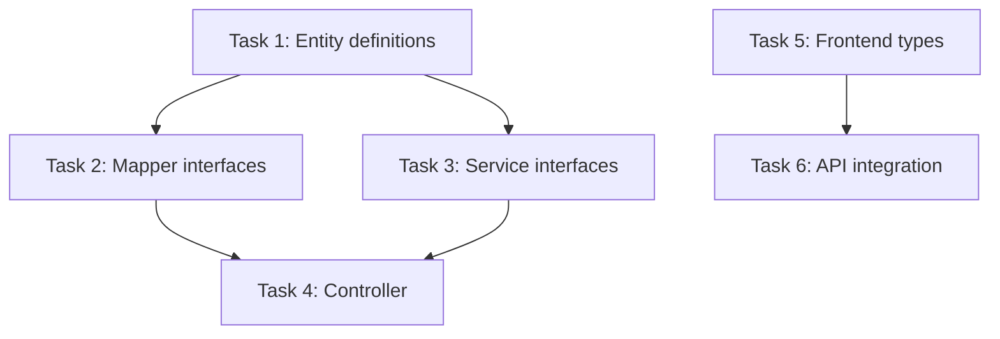

# SchemaPlexAI Claude Code Workflow — Full Guide

> This file holds all detailed workflow descriptions removed from the lean quick-reference files (`CLAUDE.md`, `CLAUDE-DEVELOPER.md`, `CLAUDE-DEVELOPER-v2.md`). Read on demand.

---

## 1. Layered Context Architecture

```
Layer 1: CLAUDE.md                          ← Project constitution (always loaded)
Layer 2: CLAUDE-DEVELOPER.md / -v2.md       ← Workflow protocol (load on demand)
Layer 3: wiki/*.md                          ← Domain knowledge (load on demand)
Layer 4: .claude/changes/<feat>/spec.md     ← Task spec context (sub-agents MUST read)
Layer 5: .claude/changes/<feat>/context.md  ← Task execution context
```

**Harness principle**: Keep Layer 1 lean (project facts only). Move all procedural details to Layer 2. Move all domain knowledge to Layer 3. This maximizes the context window available for the actual task at hand.

---

## 2. Six-Phase Change Lifecycle

All changes execute in `.claude/changes/<feat>/`.

### v1 (Generic Agent): Propose → Spec → Design → Plan → Apply → Archive

| Phase | Trigger | Output | Gate |
|-------|---------|--------|------|
| **Propose** | "I want to build X" | `proposal.md` | Developer confirms scope |
| **Spec** | Proposal confirmed | `spec.md` | >200 lines: human review; <200: self-review |
| **Design** | Spec confirmed + architecture change | `design.md` | `architect` agent review |
| **Plan** | Spec/Design confirmed | `tasks.md` (Graphify graph) | Developer confirms decomposition |
| **Apply** | Plan confirmed | Code + tests | `/verify-*` for >30 lines; TDD RED→GREEN→REFACTOR |
| **Archive** | PR merged | `.claude/changes/archive/` + updated `docs/` + `wiki/` | — |

### v2 (Superpowers + OpenSpec): Propose → Review → Design → Build → Deliver → Archive

| Phase | Trigger | Output | Key Tool |
|-------|---------|--------|----------|
| **Propose** | `/opsx:propose "desc"` | `proposal.md` + `spec.md` (draft) | OpenSpec |
| **Review** | Propose done | Approved/Modified/Rejected | Human |
| **Design** | Review passed | `tasks.md` (Graphify graph) | `/brainstorming` → `/writing-plans` |
| **Build** | Design confirmed | Code + tests | `/tdd` + executor sub-agents |
| **Deliver** | Build done | Verified artifact | `/verify-*` + CI + Code Review |
| **Archive** | PR merged | `archive/` + `docs/` + `wiki/` | `/opsx:archive` |

### Phase Details

**Propose**: Create `.claude/changes/<feat>/proposal.md` with problem, goal, scope, impact assessment. Skip for <50 lines. In v2, also generates a draft `spec.md` (秘格) + `context.md`, pre-warming from `wiki/` and `docs/specs/`.

**Spec/Review**: Write `.claude/changes/<feat>/spec.md` with: overview, architecture view, API specs, data model, state machine (if any), error scenarios, performance targets. Sync to `docs/specs/<topic>.md` for public contract changes.

**Design**: Write `.claude/changes/<feat>/design.md` with C4 diagrams, module boundaries, data flow, deployment considerations. Create ADR if new architectural decision. In v2, this phase is replaced by `/brainstorming` (explore options → `notes/brainstorming.md`) then `/writing-plans` (Graphify task graph → `tasks.md`).

**Plan**: Decompose into Graphify task graph in `.claude/changes/<feat>/tasks.md`. Each task ≤ 4 hours, with acceptance criteria. Identify parallel task groups. In v2, this is part of the Design phase output.

**Apply/Build**: `git checkout -b feature/<feat>`. Use `EnterWorktree` for complex changes. Execute tasks: parallel independent groups via OMC multi-agent, serial tasks sequentially. TDD for every task. In v2, sub-agents must read `.claude/changes/<feat>/spec.md` before executing. >30 lines: trigger `/verify-change`, `/verify-quality`, `/verify-security`.

**Deliver** (v2 only): Self-test (unit + integration + manual golden path + boundary + multi-tenant). Verification gate: `/verify-change`, `/verify-quality`, `/verify-security`, ≥80% coverage. Code Review: `code-reviewer` agent (general), `security-reviewer` agent (security-sensitive). CI gate: `mvn test`, `mvn jacoco:check`, `npm run test:run`. Must pass all gates before Archive.

**Archive**: Run `.claude/workflow/scripts/change-archive.sh <feat>`. Move to `archive/`. Sync spec/design to `docs/`. Update `wiki/log.md` and `wiki/gaps.md`.

---

## 3. Graphify Task Graph Structure

`tasks.md` uses a graph structure rather than a flat list:

```markdown
## Task Graph



## Parallel Groups

- Group 1: Tasks 1, 5 (independent, can run in parallel)
- Group 2: Tasks 2, 3 (depend on Task 1, can run in parallel)
- Group 3: Task 4 (depends on Tasks 2, 3)
- Group 4: Task 6 (depends on Task 5)

## Task List

### Task 1: Entity definitions
- **Duration**: ≤ 4h
- **Acceptance**: All entities extend BaseEntity, fields match spec, @TableName correct
- **Files**: `schemaplexai-model/.../entity/*.java`

...
```

---

## 4. Harness Efficiency Levers

### Layered Context

- **Project level** (`CLAUDE.md`): Tech stack, service map, key patterns, document boundaries.
- **Module level** (`CLAUDE-DEVELOPER.md`): Workflow protocol, commands, standards mapping.
- **Task level** (`.claude/changes/<feat>/context.md`): Feature-specific context, decisions, open questions.

Never duplicate content across layers. If a fact changes (e.g., new service added), update `CLAUDE.md` only. If workflow changes, update `CLAUDE-DEVELOPER.md` only.

### Worktree Isolation

For changes touching ≥3 modules or ≥10 files, use `EnterWorktree` to isolate the change from the main working tree. This prevents:
- Accidental commits of unrelated changes
- Stash pollution during long-running changes
- Branch confusion when context-switching

### Agent Specialization

| Phase | Recommended Agent | Why |
|-------|-------------------|-----|
| Propose | `planner` | Scope alignment, risk assessment |
| Design | `architect` | C4 diagrams, module boundaries |
| Build | `executor` (opus) | Complex multi-file implementation |
| Review | `code-reviewer` + `security-reviewer` | Quality + security gates |
| Debug | `build-error-resolver` | Incremental fix, verify after each |

### Continuous Context Refinement

After each change cycle, update:
- `wiki/log.md` — what was built, what was learned, what changed
- `wiki/gaps.md` — new undocumented areas discovered during implementation
- `wiki/active-areas.md` — current hotspots

---

## 5. Command Reference

### v1 Commands

| Command | Phase | Action |
|---------|-------|--------|
| `/propose <desc>` | Propose | Initialize change |
| `/spec` | Spec | Generate spec from proposal |
| `/design` | Design | Generate architecture design |
| `/plan` | Plan | Decompose to Graphify task graph |
| `/apply` | Apply | Execute tasks |
| `/status` | Any | Show active changes |
| `/archive <feat>` | Archive | Archive completed change |

### v2 Commands

| Command | Phase | Tool | Action |
|---------|-------|------|--------|
| `/opsx:propose "desc"` | Propose | OpenSpec | Init change, generate proposal + spec draft |
| `/brainstorming` | Design | Superpowers | Explore implementation options |
| `/writing-plans` | Design | Superpowers | Generate Graphify task graph |
| `/tdd` | Build | Superpowers | TDD execution |
| `/verify-change` | Build/Deliver | Superpowers/CCG | Impact analysis |
| `/verify-quality` | Build/Deliver | Superpowers/CCG | Complexity/code smells |
| `/verify-security` | Build/Deliver | Superpowers/CCG | Security scan |
| `/opsx:archive` | Archive | OpenSpec | Archive change, sync specs |
| `.claude/workflow/scripts/change-status.sh` | Any | Custom | Show active changes |

---

## 6. Skip Rules

| Scenario | Can Skip | Must Keep |
|----------|----------|-----------|
| < 50 lines code change | Propose, Design | tasks.md + Apply |
| Bug fix (root cause known) | Propose | tasks.md + Apply + Archive |
| Pure frontend UI adjustment | Design | Spec (simplified) + tasks + Apply |
| > 200 lines or cross-module | — | Full six-phase |
| New service/module | — | Full six-phase + ADR |

---

## 7. v1 vs v2 Selection Guide

| Scenario | Use |
|----------|-----|
| Superpowers + OpenSpec installed | **v2** (`CLAUDE-DEVELOPER-v2.md`) |
| Generic agent only | v1 (`CLAUDE-DEVELOPER.md`) |
| In-progress v1 change | Continue v1, no migration needed |

Both versions share the same `.claude/changes/<feat>/` directory structure and the same `docs/` → `wiki/` → `.claude/` layer boundaries. Only the command set and phase naming differ.

---

## 8. Troubleshooting

### "No active changes" on startup

The `SessionStart` hook runs `.claude/workflow/scripts/change-status.sh`. If no `.claude/changes/*/` directories exist (excluding `archive/`), this is expected. Start a change with `.claude/workflow/scripts/change-init.sh <feat>`.

### Plugin output goes to wrong place

Plugin-generated plans/specs are drafts. They must be:
1. Output to `.claude/changes/<feat>/plugin-output/` (or plugin cache)
2. Reviewed and integrated into `spec.md`, `design.md`, `tasks.md`
3. After review, synced to `docs/specs/`, `docs/designs/`, `docs/plans/`

Never allow plugin output to write directly to `docs/` root or create plugin-specific subdirectories under `docs/`.

### Agent context bloat

If an agent seems confused by too much context:
1. Check that `CLAUDE.md` is ≤ 150 lines.
2. Check that `CLAUDE-DEVELOPER.md` / `CLAUDE-DEVELOPER-v2.md` are ≤ 120 lines.
3. Check that no procedural text is duplicated between files.
4. If still bloated, move more content to `wiki/` or this GUIDE.md.

### Worktree conflicts

If `EnterWorktree` fails:
1. Check `git worktree list` for orphaned worktrees.
2. Clean up with `git worktree remove <path>`.
3. Ensure the branch name does not already exist.
