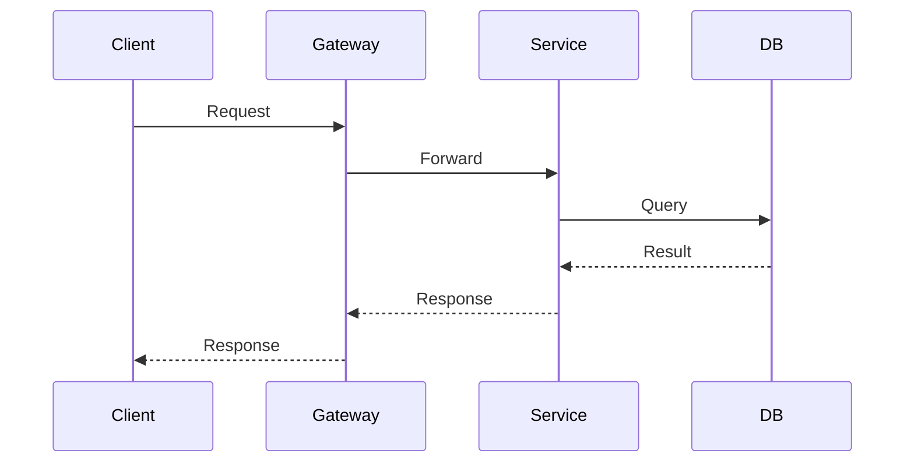

# Design: {{Feature Title}}

> 本 Design 为执行层草稿，评审通过后沉淀到 `docs/designs/{{topic}}.md`。若引入新架构决策，同步创建 ADR。

## 1. 设计目标

[引用 Spec 中的架构目标]

## 2. 架构图

### 2.1 C4 Context

[系统上下文图]

### 2.2 C4 Container

[容器/服务边界图]

### 2.3 C4 Component

[组件级别图]

## 3. 模块边界

| 模块 | 职责 | 暴露接口 | 依赖 |
|------|------|---------|------|
| | | | |

## 4. 数据流

## 5. 关键技术决策

| 决策 | 选项 A | 选项 B | 选择 | 原因 |
|------|--------|--------|------|------|
| | | | | |

## 6. 部署与运维

- [ ] 新服务是否需要 Docker 配置？
- [ ] 是否需要新增环境变量？
- [ ] 是否需要更新 docker-compose？
- [ ] 是否需要配置变更（Nginx/Gateway 路由）？

## 7. 相关文档

- Spec: `.claude/changes/{{feature-name}}/spec.md`
- ADR: `docs/decisions/ADR-NNN-xxx.md`
- 关联 wiki: `wiki/services/...`
