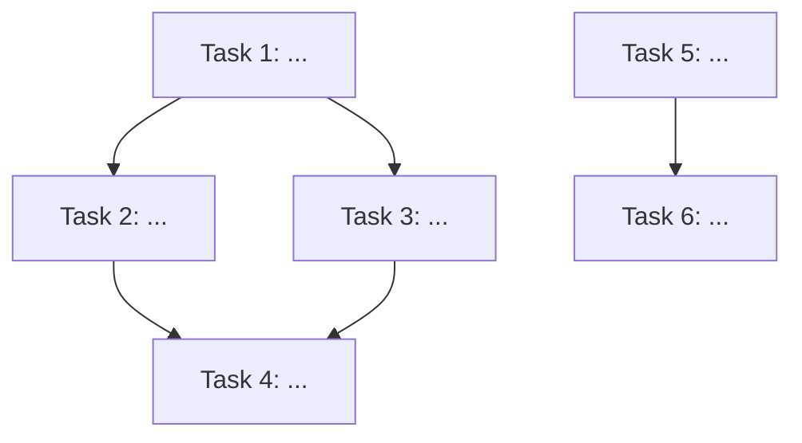

# Plan: {{Feature Title}}

## 任务图（Graphify）



## 可并行执行组

> 同一组内的任务无依赖，可并行执行（多 agent / worktree）

| 组 | 任务 | 依赖前置 |
|----|------|---------|
| Group A | Task 1, Task 5 | 无 |
| Group B | Task 2, Task 3 | Task 1 |
| Group C | Task 4 | Task 2, Task 3 |
| Group D | Task 6 | Task 5 |

## 任务清单

### Task 1: [标题]
- **ID**: T1
- **文件**: `路径/到/文件`
- **类型**: 新增 / 修改 / 删除 / 测试 / 文档
- **描述**:
- **验收标准**:
  - [ ] 标准 1
  - [ ] 标准 2
- **预估工时**: Xh
- **依赖**: 无 / T?
- **状态**: ⬜ pending / 🟡 in_progress / ✅ completed

### Task 2: [标题]
- **ID**: T2
- **文件**:
- **类型**:
- **描述**:
- **验收标准**:
  - [ ]
- **预估工时**: Xh
- **依赖**: T?
- **状态**: ⬜

### Task 3: [标题]
- **ID**: T3
- **文件**:
- **类型**:
- **描述**:
- **验收标准**:
  - [ ]
- **预估工时**: Xh
- **依赖**: T?
- **状态**: ⬜

## 关键路径

```
Task 1 → Task 2 → Task 4 → Task 6
     └──→ Task 3 ──┘
```

**关键路径总时长**: Xh
**理论最短时长**（全并行）: Xh

## 风险与缓冲

| 风险任务 | 风险描述 | 缓冲策略 |
|---------|---------|---------|
| | | |

## 回退方案

如果延期或失败：
1.
2.

## 质量门禁

- [ ] 每个任务完成后自测
- [ ] 代码变更 > 30 行触发 /verify-change
- [ ] 代码变更 > 30 行触发 /verify-quality
- [ ] 涉及安全敏感代码触发 /verify-security
- [ ] 最终 Code Review（code-reviewer agent）
- [ ] 后端变更：目标模块 pom.xml 已包含 schemaplexai-dao 及必要依赖
- [ ] 前端变更：cd schemaplexai-ui && npm run lint 通过

## 文档同步任务

- [ ] 更新 `docs/specs/...`（如公共接口变更）
- [ ] 更新 `wiki/...`（如新实体/服务）
- [ ] 更新 `wiki/log.md`
