# C4 Level 2 - Container Diagram

> SchemaPlexAI system container view: 16 Maven modules, external infrastructure, and communication patterns.

## Diagram

```mermaid
graph TB
    %% ── External Actors ──
    User["👤 User / Admin<br/><i>Browser</i>"]
    ExternalCI["🔗 GitHub / GitLab / Jenkins<br/><i>External CI/CD</i>"]

    %% ── Frontend ──
    subgraph frontend ["Frontend"]
        UI["schemaplexai-ui<br/><i>React 18 + TS 5.5 + Vite</i><br/>Port :5173 (dev)"]
    end

    %% ── Gateway ──
    GW["schemaplexai-gateway<br/><i>Spring Cloud Gateway</i><br/>Port 8080<br/>JWT / Tenant / Rate Limit / CORS"]

    %% ── Shared Libraries ──
    subgraph shared ["Shared Libraries (no runtime port)"]
        COMMON["schemaplexai-common<br/><i>BaseEntity, BaseController,<br/>Result, TenantContext</i>"]
        MODEL["schemaplexai-model<br/><i>Domain entities, DTOs</i>"]
        DAO["schemaplexai-dao<br/><i>MyBatis-Plus mappers</i>"]
        TASK["schemaplexai-task<br/><i>MQ consumers, schedulers</i>"]
    end

    %% ── Business Services ──
    subgraph services ["Business Services"]
        SYS["schemaplexai-system<br/><i>Tenant / User / Role / Permission</i><br/>Port 8081"]
        WEB["schemaplexai-web<br/><i>REST Controllers / SSE / WS<br/>Knife4j OpenAPI</i><br/>Port 8082"]
        AGENT_CFG["schemaplexai-agent-config<br/><i>Agent definitions / configs</i><br/>Port 8083"]
        AGENT_ENG["schemaplexai-agent-engine<br/><i>LLM orchestration / State machine<br/>Token budget / Tool calling</i><br/>Port 8084"]
        CTX["schemaplexai-context<br/><i>RAG / Vector search / Ingestion</i><br/>Port 8085"]
        SPEC["schemaplexai-spec<br/><i>Spec docs / Reviews / Templates</i><br/>Port 8086"]
        WF["schemaplexai-workflow<br/><i>Flowable BPMN / AI nodes</i><br/>Port 8087"]
        INTG["schemaplexai-integration<br/><i>GitHub / GitLab / Jenkins / MCP</i><br/>Port 8088"]
        OPS["schemaplexai-ops<br/><i>Artifacts / Cost analytics / Notify</i><br/>Port 8089"]
        QUAL["schemaplexai-quality<br/><i>Drift detection / Security audit</i><br/>Port 8090"]
    end

    %% ── Admin Module ──
    subgraph admin ["Admin Module (placeholder)"]
        ADMIN["schemaplexai-admin<br/><i>6 backend services:<br/>AuditLog, PlatformHealth, RoleAdmin,<br/>SystemConfig, TenantAdmin, UserAdmin</i>"]
    end

    %% ── External Infrastructure ──
    subgraph infra ["External Infrastructure"]
        PG[("PostgreSQL 16<br/><i>OLTP / Multi-tenant</i>")]
        CH[("ClickHouse 24<br/><i>Cost analytics (v1.1)</i>")]
        REDIS[("Redis 7<br/><i>Cache / Session / Rate limit</i>")]
        MQ{{"RabbitMQ 3.12<br/><i>Async jobs / Events</i>"}}
        MILVUS[("Milvus 2.3.5<br/><i>Vector embeddings</i>")]
        MINIO[("MinIO<br/><i>Object storage</i>")]
        ES[("Elasticsearch 8<br/><i>Logs / Audit search</i>")]
    end

    subgraph observability ["Observability Stack"]
        PROM["Prometheus<br/><i>Metrics</i>"]
        GRAF["Grafana<br/><i>Dashboards</i>"]
        JAEGER["Jaeger<br/><i>Distributed tracing</i>"]
        ELK["ELK Stack<br/><i>Centralized logging</i>"]
    end

    %% ── Module Dependencies (shared libs) ──
    MODEL --> COMMON
    DAO --> COMMON
    DAO --> MODEL
    TASK --> COMMON
    TASK --> MODEL
    TASK --> DAO

    %% ── Service → Shared Libs ──
    SYS --> DAO
    WEB --> DAO
    AGENT_CFG --> DAO
    AGENT_ENG --> DAO
    CTX --> DAO
    SPEC --> DAO
    WF --> DAO
    INTG --> DAO
    OPS --> DAO
    QUAL --> DAO
    ADMIN --> DAO

    %% ── User → Frontend ──
    User --> UI

    %% ── Frontend → Gateway ──
    UI -->|"HTTPS / REST / SSE / WS"| GW

    %% ── Gateway → Services (HTTP routing) ──
    GW -->|"/system/**"| SYS
    GW -->|"/web/**, /sse/**, /ws/**"| WEB
    GW -->|"/agent-config/**"| AGENT_CFG
    GW -->|"/agent/**"| AGENT_ENG
    GW -->|"/context/**"| CTX
    GW -->|"/spec/**"| SPEC
    GW -->|"/workflow/**"| WF
    GW -->|"/integration/**"| INTG
    GW -->|"/ops/**"| OPS
    GW -->|"/quality/**"| QUAL

    %% ── Service ↔ Service (internal REST via OpenFeign) ──
    WEB -.->|"internal REST"| AGENT_ENG
    WEB -.->|"internal REST"| AGENT_CFG
    WEB -.->|"internal REST"| CTX
    WEB -.->|"internal REST"| SPEC
    WEB -.->|"internal REST"| WF
    WEB -.->|"internal REST"| OPS
    AGENT_ENG -.->|"internal REST"| AGENT_CFG
    AGENT_ENG -.->|"internal REST"| CTX
    AGENT_ENG -.->|"internal REST"| QUAL
    WF -.->|"internal REST"| AGENT_ENG
    INTG -.->|"internal REST"| AGENT_ENG
    OPS -.->|"internal REST"| AGENT_ENG
    QUAL -.->|"internal REST"| AGENT_ENG

    %% ── Service → Infrastructure ──
    SYS -->|"JDBC"| PG
    WEB -->|"JDBC"| PG
    AGENT_CFG -->|"JDBC"| PG
    AGENT_ENG -->|"JDBC"| PG
    CTX -->|"JDBC"| PG
    SPEC -->|"JDBC"| PG
    WF -->|"JDBC"| PG
    INTG -->|"JDBC"| PG
    OPS -->|"JDBC"| PG
    QUAL -->|"JDBC"| PG
    ADMIN -->|"JDBC"| PG

    OPS -.->|"JDBC (v1.1)"| CH
    AGENT_ENG -.->|"Timeline"| CH

    SYS -->|"Session / Cache"| REDIS
    GW -->|"Rate limit"| REDIS
    AGENT_ENG -->|"Chat memory L1"| REDIS
    OPS -->|"Cost cache"| REDIS

    TASK -->|"AMQP"| MQ
    AGENT_ENG -->|"Events"| MQ

    CTX -->|"Embeddings"| MILVUS
    AGENT_ENG -->|"RAG / Memory"| MILVUS

    CTX -->|"File storage"| MINIO

    GW -->|"Access logs"| ES
    QUAL -->|"Audit logs"| ES

    %% ── External CI/CD → Integration ──
    ExternalCI -->|"Webhooks"| INTG

    %% ── Observability ──
    GW --> PROM
    AGENT_ENG --> PROM
    SYS --> PROM
    PROM --> GRAF
    GW --> JAEGER
    AGENT_ENG --> JAEGER
    GW --> ELK

    %% ── Styles ──
    classDef service fill:#1168bd,stroke:#0b4884,color:#fff
    classDef shared fill:#999,stroke:#666,color:#fff
    classDef infra fill:#2d8844,stroke:#1a5c2e,color:#fff
    classDef obs fill:#8b5cf6,stroke:#6d28d9,color:#fff
    classDef frontend fill:#f59e0b,stroke:#d97706,color:#000
    classDef gw fill:#ef4444,stroke:#b91c1c,color:#fff

    class SYS,WEB,AGENT_CFG,AGENT_ENG,CTX,SPEC,WF,INTG,OPS,QUAL service
    class COMMON,MODEL,DAO,TASK shared
    class PG,CH,REDIS,MQ,MILVUS,MINIO,ES infra
    class PROM,GRAF,JAEGER,ELK obs
    class UI frontend
    class GW gw
```

## Module Summary

| # | Module | Port | Role | Key Tech |
|---|--------|------|------|----------|
| 1 | schemaplexai-common | -- | Base classes, Result, TenantContext, utils | Java 21 |
| 2 | schemaplexai-model | -- | Domain entities, DTOs, enums | MyBatis-Plus annotations |
| 3 | schemaplexai-dao | -- | MyBatis-Plus mappers (BaseMapperX) | MyBatis-Plus 3.5.5 |
| 4 | schemaplexai-task | -- | MQ consumers, scheduled jobs | RabbitMQ, Spring Scheduling |
| 5 | schemaplexai-gateway | 8080 | JWT auth, tenant resolution, rate limit, routing | Spring Cloud Gateway, Redis |
| 6 | schemaplexai-system | 8081 | Tenant, user, role, permission, AI model config | Spring Security, RBAC |
| 7 | schemaplexai-web | 8082 | BFF: REST controllers, SSE, WebSocket, Knife4j | Spring MVC, OpenAPI |
| 8 | schemaplexai-agent-config | 8083 | Agent definitions, shadow configs | MyBatis-Plus |
| 9 | schemaplexai-agent-engine | 8084 | LLM orchestration, state machine, token budget, tools | LangChain4j 0.31.0 |
| 10 | schemaplexai-context | 8085 | RAG, vector search, document ingestion, file storage | Milvus, MinIO, Tika |
| 11 | schemaplexai-spec | 8086 | Spec documents, templates, reviews, change tracking | -- |
| 12 | schemaplexai-workflow | 8087 | BPMN workflow engine, AI workflow nodes | Flowable 7.0.0 |
| 13 | schemaplexai-integration | 8088 | GitHub/GitLab/Jenkins, MCP server, skill registry | Webhooks, REST |
| 14 | schemaplexai-ops | 8089 | Artifacts, cost analytics, notifications | ClickHouse (v1.1), Redis |
| 15 | schemaplexai-quality | 8090 | Drift detection, security audit, quality gates | -- |
| 16 | schemaplexai-admin | -- | Admin backend (6 services, no frontend yet) | -- |

## Communication Patterns

| Pattern | Protocol | Used By |
|---------|----------|---------|
| External → Gateway | HTTPS (REST, SSE, WS) | Browser clients |
| Gateway → Services | HTTP (Spring Cloud LoadBalancer `lb://`) | All route-based forwarding |
| Service ↔ Service | Internal REST (OpenFeign) | Cross-domain queries |
| Async Events | AMQP (RabbitMQ, topic exchange, manual ack) | Task consumers, agent events |
| Real-time Push | SSE (`/sse/subscribe/{clientId}`), WebSocket (`/ws/**`) | Agent execution updates |
| Database | JDBC (PostgreSQL 16, multi-tenant via TenantLineInterceptor) | All business services |
| Cache | Redis 7 (session, rate limit, chat memory, cost cache) | Gateway, system, agent-engine, ops |
| Vector Store | Milvus 2.3.5 (gRPC) | context (ingestion), agent-engine (RAG) |
| Object Store | MinIO (S3-compatible) | context (file storage) |
| Analytics | ClickHouse 24 (deferred to v1.1) | ops (cost analytics), agent-engine (timeline) |
| Search | Elasticsearch 8 | Gateway (access logs), quality (audit) |

## References

- Architecture overview: `wiki/architecture.md`
- Dependency matrix: `wiki/dependencies.md`
- Service decomposition: `docs/decisions/ADR-001-service-decomposition.md`
- Domain decomposition: `docs/decisions/ADR-008-domain-decomposition.md`
- API Gateway design: `docs/decisions/ADR-007-api-gateway.md`
