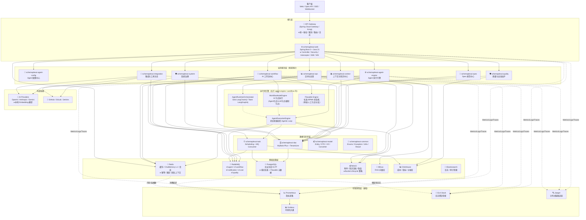
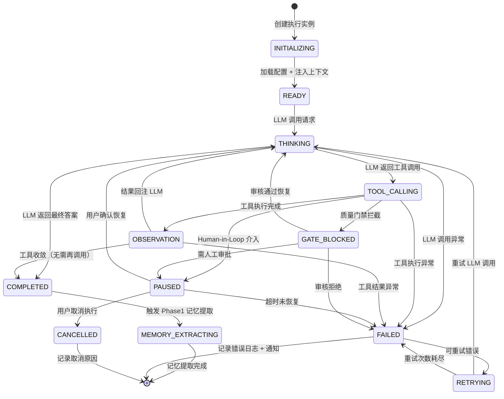

# SchemaPlexAI — 修订版架构设计文档

> **修订版本**：v1.1  
> **修订日期**：2026-04-29  
> **修订依据**：架构评审报告 v1.0  
> **状态**：评审通过，进入开发阶段

---

## 修订总览

| 修订项 | 原设计问题 | 修订内容 | 优先级 |
|--------|-----------|----------|--------|
| **系统架构** | 缺少 API Gateway；Service 层过于庞大 | 增加 API Gateway；按域拆分 Service | P0 |
| **可观测性** | 无监控告警层 | 增加 Prometheus + Grafana + ELK + Jaeger | P0 |
| **Agent 引擎** | `runAgenticLoop` 复杂度爆炸；无中断恢复 | 状态机重构；增加 PAUSED/RESUMED 状态；Token 预算管理 | P0 |
| **产品架构** | Agent 管理中心职责过重；工作台单薄 | 拆分为 Agent 配置域 + Agent 执行域；工作台合并至 Dashboard 聚合层 | P1 |
| **数据架构** | `sf_chat_message` 单表风险；ClickHouse 游标易失 | 按 `conversation_id` 分区 + 冷热分离；游标持久化到 PG | P1 |
| **一致性保障** | Milvus 与 PG 可能不一致；RabbitMQ 可能重复消费 | 消息队列异步同步 + 定时对账；幂等键去重 | P1 |
| **运维保障** | 无备份策略；Redis OOM 风险 | PG 主从 + 逻辑备份；Redis 记忆压缩 + 过期策略 | P2 |

---

## 一、产品架构修订

### 1.1 模块调整

```
SchemaPlexAI AI 研发协作平台
│
├── 🖥️ 工作台 / Dashboard（聚合层）          ← 修订：从独立一级模块变为聚合层
│   └── 监控概览 / 全局搜索 / 快捷入口
│
├── 🛡️ 系统治理
│   ├── 租户 / 用户 / 角色 / 权限 / 菜单
│   ├── AI 模型 / 模型组 / 模型供应商 / 路由降级    ← 新增：模型供应商管理
│   └── 字典 / 国际化 / 系统配置
│
├── 📖 Spec 规范中心
│   ├── requirements / design / tasks 文档
│   ├── 版本 / 模板 / 评审 / 审批 / 变更追踪
│   └── Steering 文档（Spec 的一种类型）          ← 明确：Steering 是 Spec 子类型
│
├── 🤖 Agent 配置中心（拆分自原 Agent 管理中心）     ← 修订：职责拆分
│   ├── Solo Agent / Team Agent（Lead + Sub-Agent）
│   ├── 模型 / 工具 / 上下文 / Hook / 运行模式配置
│   └── 执行记录 / 日志 / SSE 事件 / Human-in-Loop 查看
│
├── ⚙️ Agent 执行引擎（拆分自原 Agent 管理中心）     ← 新增：独立执行域
│   ├── AgentRuntimeOrchestrator（Solo / Team 编排）
│   ├── AgentExecutionEngine（状态机驱动的 Agentic Loop）
│   └── 准入控制 / 限流降级 / Token 预算 / 中断恢复
│
├── 🔀 AI 工作流中心
│   ├── 工作流模板 / 实例 / 触发器
│   ├── 节点编排（触发 / 文档 / Agent / 人工审批 / 质量 / 通知 / 制品）
│   └── Flowable 运行时（标准 BPMN）+ WorkflowNodeEngine（AI 节点）
│
├── 📚 上下文与知识中心
│   ├── 工作空间 / 分支 / Git 工作区
│   ├── 上下文库 / 快照 / 关系
│   └── 知识文档 / RAG 配置 / 向量检索
│
├── 🛡️ 质量与安全加护
│   ├── Spec 偏离检测 / 交叉评审 / 意图缺陷
│   ├── 安全策略 / 审计事件 / 事件处置 / 规则包
│   └── 审批中心 / 质量门禁
│
├── 🔧 集成与工具生态
│   ├── GitHub / GitLab / Jenkins / CI-CD
│   ├── MCP Server / 数据库源
│   └── 内置工具 / Skill / 插件市场 / API Gateway 管理
│
└── 📊 交付与运营
    ├── 制品 / 版本 / 交付记录
    ├── 站内信 / 邮件 / IM 通知
    ├── 预算 / Token 成本 / ClickHouse 报表
    └── 评测数据集 / 任务 / 结果
```

### 1.2 跨模块交互流（修订版）

```
系统治理（权限/租户/模型策略）
    │
    ├─控制流─→ Spec 规范中心 ───┐
    │                            │
    └─控制流─→ AI 工作流中心 ←───┤
                                  │ 编排节点并调度
    上下文与知识中心 ←──────────────┼──→ Agent 执行引擎 ←──→ 集成与工具生态
    (读取上下文/知识)              │      │                    (调用工具)
                                  │      ↓
                         质量与安全加护（门禁/审批/拦截/暂停/告警）
                                  │      │
                                  └──────┼────→ 交付与运营（日志/制品/成本）
                                         │
                                         └──→ 工作台 / Dashboard（聚合展示）
```

---

## 二、系统架构修订

### 2.1 修订版分层架构



### 2.2 关键修订说明

#### 修订 1：增加 API Gateway 层

```yaml
API Gateway 职责:
  - 统一入口: 所有客户端请求（Web/App/第三方）统一经过 Gateway
  - 鉴权前置: JWT 校验在 Gateway 完成，减少下游服务重复鉴权
  - 租户解析: X-Tenant-Id Header 解析并注入到请求上下文
  - 限流熔断: 基于 Redis 的全局限流（租户级/API级/IP级）
  - 路由转发: /api/v1/agents/* → agent-engine-service
  - 日志审计: 请求/响应日志统一记录到 Elasticsearch
  - SSE/WebSocket 代理: 支持长连接透传
```

#### 修订 2：按域拆分 Service 层

原 `schemaplexai-service` 拆分为 9 个独立可部署单元：

| 服务模块 | 职责 | 数据库访问范围 | 对外暴露 |
|----------|------|---------------|----------|
| `schemaplexai-system` | 租户/用户/角色/权限/菜单/模型/配置 | `sf_tenant`, `sf_user`, `sf_role`, `sf_permission`, `sf_ai_model`, `sf_config` | REST API |
| `schemaplexai-spec` | Spec 文档/版本/模板/评审/审批 | `sf_spec*`, `sf_approval*` | REST API |
| `schemaplexai-agent-config` | Agent 配置/模型绑定/工具注册 | `sf_agent`, `sf_agent_config`, `sf_tool*` | REST API |
| `schemaplexai-agent-engine` | Agent 执行引擎/运行时/编排 | `sf_agent_execution*`, `sf_chat_message*` | REST + SSE + MQ |
| `schemaplexai-workflow` | 工作流模板/实例/节点编排 | `sf_workflow*`, Flowable 表 | REST + MQ |
| `schemaplexai-context` | 上下文库/知识文档/RAG | `sf_workspace*`, `sf_context*`, `sf_knowledge_doc` | REST |
| `schemaplexai-quality` | 质量门禁/安全策略/审计 | `sf_quality*`, `sf_security*`, `sf_audit_event` | REST + MQ |
| `schemaplexai-integration` | Git/Jenkins/MCP/Skill/插件 | `sf_integration*`, `sf_skill`, `sf_mcp_server` | REST + Webhook |
| `schemaplexai-ops` | 制品/通知/成本/评测 | `sf_artifact*`, `sf_notification*`, `sf_budget`, `sf_eval*` | REST + MQ |

**跨服务调用规范**：
- 同步调用：OpenFeign + 负载均衡（仅查询类接口）
- 异步调用：RabbitMQ（事件驱动，降低耦合）
- 数据一致性：最终一致性，Saga 模式补偿

#### 修订 3：增加可观测性层

```yaml
可观测性三大支柱:
  Metrics（指标）:
    采集器: Micrometer + Prometheus
    指标项:
      - Agent 执行 QPS / 延迟 / 成功率
      - LLM 调用 Token 数 / 成本 / 响应时间
      - 各服务 JVM / GC / 线程池状态
      - RabbitMQ 队列深度 / 消费速率
      - Redis 内存使用 / 连接数 / 命中率
    告警规则: 
      - Agent 执行成功率 < 95% 触发告警
      - LLM 调用 P99 延迟 > 10s 触发告警
      - Redis 内存使用率 > 80% 触发告警

  Logs（日志）:
    采集器: Logstash / Filebeat
    存储: Elasticsearch
    检索: Kibana
    日志规范:
      - TraceID 全链路传递（Gateway → Service → DAO → LLM）
      - 结构化日志（JSON）：timestamp / level / service / tenantId / traceId / message
      - Agent 执行日志独立索引（`sf-agent-logs-*`）

  Traces（链路）:
    采集器: OpenTelemetry / Jaeger Client
    存储: Jaeger + Elasticsearch
    追踪范围:
      - HTTP 请求全链路
      - RabbitMQ 消息消费链路
      - LLM API 调用链路（含模型名称/Token数/耗时）
      - 数据库查询链路（慢查询标记）
```

#### 修订 4：Flowable 与 WorkflowNodeEngine 边界明确

```
┌─────────────────────────────────────────────────────────────┐
│                    AI 工作流执行模型                          │
├─────────────────────────────────────────────────────────────┤
│  Flowable Engine（标准 BPMN）                                │
│  ├── 负责：流程定义解析、实例状态机、任务分配、历史记录        │
│  ├── 处理节点：开始/结束、并行网关、排他网关、人工任务         │
│  ├── 不处理：LLM 调用、Agent 执行、RAG 检索                   │
│  └── 表：ACT_RE_*, ACT_RU_*, ACT_HI_*                        │
├─────────────────────────────────────────────────────────────┤
│  WorkflowNodeEngine（AI 专属节点执行器）                      │
│  ├── 作为 Flowable 的 JavaDelegate / ServiceTask 实现        │
│  ├── 处理节点：Agent 节点、LLM 节点、文档节点、通知节点        │
│  ├── 调用 AgentExecutionEngine 执行 Agentic Loop             │
│  ├── 调用 RAG 服务检索知识                                    │
│  └── 状态回写：将执行结果写回 Flowable 的变量表               │
├─────────────────────────────────────────────────────────────┤
│  交互方式：                                                   │
│  Flowable ──(ServiceTask)──▶ WorkflowNodeEngine              │
│  WorkflowNodeEngine ──(变量/事件)──▶ Flowable                │
└─────────────────────────────────────────────────────────────┘
```

---

## 三、Agent 执行引擎修订

### 3.1 状态机重构（核心修订）

原 `runAgenticLoop` 改为**显式状态机**驱动：



### 3.2 状态机核心代码结构

```java
/**
 * Agent 执行状态机（修订版）
 */
public enum AgentExecutionState {
    INITIALIZING,      // 初始化：加载配置、构建上下文
    READY,             // 就绪：等待触发
    THINKING,          // 思考中：调用 LLM
    TOOL_CALLING,      // 工具调用：解析并执行工具
    OBSERVATION,       // 观察：处理工具返回结果
    PAUSED,            // 暂停：Human-in-Loop / 审批等待
    GATE_BLOCKED,      // 门禁拦截：质量/安全拦截
    RETRYING,          // 重试中：LLM/工具调用失败重试
    COMPLETED,         // 完成：正常结束
    FAILED,            // 失败：异常结束
    CANCELLED          // 取消：用户主动取消
}

public interface AgentStateHandler {
    AgentExecutionState handle(AgentExecutionContext ctx);
}

@Component
public class AgentStateMachine {
    
    private final Map<AgentExecutionState, AgentStateHandler> handlers;
    
    public AgentExecutionResult run(AgentExecutionContext ctx) {
        // Token 预算初始化
        TokenBudget budget = new TokenBudget(ctx.getMaxInputTokens(), ctx.getMaxOutputTokens());
        ctx.setTokenBudget(budget);
        
        AgentExecutionState current = AgentExecutionState.INITIALIZING;
        
        while (!current.isTerminal()) {
            // 每轮检查 Token 预算
            if (budget.isExceeded()) {
                ctx.setFailureReason("TOKEN_BUDGET_EXCEEDED");
                current = AgentExecutionState.FAILED;
                break;
            }
            
            // 检查循环检测
            if (ctx.getLoopDetector().isLoopDetected()) {
                ctx.setFailureReason("LOOP_DETECTED");
                current = AgentExecutionState.FAILED;
                break;
            }
            
            // 状态转换
            AgentStateHandler handler = handlers.get(current);
            AgentExecutionState next = handler.handle(ctx);
            
            // 记录状态转换日志
            logStateTransition(ctx.getExecutionId(), current, next);
            
            current = next;
        }
        
        return buildResult(ctx, current);
    }
}
```

### 3.3 新增：Token 预算管理

```java
/**
 * Token 预算管理器（新增）
 */
@Data
public class TokenBudget {
    private final long maxInputTokens;
    private final long maxOutputTokens;
    private final AtomicLong consumedInputTokens = new AtomicLong(0);
    private final AtomicLong consumedOutputTokens = new AtomicLong(0);
    
    /**
     * 每轮 LLM 调用前检查
     */
    public boolean checkBeforeLlmCall(long estimatedPromptTokens, long estimatedCompletionTokens) {
        long remainingInput = maxInputTokens - consumedInputTokens.get();
        long remainingOutput = maxOutputTokens - consumedOutputTokens.get();
        
        if (estimatedPromptTokens > remainingInput) {
            // 输入 Token 超限，触发上下文压缩
            return false;
        }
        if (estimatedCompletionTokens > remainingOutput) {
            // 输出 Token 超限，降低 max_tokens 参数
            return false;
        }
        return true;
    }
    
    public void consume(long inputTokens, long outputTokens) {
        consumedInputTokens.addAndGet(inputTokens);
        consumedOutputTokens.addAndGet(outputTokens);
    }
    
    public boolean isExceeded() {
        return consumedInputTokens.get() >= maxInputTokens 
            || consumedOutputTokens.get() >= maxOutputTokens;
    }
    
    /**
     * 触发上下文压缩策略（按优先级裁剪）
     */
    public CompressionStrategy getCompressionStrategy() {
        long inputRatio = consumedInputTokens.get() * 100 / maxInputTokens;
        if (inputRatio > 90) {
            // 紧急：只保留 Spec + 最近1轮对话
            return CompressionStrategy.AGGRESSIVE;
        } else if (inputRatio > 70) {
            // 警告：摘要历史记忆 + 保留最近5轮
            return CompressionStrategy.MODERATE;
        }
        return CompressionStrategy.NONE;
    }
}

public enum CompressionStrategy {
    NONE,       // 不压缩
    MODERATE,   // 摘要历史记忆，保留最近5轮
    AGGRESSIVE  // 仅保留 Spec + 最近1轮
}
```

### 3.4 新增：执行中断与恢复机制

```java
/**
 * 执行中断/恢复服务（新增）
 */
@Service
public class AgentExecutionLifecycleService {
    
    @Autowired
    private AgentExecutionRepository executionRepo;
    
    @Autowired
    private CompositeChatMemoryStore memoryStore;
    
    @Autowired
    private RedisTemplate<String, String> redisTemplate;
    
    private static final String PAUSED_EXECUTION_KEY = "sf:execution:paused:%s";
    
    /**
     * 暂停执行（Human-in-Loop / 审批等待）
     */
    public void pauseExecution(String executionId, PauseReason reason) {
        AgentExecution execution = executionRepo.findById(executionId);
        execution.setState(AgentExecutionState.PAUSED);
        execution.setPausedAt(LocalDateTime.now());
        execution.setPauseReason(reason);
        executionRepo.save(execution);
        
        // 保存执行上下文快照到 Redis（含对话记忆状态）
        ExecutionSnapshot snapshot = createSnapshot(execution);
        redisTemplate.opsForValue().set(
            String.format(PAUSED_EXECUTION_KEY, executionId),
            JSON.toJSONString(snapshot),
            Duration.ofHours(24)  // 24小时过期
        );
        
        // 发送暂停事件（SSE / MQ）
        publishEvent(new ExecutionPausedEvent(executionId, reason));
    }
    
    /**
     * 恢复执行
     */
    public AgentExecutionResult resumeExecution(String executionId, ResumeInput input) {
        // 从 Redis 恢复上下文快照
        String snapshotJson = redisTemplate.opsForValue().get(
            String.format(PAUSED_EXECUTION_KEY, executionId)
        );
        if (snapshotJson == null) {
            throw new ExecutionNotFoundException("暂停的执行已过期或不存在: " + executionId);
        }
        
        ExecutionSnapshot snapshot = JSON.parseObject(snapshotJson, ExecutionSnapshot.class);
        AgentExecutionContext ctx = restoreContext(snapshot);
        
        // 注入用户恢复输入
        if (input.getUserFeedback() != null) {
            ctx.getMemory().addUserMessage(input.getUserFeedback());
        }
        
        // 继续状态机执行
        return agentStateMachine.run(ctx);
    }
    
    /**
     * 取消执行
     */
    public void cancelExecution(String executionId, String reason) {
        AgentExecution execution = executionRepo.findById(executionId);
        execution.setState(AgentExecutionState.CANCELLED);
        execution.setCancelledAt(LocalDateTime.now());
        execution.setCancelReason(reason);
        executionRepo.save(execution);
        
        // 清理暂停快照
        redisTemplate.delete(String.format(PAUSED_EXECUTION_KEY, executionId));
        
        publishEvent(new ExecutionCancelledEvent(executionId, reason));
    }
    
    private ExecutionSnapshot createSnapshot(AgentExecution execution) {
        return ExecutionSnapshot.builder()
            .executionId(execution.getId())
            .currentState(execution.getState())
            .chatMessages(memoryStore.getMessages(execution.getConversationId()))
            .toolCallHistory(execution.getToolCallHistory())
            .tokenBudget(execution.getTokenBudget())
            .loopDetectionState(execution.getLoopDetectionState())
            .build();
    }
}

public enum PauseReason {
    HUMAN_IN_LOOP,      // 人工确认
    TOOL_APPROVAL,      // 工具调用审批
    QUALITY_GATE,       // 质量门禁等待
    SAFETY_CHECK,       // 安全检查等待
    USER_REQUEST        // 用户主动暂停
}
```

### 3.5 修订：影子审核反馈闭环

```java
/**
 * 影子审核服务（修订：增加反馈闭环）
 */
@Service
public class AgentLoopShadowReviewService {
    
    @Autowired
    private QualityIssueRepository qualityIssueRepo;
    
    @Autowired
    private AgentConfigRepository agentConfigRepo;
    
    @Autowired
    private RabbitTemplate rabbitTemplate;
    
    /**
     * 异步影子审核（不阻塞主链路）
     */
    @Async("shadowReviewExecutor")
    public void reviewAsync(AgentExecution execution, List<ChatMessage> conversation) {
        try {
            // 1. 执行多维度审核
            List<QualityIssue> issues = performReview(execution, conversation);
            
            // 2. 保存审核结果
            if (!issues.isEmpty()) {
                qualityIssueRepo.saveBatch(issues);
                
                // 3. 【修订】反馈闭环：影响下次执行的 Prompt 或配置
                FeedbackAction action = determineFeedbackAction(issues);
                applyFeedback(execution.getAgentId(), action);
                
                // 4. 通知（仅当发现严重问题时）
                if (issues.stream().anyMatch(i -> i.getSeverity() == Severity.CRITICAL)) {
                    rabbitTemplate.convertAndSend("sf.quality.shadow", 
                        new ShadowReviewAlertEvent(execution.getId(), issues));
                }
            }
        } catch (Exception e) {
            log.error("影子审核失败, executionId={}", execution.getId(), e);
            // 影子审核失败不影响主链路
        }
    }
    
    /**
     * 【新增】确定反馈动作
     */
    private FeedbackAction determineFeedbackAction(List<QualityIssue> issues) {
        // 统计问题类型分布
        Map<IssueType, Long> typeCount = issues.stream()
            .collect(Collectors.groupingBy(QualityIssue::getType, Collectors.counting()));
        
        if (typeCount.getOrDefault(IssueType.HALLUCINATION, 0L) > 3) {
            // 多次幻觉：增强 grounding 检查，降低温度参数
            return FeedbackAction.builder()
                .actionType(FeedbackActionType.ADJUST_PROMPT)
                .param("temperature", 0.3)
                .param("grounding_check", "strict")
                .build();
        }
        
        if (typeCount.getOrDefault(IssueType.TOOL_MISUSE, 0L) > 2) {
            // 多次工具误用：增强工具描述，增加示例
            return FeedbackAction.builder()
                .actionType(FeedbackActionType.ENHANCE_TOOL_DESC)
                .build();
        }
        
        if (typeCount.getOrDefault(IssueType.SPEC_DEVIATION, 0L) > 1) {
            // Spec 偏离：在 System Prompt 中强化 Spec 约束
            return FeedbackAction.builder()
                .actionType(FeedbackActionType.STRENGTHEN_SPEC_PROMPT)
                .build();
        }
        
        return FeedbackAction.builder()
            .actionType(FeedbackActionType.NONE)
            .build();
    }
    
    /**
     * 【新增】应用反馈到 Agent 配置
     */
    private void applyFeedback(String agentId, FeedbackAction action) {
        if (action.getActionType() == FeedbackActionType.NONE) {
            return;
        }
        
        // 更新 Agent 配置的反馈记录（不直接修改生产配置，而是记录到影子配置）
        AgentShadowConfig shadowConfig = agentConfigRepo.findShadowConfig(agentId);
        shadowConfig.applyFeedback(action);
        agentConfigRepo.saveShadowConfig(shadowConfig);
        
        // 发布配置变更事件（由 Agent 配置中心消费，可选择是否启用影子配置）
        rabbitTemplate.convertAndSend("sf.agent.config.shadow", 
            new ShadowConfigUpdatedEvent(agentId, action));
    }
}
```

### 3.6 修订：限流增加模型供应商维度

```java
/**
 * 执行准入服务（修订：四维限流）
 */
@Service
public class ExecutionAdmissionService {
    
    // 原三维限流 + 新增供应商维度
    private final Map<String, Semaphore> tenantSemaphores = new ConcurrentHashMap<>();
    private final Map<String, Semaphore> agentSemaphores = new ConcurrentHashMap<>();
    private final Map<String, Semaphore> modelSemaphores = new ConcurrentHashMap<>();
    private final Map<String, Semaphore> providerSemaphores = new ConcurrentHashMap<>();  // 新增
    
    @Autowired
    private RedisTemplate<String, String> redisTemplate;
    
    private static final String RATE_LIMIT_KEY = "sf:rate:%s:%s";
    
    public AdmissionResult admit(AgentExecutionRequest request) {
        String tenantId = request.getTenantId();
        String agentId = request.getAgentId();
        String modelId = request.getModelId();
        String providerId = resolveProviderId(modelId);  // 新增：解析模型供应商
        
        // 1. 租户级限流
        if (!tryAcquire(tenantSemaphores, tenantId, getTenantLimit(tenantId))) {
            return AdmissionResult.rejected("TENANT_RATE_LIMIT_EXCEEDED");
        }
        
        // 2. Agent 级限流
        if (!tryAcquire(agentSemaphores, agentId, getAgentLimit(agentId))) {
            return AdmissionResult.rejected("AGENT_RATE_LIMIT_EXCEEDED");
        }
        
        // 3. 模型级限流
        if (!tryAcquire(modelSemaphores, modelId, getModelLimit(modelId))) {
            return AdmissionResult.rejected("MODEL_RATE_LIMIT_EXCEEDED");
        }
        
        // 4. 【新增】供应商级限流（防止同一供应商多模型合计超限）
        if (!tryAcquire(providerSemaphores, providerId, getProviderLimit(providerId))) {
            return AdmissionResult.rejected("PROVIDER_RATE_LIMIT_EXCEEDED");
        }
        
        // 5. Redis 分布式限流（滑动窗口）
        if (!checkDistributedRateLimit(tenantId, agentId)) {
            return AdmissionResult.rejected("DISTRIBUTED_RATE_LIMIT_EXCEEDED");
        }
        
        return AdmissionResult.admitted();
    }
    
    private boolean checkDistributedRateLimit(String tenantId, String agentId) {
        String key = String.format(RATE_LIMIT_KEY, tenantId, agentId);
        Long current = redisTemplate.opsForValue().increment(key);
        if (current == 1) {
            redisTemplate.expire(key, Duration.ofMinutes(1));
        }
        return current <= getDistributedLimit(tenantId);
    }
}
```

---

## 四、数据架构修订

### 4.1 修订版数据架构图

```mermaid
flowchart TB
    subgraph 数据入口
        REQ["用户请求<br/>REST / SSE / WebSocket"]
        WEB["Web 接入层<br/>JWT + Tenant"]
    end

    subgraph PostgreSQL_OLTP["🐘 PostgreSQL 主业务库（OLTP）"]
        direction TB
        
        subgraph 治理域["核心治理域"]
            T1["sf_tenant"]
            T2["sf_user"]
            T3["sf_role"]
            T4["sf_permission"]
            T5["sf_ai_model"]
            T6["sf_model_group"]
            T7["sf_model_provider"]           %% 新增：模型供应商
            T8["sf_config"]
        end
        
        subgraph Spec域["Spec 域"]
            S1["sf_spec"]
            S2["sf_spec_document"]
            S3["sf_spec_version"]
            S4["sf_spec_template"]
            S5["sf_spec_steering"]            %% 明确：Steering 是 Spec 子表
        end
        
        subgraph Agent域["Agent 域"]
            A1["sf_agent"]
            A2["sf_agent_config"]
            A3["sf_agent_shadow_config"]      %% 新增：影子审核反馈配置
            A4["sf_agent_execution"]
            A5["sf_agent_execution_log"]
            A6["sf_agent_execution_snapshot"] %% 新增：暂停执行快照
        end
        
        subgraph Workflow域["Workflow 域"]
            W1["sf_workflow_template"]
            W2["sf_workflow_instance"]
            W3["sf_workflow_node_execution"]
        end
        
        subgraph Context域["Context 域"]
            C1["sf_workspace"]
            C2["sf_context"]
            C3["sf_context_item"]
            C4["sf_context_snapshot"]
            C5["sf_knowledge_doc"]
            C6["sf_knowledge_doc_version"]    %% 新增：知识文档版本
        end
        
        subgraph 记忆域["对话记忆域（修订）"]
            M1["sf_chat_message<br/>▸ 按 conversation_id 分区"]
            M2["sf_chat_message_turn_index"]
            M3["sf_chat_message_archive<br/>▸ 归档表（冷数据）"]  %% 新增
            M4["sf_agent_memory<br/>▸ 提取的记忆"]
        end
        
        subgraph 质量域["质量安全域"]
            Q1["sf_quality_gate"]
            Q2["sf_quality_issue"]
            Q3["sf_security_policy"]
            Q4["sf_audit_event"]
            Q5["sf_review_record"]
            Q6["sf_tool_approval_amendment"]
        end
        
        subgraph 集成域["集成工具域"]
            I1["sf_integration"]
            I2["sf_skill"]
            I3["sf_mcp_server"]
            I4["sf_api_gateway_config"]
        end
        
        subgraph 运营域["通知运营域"]
            N1["sf_notification_*"]
            N2["sf_budget"]
            N3["sf_audit_log"]
            N4["sf_eval_dataset"]
            N5["sf_eval_task"]
        end
        
        subgraph 同步域["同步与游标域（新增）"]
            SYNC1["sf_sync_cursor<br/>▸ ClickHouse 同步游标"]       %% 新增
            SYNC2["sf_sync_batch_log<br/>▸ 同步批次日志"]           %% 新增
            SYNC3["sf_idempotency_key<br/>▸ MQ 幂等键"]             %% 新增
        end
    end

    subgraph RAG_Pipeline["📚 RAG 数据加工流水线"]
        TIKA["Apache Tika<br/>解析"]
        CLEAN["清洗"]
        CHUNK["分块"]
        EMBED["Embedding<br/>OpenAI兼容/本地模型"]
        MILVUS["🔷 Milvus<br/>向量存储<br/>▸ 含 PG 主键外键"]
    end

    subgraph Agent_Execution_Flow["🤖 Agent 执行数据流（修订）"]
        PROMPT["四层上下文注入<br/>System Prompt:<br/>1. Spec/任务意图<br/>2. 团队上下文<br/>3. 知识检索结果<br/>4. 历史对话记忆"]
        ROUTER["AIModelRouter<br/>模型组/路由降级/负载均衡<br/>▸ 供应商级冷却期"]
        LLM["外部 LLM"]
        TOOL["工具执行<br/>Builtin / Skill / MCP / API / Git"]
        LOG["执行日志 / 工具审计 / Trace"]
    end

    subgraph MessageQueue["🐰 RabbitMQ"]
        MQ1["sf.agent.exec.event<br/>▸ 多实例 SSE 广播"]
        MQ2["sf.agent.team.context<br/>▸ 团队上下文共享"]
        MQ3["sf.workflow.trigger<br/>▸ 工作流触发"]
        MQ4["sf.notification<br/>▸ 通知"]
        MQ5["sf.cost<br/>▸ 成本同步"]
        MQ6["sf.quality<br/>▸ 质量事件"]
        MQ7["sf.milvus.sync<br/>▸ 【新增】PG→Milvus 同步"]       %% 新增
    end

    subgraph CacheStorage["缓存与文件存储"]
        REDIS["🔴 Redis<br/>ChatMemory L1<br/>团队上下文缓存<br/>幂等键 / 限流 / 执行准入"]
        MINIO["📦 MinIO<br/>聊天附件 / 知识文档 / 制品<br/>▸ Bucket Lifecycle 策略"]
    end

    subgraph Analytics["📊 ClickHouse 分析数仓"]
        CK1["sf_cost_record<br/>租户成本明细"]
        CK2["mv_daily_cost<br/>日成本聚合视图"]
        CK3["sf_agent_metric<br/>执行指标"]
        CK4["sf_sync_state<br/>【新增】同步状态跟踪"]              %% 新增
    end

    subgraph 可观测性数据["可观测性数据"]
        ES["📄 Elasticsearch<br/>日志 / 审计检索"]
        PROM2["📈 Prometheus<br/>指标"]
        JAEGER2["🔍 Jaeger<br/>链路追踪"]
    end

    subgraph 备份架构["备份架构（新增）"]
        PG_REP["PostgreSQL 从库"]
        PG_BACKUP["逻辑备份<br/>pg_dump 每日"]
        REDIS_AOF["Redis AOF + RDB"]
        MINIO_REP["MinIO 跨区复制"]
    end

    REQ --> WEB --> PostgreSQL_OLTP
    WEB --> REDIS
    WEB --> MINIO
    
    C5 --> TIKA --> CLEAN --> CHUNK --> EMBED --> MILVUS
    C5 -.->|PG 主键| MILVUS
    
    PostgreSQL_OLTP -->|变更事件| MQ7 -.->|同步向量| MILVUS
    
    REDIS -->|ChatMemory L1| Agent_Execution_Flow
    M1 -->|ChatMemory L2| Agent_Execution_Flow
    C1 -->|上下文| Agent_Execution_Flow
    MILVUS -->|RAG 检索| Agent_Execution_Flow
    
    Agent_Execution_Flow --> LOG --> PostgreSQL_OLTP
    Agent_Execution_Flow --> MQ1
    Agent_Execution_Flow --> MQ2
    
    MQ1 -->|广播| REDIS -->|SSE| USR["用户<br/>SSE/WebSocket"]
    MQ2 --> REDIS
    MQ3 --> W2
    MQ5 --> SYNC1
    
    SYNC1 -->|增量同步| CK1
    CK1 --> CK2
    CK1 --> CK3
    
    PostgreSQL_OLTP -.->|日志| ES
    PostgreSQL_OLTP --> PG_REP
    PostgreSQL_OLTP -.-> PG_BACKUP
    REDIS -.-> REDIS_AOF
    MINIO -.-> MINIO_REP
    
    PostgreSQL_OLTP --> SYNC3
    MQ --> SYNC3
```

### 4.2 数据模型修订详情

#### 修订 1：`sf_chat_message` 分区与归档策略

```sql
-- 原设计：单表
-- CREATE TABLE sf_chat_message (...);

-- 修订：按 conversation_id 哈希分区 + 归档表

-- 主表（热数据：最近 30 天）
CREATE TABLE sf_chat_message (
    id              BIGSERIAL,
    conversation_id VARCHAR(64) NOT NULL,
    tenant_id       VARCHAR(64) NOT NULL,
    turn_index      INT NOT NULL,
    role            VARCHAR(32) NOT NULL,  -- SYSTEM / USER / ASSISTANT / TOOL
    content         TEXT,
    tool_calls      JSONB,                  -- 工具调用信息
    token_count     INT DEFAULT 0,
    created_at      TIMESTAMP NOT NULL DEFAULT NOW(),
    PRIMARY KEY (id, conversation_id)
) PARTITION BY HASH (conversation_id);

-- 创建 16 个分区
CREATE TABLE sf_chat_message_p0 PARTITION OF sf_chat_message FOR VALUES WITH (MODULUS 16, REMAINDER 0);
CREATE TABLE sf_chat_message_p1 PARTITION OF sf_chat_message FOR VALUES WITH (MODULUS 16, REMAINDER 1);
-- ... p2 ~ p15

-- 索引
CREATE INDEX idx_chat_msg_conversation ON sf_chat_message (conversation_id, turn_index);
CREATE INDEX idx_chat_msg_tenant ON sf_chat_message (tenant_id, created_at);

-- 归档表（冷数据：30 天前）
CREATE TABLE sf_chat_message_archive (
    LIKE sf_chat_message INCLUDING ALL,
    archived_at TIMESTAMP NOT NULL DEFAULT NOW()
);

-- 归档策略（每日定时任务）
-- 将 created_at < NOW() - INTERVAL '30 days' 的数据迁移到归档表
```

#### 修订 2：ClickHouse 同步游标持久化

```sql
-- 新增表：同步游标
CREATE TABLE sf_sync_cursor (
    id              BIGSERIAL PRIMARY KEY,
    sync_name       VARCHAR(128) NOT NULL UNIQUE,  -- 如 'agent_cost_to_clickhouse'
    source_table    VARCHAR(128) NOT NULL,
    target_table    VARCHAR(128) NOT NULL,
    last_sync_id    BIGINT NOT NULL DEFAULT 0,     -- 最后同步的源表主键
    last_sync_time  TIMESTAMP NOT NULL DEFAULT '1970-01-01',
    sync_batch_size INT NOT NULL DEFAULT 1000,
    sync_interval_sec INT NOT NULL DEFAULT 60,
    failed_count    INT NOT NULL DEFAULT 0,
    last_error      TEXT,
    created_at      TIMESTAMP NOT NULL DEFAULT NOW(),
    updated_at      TIMESTAMP NOT NULL DEFAULT NOW()
);

-- 新增表：同步批次日志
CREATE TABLE sf_sync_batch_log (
    id              BIGSERIAL PRIMARY KEY,
    sync_name       VARCHAR(128) NOT NULL,
    batch_id        VARCHAR(64) NOT NULL UNIQUE,
    start_id        BIGINT NOT NULL,
    end_id          BIGINT NOT NULL,
    record_count    INT NOT NULL,
    status          VARCHAR(32) NOT NULL,  -- SUCCESS / FAILED / PARTIAL
    error_msg       TEXT,
    started_at      TIMESTAMP NOT NULL,
    completed_at    TIMESTAMP,
    created_at      TIMESTAMP NOT NULL DEFAULT NOW()
);

-- ClickHouse 侧同步状态表
CREATE TABLE sf_sync_state (
    sync_name       String,
    batch_id        String,
    record_count    UInt64,
    checksum        String,  -- MD5校验
    synced_at       DateTime DEFAULT now()
) ENGINE = MergeTree()
ORDER BY (sync_name, synced_at);
```

#### 修订 3：Milvus 与 PG 一致性保障

```java
/**
 * 知识文档变更事件（新增）
 */
public enum KnowledgeDocEventType {
    CREATED,    // 新文档上传
    UPDATED,    // 文档更新
    DELETED,    // 文档删除
    REINDEXED   // 重新索引
}

/**
 * Milvus 同步消费者（新增）
 */
@Component
@RabbitListener(queues = "sf.milvus.sync")
public class MilvusSyncConsumer {
    
    @Autowired
    private MilvusClient milvusClient;
    
    @Autowired
    private KnowledgeDocRepository docRepo;
    
    @Transactional
    public void onMessage(KnowledgeDocSyncEvent event) {
        try {
            switch (event.getEventType()) {
                case CREATED:
                case UPDATED:
                case REINDEXED:
                    // 1. 从 PG 读取最新文档
                    KnowledgeDoc doc = docRepo.findById(event.getDocId());
                    // 2. 重新分块 + Embedding
                    List<EmbeddingVector> vectors = embeddingService.embed(doc);
                    // 3. 写入/更新 Milvus（带 PG 主键作为外键）
                    milvusClient.upsert(doc.getId(), vectors);
                    // 4. 更新 PG 同步状态
                    docRepo.updateSyncStatus(doc.getId(), SyncStatus.SYNCED);
                    break;
                    
                case DELETED:
                    // 1. 从 Milvus 删除
                    milvusClient.deleteByDocId(event.getDocId());
                    // 2. PG 已逻辑删除，无需额外操作
                    break;
            }
        } catch (Exception e) {
            // 失败记录到重试队列
            log.error("Milvus 同步失败, docId={}", event.getDocId(), e);
            throw new AmqpRejectAndDontRequeueException(e);  // 进入死信队列
        }
    }
}

/**
 * 定时对账任务（新增）
 */
@Component
public class MilvusPgReconciliationTask {
    
    @Scheduled(cron = "0 0 3 * * ?")  // 每日凌晨3点
    public void reconcile() {
        // 1. 获取 PG 中所有活跃文档 ID
        Set<String> pgDocIds = docRepo.findAllActiveDocIds();
        
        // 2. 获取 Milvus 中所有文档 ID（通过 metadata 过滤）
        Set<String> milvusDocIds = milvusClient.findAllDocIds();
        
        // 3. 找出差异
        Set<String> missingInMilvus = Sets.difference(pgDocIds, milvusDocIds);
        Set<String> orphanInMilvus = Sets.difference(milvusDocIds, pgDocIds);
        
        // 4. 补偿：PG 有但 Milvus 无的，重新发送同步事件
        missingInMilvus.forEach(docId -> 
            rabbitTemplate.convertAndSend("sf.milvus.sync", 
                new KnowledgeDocSyncEvent(docId, KnowledgeDocEventType.REINDEXED)));
        
        // 5. 清理：Milvus 有但 PG 已删除的，执行物理删除
        orphanInMilvus.forEach(milvusClient::deleteByDocId);
        
        log.info("对账完成: missing={}, orphan={}", missingInMilvus.size(), orphanInMilvus.size());
    }
}
```

#### 修订 4：MinIO Bucket Lifecycle 策略

```yaml
# MinIO Bucket Lifecycle 配置（新增）
buckets:
  sf-chat-attachments:
    lifecycle:
      - id: "expire-old-attachments"
        status: Enabled
        filter:
          prefix: ""  # 适用于所有对象
        expiration:
          days: 90    # 聊天附件保留 90 天
          
  sf-knowledge-docs:
    lifecycle:
      - id: "archive-old-docs"
        status: Enabled
        filter:
          prefix: "archive/"
        expiration:
          days: 365   # 归档文档保留 1 年
          
  sf-artifacts:
    lifecycle:
      - id: "versioning-cleanup"
        status: Enabled
        noncurrentVersionExpiration:
          noncurrentDays: 30  # 旧版本保留 30 天
```

#### 修订 5：RabbitMQ 幂等性保障

```java
/**
 * MQ 幂等性拦截器（新增）
 */
@Component
public class MqIdempotencyInterceptor {
    
    @Autowired
    private StringRedisTemplate redisTemplate;
    
    @Autowired
    private IdempotencyKeyRepository idempotencyRepo;
    
    private static final String IDEMPOTENCY_KEY = "sf:idempotency:%s";
    private static final Duration TTL = Duration.ofHours(24);
    
    /**
     * 消费前检查幂等性
     */
    public boolean checkAndMark(String messageId) {
        String key = String.format(IDEMPOTENCY_KEY, messageId);
        
        // 1. Redis 快速检查
        Boolean absent = redisTemplate.opsForValue().setIfAbsent(key, "1", TTL);
        if (Boolean.TRUE.equals(absent)) {
            return true;  // 首次消费
        }
        
        // 2. Redis 命中（可能重复），查询 PG 确认
        boolean exists = idempotencyRepo.existsByMessageId(messageId);
        if (exists) {
            log.warn("重复消息被丢弃, messageId={}", messageId);
            return false;  // 已消费过
        }
        
        // 3. Redis 误报（过期），允许消费
        return true;
    }
    
    /**
     * 消费成功后持久化
     */
    public void persist(String messageId, String consumerGroup, String status) {
        IdempotencyRecord record = new IdempotencyRecord();
        record.setMessageId(messageId);
        record.setConsumerGroup(consumerGroup);
        record.setStatus(status);
        record.setConsumedAt(LocalDateTime.now());
        idempotencyRepo.save(record);
    }
}

// 幂等键表
CREATE TABLE sf_idempotency_key (
    id              BIGSERIAL PRIMARY KEY,
    message_id      VARCHAR(128) NOT NULL,
    consumer_group  VARCHAR(128) NOT NULL,
    status          VARCHAR(32) NOT NULL,  -- SUCCESS / FAILED
    consumed_at     TIMESTAMP NOT NULL,
    UNIQUE (message_id, consumer_group)
);
```

#### 修订 6：Redis 防护策略

```yaml
# Redis 配置与防护策略（新增）
redis:
  # 内存管理
  maxmemory: 8gb
  maxmemory-policy: allkeys-lru  # 内存满时淘汰最近最少使用
  
  # 持久化
  appendonly: yes
  appendfsync: everysec
  save: "900 1 300 10 60 10000"
  
  # 连接池
  lettuce:
    pool:
      max-active: 100
      max-idle: 50
      min-idle: 10

# 应用层 Redis 防护
redis_protection:
  chat_memory:
    max_conversation_length: 50        # 单会话最多保留 50 轮
    compression_threshold: 20          # 超过 20 轮触发摘要压缩
    ttl: 7d                            # 7 天无访问自动清理
    max_memory_per_conversation: 100KB # 单会话内存上限
    
  team_context:
    ttl: 1h                            # 团队上下文缓存 1 小时
    max_size: 10MB                     # 单团队上下文上限
    
  rate_limit:
    algorithm: sliding_window          # 滑动窗口算法
    window_size: 60s
    
  idempotency:
    ttl: 24h
    
  # 热点 Key 本地缓存（Caffeine）
  local_cache:
    enabled: true
    max_size: 10000
    expire_after_write: 5m
```

```java
/**
 * ChatMemory 压缩触发器（新增）
 */
@Component
public class ChatMemoryCompactionTrigger {
    
    @Autowired
    private AgentChatMemoryCompactor compactor;
    
    @Autowired
    private CompositeChatMemoryStore memoryStore;
    
    /**
     * 每次添加消息后检查是否需要压缩
     */
    public void onMessageAdded(String conversationId, ChatMessage message) {
        List<ChatMessage> messages = memoryStore.getMessages(conversationId);
        
        // 触发条件 1：轮次超过阈值
        if (messages.size() > 50) {
            compactor.compact(conversationId, CompactionStrategy.AGGRESSIVE);
            return;
        }
        
        // 触发条件 2：预估 Token 超过阈值
        long estimatedTokens = estimateTokens(messages);
        if (estimatedTokens > 8000) {  // 假设模型上下文 8K
            compactor.compact(conversationId, CompactionStrategy.MODERATE);
        }
    }
    
    private long estimateTokens(List<ChatMessage> messages) {
        // 简单估算：1 token ≈ 4 字符（英文）或 1 汉字
        return messages.stream()
            .mapToLong(m -> m.getContent().length() / 4)
            .sum();
    }
}
```

---

## 五、工程结构修订

### 5.1 修订版模块结构

```
schemaplexai/
├── schemaplexai-gateway              # 【新增】API Gateway（统一入口）
│   ├── filter/
│   │   ├── JwtAuthFilter.java        # JWT 鉴权
│   │   ├── TenantResolveFilter.java  # 租户解析
│   │   ├── RateLimitFilter.java      # 全局限流
│   │   └── LoggingFilter.java        # 请求日志
│   ├── predicate/
│   │   └── RoutePredicate.java       # 路由断言
│   └── config/
│       └── GatewayConfig.java
│
├── schemaplexai-web                  # Web 接入层（职责精简）
│   ├── controller/                   # REST API 控制器（仅编排，无业务逻辑）
│   ├── sse/                          # SSE 事件推送
│   ├── websocket/                    # WebSocket 处理器
│   └── config/
│
├── schemaplexai-system               # 【拆分】系统治理服务
│   ├── tenant/
│   ├── user/
│   ├── role/
│   ├── permission/
│   ├── menu/
│   ├── ai-model/                     # 【新增】模型供应商管理
│   └── config/
│
├── schemaplexai-spec                 # 【拆分】Spec 规范中心
│   ├── spec/
│   ├── document/
│   ├── version/
│   ├── template/
│   ├── steering/                     # 【明确】Steering 是 Spec 子类型
│   └── review/
│
├── schemaplexai-agent-config         # 【拆分】Agent 配置中心
│   ├── solo-agent/
│   ├── team-agent/
│   ├── model-binding/
│   ├── tool-registry/
│   ├── hook/
│   ├── execution-mode/
│   └── shadow-config/                # 【新增】影子审核反馈配置
│
├── schemaplexai-agent-engine         # 【拆分】Agent 执行引擎
│   ├── orchestrator/
│   │   ├── AgentRuntimeOrchestrator.java
│   │   ├── SoloAgentOrchestrator.java
│   │   └── TeamAgentOrchestrator.java
│   ├── engine/
│   │   ├── AgentStateMachine.java              # 【修订】状态机驱动
│   │   ├── AgentExecutionEngine.java
│   │   └── state/
│   │       ├── AgentExecutionState.java
│   │       ├── ThinkingStateHandler.java
│   │       ├── ToolCallingStateHandler.java
│   │       ├── PausedStateHandler.java          # 【新增】暂停状态
│   │       └── CompletedStateHandler.java
│   ├── context/
│   │   └── ContextInjector.java
│   ├── memory/
│   │   ├── CompositeChatMemoryStore.java
│   │   ├── AgentChatMemoryCompactor.java
│   │   └── compaction/                          # 【新增】压缩策略
│   │       ├── CompressionStrategy.java
│   │       ├── SummaryCompactor.java
│   │       └── SlidingWindowCompactor.java
│   ├── model/
│   │   ├── AIModelRouter.java
│   │   └── provider/                            # 【新增】供应商抽象
│   │       ├── LlmProvider.java
│   │       ├── OpenAiProvider.java
│   │       └── AnthropicProvider.java
│   ├── loop/
│   │   ├── AgentLoopDetectionService.java
│   │   ├── AgentLoopToolHandler.java
│   │   ├── AgentLoopCompletionHandler.java
│   │   └── AgentLoopQualityChecker.java
│   ├── admission/
│   │   ├── ExecutionAdmissionService.java       # 【修订】四维限流
│   │   └── TokenBudget.java                     # 【新增】Token 预算
│   ├── lifecycle/
│   │   ├── AgentExecutionLifecycleService.java  # 【新增】中断/恢复/取消
│   │   └── ExecutionSnapshot.java               # 【新增】上下文快照
│   ├── shadow/
│   │   ├── AgentLoopShadowReviewService.java    # 【修订】反馈闭环
│   │   └── FeedbackAction.java                  # 【新增】反馈动作
│   ├── security/
│   │   ├── SecurityRuntimeGuardService.java
│   │   └── ToolOutputMaskingService.java
│   └── trace/
│       └── AgentTraceService.java
│
├── schemaplexai-workflow             # 【拆分】AI 工作流中心
│   ├── template/
│   ├── instance/
│   ├── trigger/
│   ├── node/
│   │   ├── WorkflowNodeEngine.java              # 【明确】AI 节点执行器
│   │   ├── AgentNodeExecutor.java
│   │   ├── LlmNodeExecutor.java
│   │   └── NotificationNodeExecutor.java
│   └── flowable/                                # 【明确】Flowable 边界
│       ├── FlowableDelegateAdapter.java
│       └── FlowableVariableMapper.java
│
├── schemaplexai-context              # 【拆分】上下文与知识中心
│   ├── workspace/
│   ├── context/
│   ├── snapshot/
│   ├── knowledge/
│   │   ├── document/
│   │   ├── chunk/
│   │   ├── embedding/
│   │   └── retrieval/
│   └── rag/
│       ├── TikaParser.java
│       ├── TextChunker.java
│       └── MilvusSyncConsumer.java              # 【新增】PG→Milvus 同步
│
├── schemaplexai-quality              # 【拆分】质量与安全加护
│   ├── gate/
│   ├── deviation/
│   ├── review/
│   ├── security/
│   └── audit/
│
├── schemaplexai-integration          # 【拆分】集成与工具生态
│   ├── git/
│   ├── jenkins/
│   ├── mcp/
│   ├── skill/
│   └── plugin/
│
├── schemaplexai-ops                  # 【拆分】交付与运营
│   ├── artifact/
│   ├── notification/
│   ├── cost/
│   ├── budget/
│   └── evaluation/
│
├── schemaplexai-task                 # 异步/调度层（增强）
│   ├── scheduling/
│   │   ├── CostStatisticsJob.java
│   │   ├── HealthCheckJob.java
│   │   ├── ApprovalTimeoutJob.java
│   │   ├── MemoryConsolidationJob.java
│   │   ├── MilvusReconciliationJob.java         # 【新增】Milvus 对账
│   │   └── ChatMessageArchiveJob.java           # 【新增】消息归档
│   └── mq/
│       ├── AgentExecuteDispatcher.java
│       ├── WorkflowTriggerConsumer.java
│       ├── CostSyncConsumer.java
│       └── MilvusSyncConsumer.java
│
├── schemaplexai-dao                  # 数据访问层（增强）
│   ├── mapper/
│   ├── tenant/
│   └── config/
│       ├── MybatisPlusConfig.java
│       └── TenantLineInterceptor.java
│
├── schemaplexai-model                # 模型层
│   ├── entity/
│   ├── dto/
│   ├── vo/
│   └── converter/
│
└── schemaplexai-common               # 公共组件
    ├── enums/
    ├── exception/
    ├── utils/
    ├── result/
    └── constants/
```

### 5.2 服务间通信规范

```yaml
# 同步调用（查询类）
sync_call:
  protocol: HTTP/REST
  client: OpenFeign
  loadbalancer: Spring Cloud LoadBalancer
  timeout: 5s
  retry: 1
  circuit_breaker:
    enabled: true
    failure_rate_threshold: 50
    wait_duration_in_open_state: 30s

# 异步调用（事件驱动）
async_call:
  protocol: AMQP
  broker: RabbitMQ
  exchange_type: topic
  delivery_mode: persistent
  ack_mode: manual
  dead_letter: enabled
  
# 跨服务数据一致性
consistency:
  pattern: eventual_consistency
  compensation: saga_pattern
  outbox: enabled  # Outbox 模式保证事件至少发送一次
```

---

## 六、接口变更清单

### 6.1 新增接口

| 接口 | 方法 | 路径 | 说明 |
|------|------|------|------|
| 执行暂停 | POST | `/agents/{id}/executions/{execId}/pause` | Human-in-Loop 暂停 |
| 执行恢复 | POST | `/agents/{id}/executions/{execId}/resume` | 恢复暂停的执行 |
| 执行取消 | POST | `/agents/{id}/executions/{execId}/cancel` | 取消执行 |
| 获取执行快照 | GET | `/agents/{id}/executions/{execId}/snapshot` | 获取暂停时的上下文 |
| 模型供应商管理 | CRUD | `/system/model-providers` | 供应商增删改查 |
| 影子配置查看 | GET | `/agents/{id}/shadow-config` | 查看影子审核反馈配置 |
| 影子配置启用 | POST | `/agents/{id}/shadow-config/enable` | 启用影子配置优化 |
| 同步状态查询 | GET | `/admin/sync-status` | 查看各同步任务状态 |
| 对账结果查询 | GET | `/admin/reconciliation` | 查看 Milvus/PG 对账结果 |

### 6.2 修订接口

| 接口 | 变更 | 说明 |
|------|------|------|
| POST `/agents/{id}/execute` | 增加 `token_budget` 参数 | 单执行 Token 上限 |
| POST `/agents/{id}/execute` | 增加 `enable_shadow_config` 参数 | 是否启用影子审核优化 |
| POST `/agents/{id}/execute` | 响应增加 `execution_state` 枚举 | 返回状态机状态 |
| SSE 事件流 | 增加 `PAUSED` / `RESUMED` / `GATE_BLOCKED` 事件 | 状态机新增状态 |

---

## 七、修订后的项目计划调整

基于本次架构修订，项目计划需做以下调整：

### 7.1 Phase 0 调整

| 原任务 | 调整 |
|--------|------|
| 初始化多模块工程 | **增加** `schemaplexai-gateway` 模块 |
| 配置开发环境 | **增加** Prometheus + Grafana + ELK + Jaeger 本地环境 |
| 搭建中间件 | **增加** Elasticsearch；MinIO 配置 Lifecycle |

### 7.2 Phase 1 调整

| 原任务 | 调整 |
|--------|------|
| AI 模型/模型组管理 | **增加** 模型供应商管理 (`sf_model_provider`) |
| 模型路由与降级 | **增加** 供应商级限流与冷却期 |
| 审批中心基础框架 | 无变化 |

### 7.3 Phase 2 调整（核心）

| 原任务 | 调整 |
|--------|------|
| `runAgenticLoop` 主循环 | **重构** 为状态机驱动，增加 `AgentStateMachine` + `AgentExecutionState` |
| Agentic Loop 主循环 | **增加** Token 预算管理 (`TokenBudget`) |
| 执行记录持久化 | **增加** 执行快照表 (`sf_agent_execution_snapshot`) |
| 双层记忆实现 | **增加** 记忆压缩触发器 + 压缩策略 |
| 上下文注入 | **增加** Token 预估与裁剪策略 |
| SSE 事件流 | **增加** `PAUSED` / `RESUMED` / `GATE_BLOCKED` 事件类型 |
| 准入控制 | **增加** 供应商维度限流 |
| **【新增任务】** | 执行中断/恢复服务 (`AgentExecutionLifecycleService`) |
| **【新增任务】** | LLM Provider 抽象层 + Fallback 方案 |
| **【新增任务】** | 影子审核反馈闭环机制 |

### 7.4 Phase 3 调整

| 原任务 | 调整 |
|--------|------|
| 知识文档管理 | **增加** 文档版本管理 (`sf_knowledge_doc_version`) |
| Milvus 向量存储 | **增加** PG 主键外键关联；同步消费者；定时对账任务 |

### 7.5 Phase 8 调整

| 原任务 | 调整 |
|--------|------|
| ClickHouse 成本库 | **增加** 游标持久化表 (`sf_sync_cursor`, `sf_sync_batch_log`) |
| ClickHouseCostSyncService | **增加** 失败重试 + 批次校验 |
| **【新增任务】** | MQ 幂等性保障 (`sf_idempotency_key`) |

### 7.6 Phase 9 调整

| 原任务 | 调整 |
|--------|------|
| Team Agent 编排 | **前置条件**：LangChain4j/LangGraph4j 技术预研通过 |
| 记忆提取/固化 | **增加** 归档任务 (`ChatMessageArchiveJob`) |
| AgentTraceService | **增加** OpenTelemetry 集成 |

### 7.7 Phase 10 调整

| 原任务 | 调整 |
|--------|------|
| 集成测试 | **增加** 跨服务调用测试、Saga 补偿测试 |
| 压测 | **增加** Redis OOM 压测、Milvus 并发检索压测 |
| 安全审计 | **增加** 多租户隔离穿透测试、幂等性测试 |

### 7.8 工期影响评估

| 阶段 | 原计划 | 修订后 | 影响 |
|------|--------|--------|------|
| Phase 0 | 2 周 | 2.5 周 | +0.5 周（Gateway + 可观测性环境） |
| Phase 1 | 2 周 | 2 周 | 无变化 |
| Phase 2 | 4 周 | 5 周 | +1 周（状态机重构 + 中断恢复 + Token 预算） |
| Phase 3 | 2 周 | 2.5 周 | +0.5 周（Milvus 同步 + 对账） |
| Phase 4-10 | 16 周 | 16 周 | 无重大变化 |
| **总计** | **26 周** | **~28 周** | **+2 周** |

> 建议：**预留 2 周缓冲期**，总工期控制在 **30 周（~7 个月）** 以内。

---

## 八、附录：关键设计决策（ADR 修订）

### ADR-007：增加 API Gateway 层

| 项目 | 内容 |
|------|------|
| **背景** | 原设计缺少统一入口，鉴权/限流/日志分散在各服务 |
| **决策** | 引入 Spring Cloud Gateway 作为统一 API 网关 |
| **理由** | ① 统一鉴权减少下游重复逻辑 ② 集中限流更易管控 ③ SSE/WebSocket 代理标准化 ④ 日志审计集中化 |
| **影响** | 增加 1 个可部署单元；所有外部请求需经过 Gateway |
| **替代方案** | Kong / APISIX / Nginx + Lua |

### ADR-008：按域拆分 Service 层

| 项目 | 内容 |
|------|------|
| **背景** | 原 `schemaplexai-service` 包含 8 个业务域，随着发展会成为大泥球 |
| **决策** | 按业务域拆分为 9 个独立服务模块（可独立部署） |
| **理由** | ① 单一职责 ② 独立扩缩容（agent-engine 可单独扩容）③ 故障隔离 ④ 团队并行开发 |
| **影响** | 增加服务治理复杂度（需服务发现、配置中心）；跨服务调用需设计好接口契约 |
| **替代方案** | 保持单模块，通过 Maven 子模块逻辑拆分（不独立部署） |

### ADR-009：Agent 执行引擎状态机化

| 项目 | 内容 |
|------|------|
| **背景** | 原 `runAgenticLoop` 为一个大方法，状态转换隐含在 if-else 中，难以测试和维护 |
| **决策** | 重构为显式状态机（`AgentStateMachine` + `AgentExecutionState` + `AgentStateHandler`） |
| **理由** | ① 状态转换清晰可追溯 ② 每个状态独立测试 ③ 易于扩展新状态（如 PAUSED）④ 支持持久化状态快照 |
| **影响** | Phase 2 开发周期增加 ~1 周；需重新设计执行记录表结构 |
| **替代方案** | 保持原设计，增加状态枚举但不改变控制流 |

### ADR-010：Token 预算管理

| 项目 | 内容 |
|------|------|
| **背景** | LLM 调用成本高昂，缺乏执行级 Token 管控手段 |
| **决策** | 引入 `TokenBudget` 机制，每轮 LLM 调用前检查预算，超限时触发压缩或终止 |
| **理由** | ① 防止单执行消耗过多 Token ② 支持按租户/Agent 精细化成本控制 ③ 提前预警避免账单失控 |
| **影响** | 增加 Token 预估逻辑（可能不准确，需预留缓冲）；需存储预算消耗到执行记录 |
| **替代方案** | 仅事后统计，不事中拦截 |

---

## 九、下一步行动（修订后）

1. **本周内**：评审确认修订版架构，冻结 Phase 0-2 核心表结构
2. **第 1 周**：启动 Phase 0，优先搭建 `schemaplexai-gateway` + 可观测性环境
3. **同步启动**：
   - LangChain4j 技术预研（重点验证 Tool Calling、Streaming、Memory）
   - LangGraph4j Team Agent 可行性评估（决定是否纳入 P9）
4. **第 2 周**：完成 `AgentStateMachine` 原型验证（状态转换 + 暂停恢复）
5. **基础设施准备**：申请 Elasticsearch + 确认 MinIO Bucket Lifecycle 配置权限

---

*本修订版架构设计基于评审报告 v1.0 的 7 项架构层建议、4 项 Agent 引擎层建议、4 项数据层建议进行全面修订。所有修订均以可落地、可测试、可观测为原则。*
