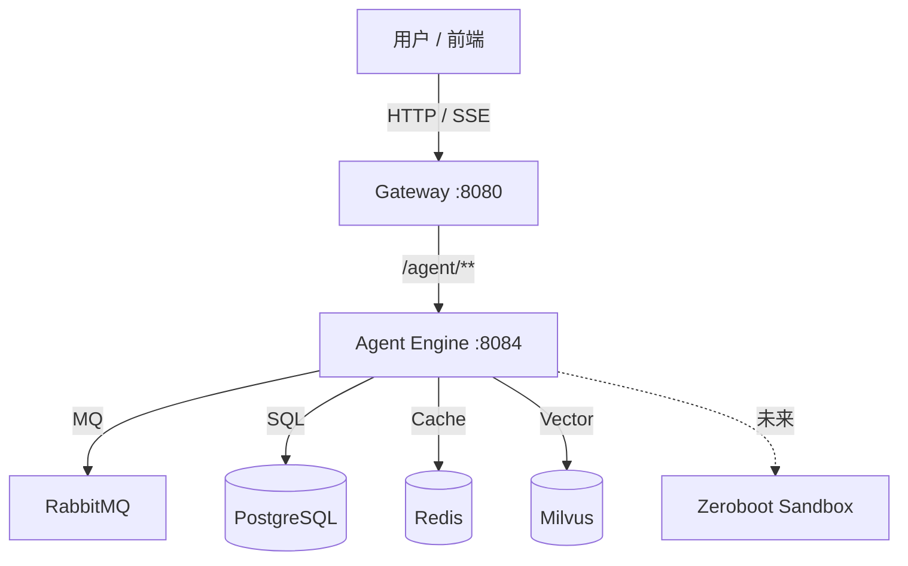
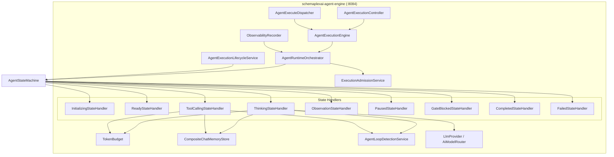
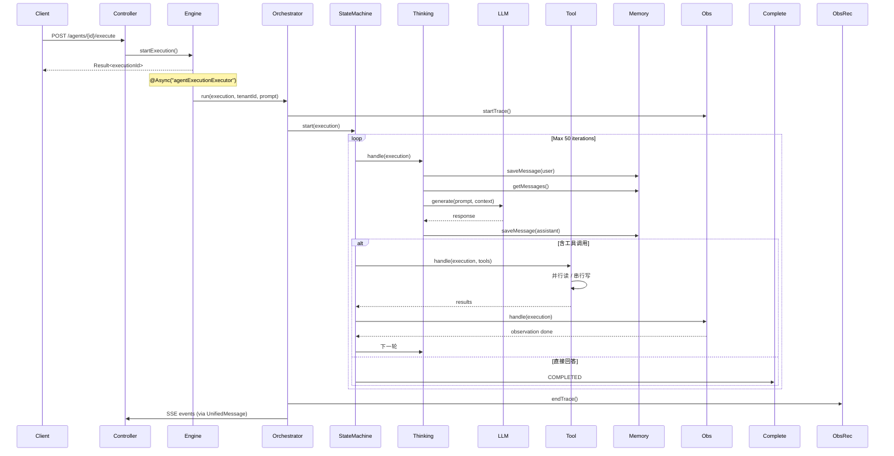
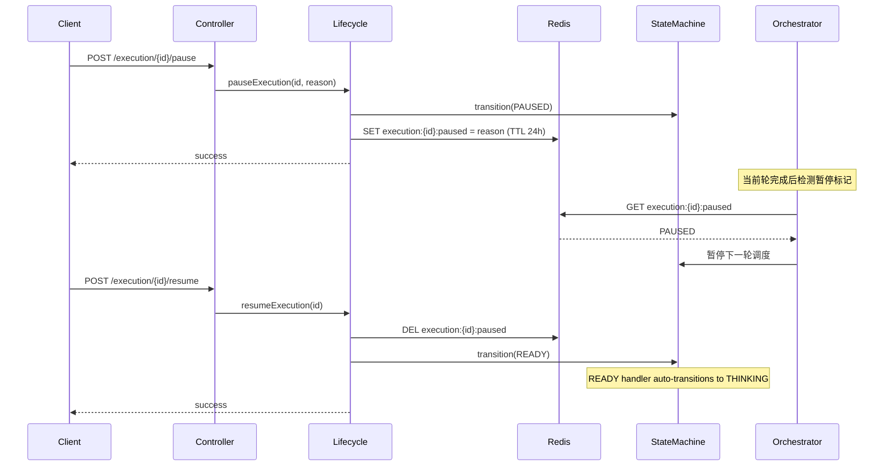
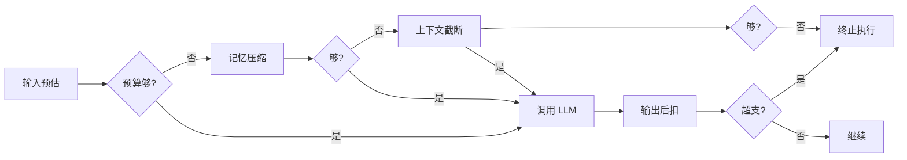

# Design: Core AI Engine (Phase 2)

> 本 Design 为 Phase 2 执行层草稿，评审通过后沉淀到 `docs/designs/core-ai-engine.md`。
> 若引入新架构决策，同步创建 ADR。

## 1. 设计目标

将 `schemaplexai-agent-engine` 从 scaffolding 推进为可异步运行的 Agent 执行引擎，支持：
- 异步执行（线程池隔离）
- 状态机驱动（11 状态 + 严格转换矩阵）
- LLM 调用（LangChain4j 防腐层）
- 工具执行（并行读/串行写）
- Token 预算（预检 → 后扣 → 超限处理链）
- 双层记忆（Redis L1 + PostgreSQL L2 + 自动压缩）
- 可观测性（Trace/Span 全链路记录）

## 2. 架构图

### 2.1 C4 Context



### 2.2 C4 Container



### 2.3 C4 Component（Orchestrator 内部）

```mermaid
graph TD
    subgraph "AgentRuntimeOrchestrator"
        Entry[run(execution, tenantId, prompt)]
        TraceStart[startTrace]
        Admit[admissionService.admit]
        BudgetInit[TokenBudget init]
        SavePrompt[chatMemoryStore.saveMessage]
        Loop{iteration < MAX_ITERATIONS?}
        GetState[stateMachine.getCurrentState]
        Transition[stateMachine.transition]
        TraceEnd[endTrace]
        Release[admissionService.releaseConcurrency]
    end

    Entry --> TraceStart
    TraceStart --> BudgetInit
    BudgetInit --> Admit
    Admit -->|allowed| SavePrompt
    Admit -->|denied| TraceEnd
    SavePrompt --> Loop
    Loop -->|yes| GetState
    GetState -->|non-terminal| Transition
    Transition --> Loop
    Loop -->|no / terminal| TraceEnd
    TraceEnd --> Release
```

## 3. 模块边界

| 模块/包 | 职责 | 暴露接口 | 依赖 |
|---------|------|---------|------|
| `controller` | REST API + SSE | `AgentExecutionController` | `engine`, `lifecycle` |
| `engine` | 执行入口 + 异步分发 | `AgentExecutionEngine.startExecution()` | `orchestrator` |
| `mq` | MQ 消费 | `AgentExecuteDispatcher` | `engine` |
| `orchestrator` | 编排循环 | `AgentRuntimeOrchestrator.run()` | `state`, `admission`, `memory`, `observability` |
| `state` | 状态机 + Handler | `AgentStateMachine`, `*StateHandler` | `llm`, `tool`, `budget`, `memory`, `loop` |
| `admission` | 准入控制 | `ExecutionAdmissionService.admit()` | Redis (并发计数) |
| `budget` | Token 预算 | `TokenBudget.consume*()` | 无 |
| `memory` | 对话记忆 | `CompositeChatMemoryStore` | Redis, PostgreSQL |
| `llm` | LLM 防腐层 | `LlmProvider.generate()` | LangChain4j |
| `tool` | 工具注册/执行 | `ToolAdapter`, `ToolRegistry` | 无 |
| `loop` | 循环检测 | `AgentLoopDetectionService` | 无 |
| `observability` | Trace/Span | `ObservabilityRecorder` | PostgreSQL |
| `lifecycle` | 暂停/恢复/取消 | `AgentExecutionLifecycleService` | Redis, PostgreSQL |

## 4. 数据流

### 4.1 正常执行流



### 4.2 暂停/恢复流



## 5. 关键技术决策

| 决策 | 选项 A | 选项 B | 选择 | 原因 |
|------|--------|--------|------|------|
| 异步执行 | `@Async` + 自定义线程池 | WebFlux reactive | **A** | 团队熟悉 Spring MVC，WebFlux 学习成本高 |
| LLM 接入 | LangChain4j (已选型) | Spring AI | **A** | ADR-003 已批准，且支持多 provider fallback |
| 记忆存储 | Redis L1 + PostgreSQL L2 | 纯 Redis / 纯 PG | **A** | Redis 快但贵，PG 慢但持久，双层平衡 |
| 工具并发 | 并行读 + 串行写 | 全并行 | **A** | 写工具冲突风险高，读工具无状态可并行 |
| 循环检测 | 哈希 + 工具序列 | 仅 LLM 判断 | **A** | 确定性检测成本低，LLM 判断慢且贵 |
| 流式输出 | SSE (Server-Sent Events) | WebSocket | **A** | SSE 单向推送足够，WebSocket 双向过度设计 |

## 6. Token Budget 架构



**实现要点**:
- `TokenBudget` 使用 `AtomicLong` CAS 循环保证并发安全
- 预检失败率 > 10% 时告警，提示调整默认预算
- 每次状态转换记录 `tokenBudgetJson` 到 `sf_agent_execution`

## 7. Chat Memory 架构

```
┌─────────────────────────────────────────┐
│         CompositeChatMemoryStore         │
│  ┌─────────────┐    ┌─────────────────┐ │
│  │  L1: Redis  │    │  L2: PostgreSQL │ │
│  │  List<Msg>  │    │  sf_chat_memory │ │
│  │  TTL: 7 天  │    │  永久存储        │ │
│  └──────┬──────┘    └─────────────────┘ │
│         │                               │
│    读取时: L1 miss → 查 L2 → 回填 L1     │
│    写入时: 双写 L1 + L2                  │
│    压缩时: L1 清空 → L2 保留摘要         │
└─────────────────────────────────────────┘
```

**压缩策略**:
- 触发条件: 消息轮数 > 50
- 保留: 最近 10 轮完整消息 + 前面 40 轮的 LLM 摘要
- 摘要生成: 调用轻量模型（如 gpt-3.5-turbo）或规则提取

## 8. 部署与运维

### 8.1 新增配置

```yaml
agent:
  execution:
    async:
      core-pool-size: 10
      max-pool-size: 50
      queue-capacity: 200
      thread-name-prefix: "agent-exec-"
    admission:
      tenant-max-concurrent: 100
      agent-max-concurrent: 10
      model-max-concurrent: 50
      provider-max-concurrent: 30
      provider-cooldown-seconds: 60
    loop-detection:
      window-size: 5
      max-same-hash: 3
      max-same-tool-sequence: 3
    memory:
      l1-ttl-days: 7
      compression-threshold: 50

langchain4j:
  open-ai:
    api-key: ${OPENAI_API_KEY}
    model-name: gpt-4o
  fallback:
    enabled: true
    provider: azure-openai
```

### 8.2 Docker / Gateway 变更

- 无需新增服务（仍在 `:8084`）
- Gateway 路由已有 `/agent/** → agent-engine:8084`
- 无需更新 docker-compose（agent-engine 容器已存在）
- 需新增环境变量: `OPENAI_API_KEY`, `AZURE_OPENAI_API_KEY`

### 8.3 监控指标

| 指标 | 类型 | 告警阈值 |
|------|------|----------|
| `agent.execution.active` | Gauge | > 80% 线程池 |
| `agent.execution.duration` | Histogram P99 | > 30s |
| `agent.admission.denied` | Counter | > 10/min |
| `agent.token.budget.exceeded` | Counter | > 5/min |
| `agent.loop.detected` | Counter | > 1/min |
| `agent.memory.compression` | Counter | — |

## 9. zeroboot 集成点（Phase 3 预览）

zeroboot 作为 **ToolAdapter** 的一种实现接入：

```java
@Component
public class ZerobootToolAdapter implements ToolAdapter {
    @Override
    public String getToolName() { return "code-sandbox"; }

    @Override
    public ToolResult execute(Map<String, Object> params, Long tenantId) {
        // POST /v1/exec to zeroboot service
        // params: { "code": "...", "language": "python" }
        // returns: { stdout, stderr, exitCode, forkTimeMs, execTimeMs }
    }

    @Override
    public boolean isReadOnly() { return false; } // writes to sandbox FS
}
```

**集成位置**: `schemaplexai-integration` 模块增加 `ZerobootClient`，`agent-engine` 通过 `ToolRegistry` 调用。

## 10. 风险与回退

| 风险 | 影响 | 缓解 | 回退方案 |
|------|------|------|---------|
| LangChain4j 版本兼容性 | 高 | 锁定 0.31.0，升级前在 staging 验证 | 回退到 Direct SDK 调用 |
| Async 线程池耗尽 | 高 | 监控 + 动态扩容 + 拒绝策略 | 同步降级（有损） |
| Redis 故障导致记忆丢失 | 中 | Redis Cluster + 持久化 | L2 PostgreSQL 兜底 |
| Token 预算不准 | 中 | 使用 tiktoken 估算 | 宽松预算 + 后扣告警 |
| 循环检测误报 | 低 | 窗口可调 + 人工 review | 关闭检测（配置开关） |

## 11. 实施顺序建议

```
Week 1: @Async 线程池 + ThinkingStateHandler + LlmProvider
Week 2: ToolCallingStateHandler + AgentLoopDetectionService
Week 3: CompositeChatMemoryStore 完整实现 + TokenBudget 完善
Week 4: 集成测试 + 压测 + SSE 事件流调通
```

## 12. 相关文档

- Spec: `.claude/changes/core-ai-engine-design/spec.md`
- 已批准基础规格: `docs/specs/2026-04-30-v1.0-agent-execution-engine.md`
- ADR: `docs/decisions/ADR-002-cursor-sdk-to-opensandbox.md`
- ADR: `docs/decisions/ADR-003-langchain4j-selection.md`
- Wiki: `wiki/services/AgentRuntimeOrchestrator.md`
- Wiki: `wiki/services/AgentExecutionLifecycleService.md`
- Wiki: `wiki/ideas/2026-04-30-zeroboot-architecture.md`
