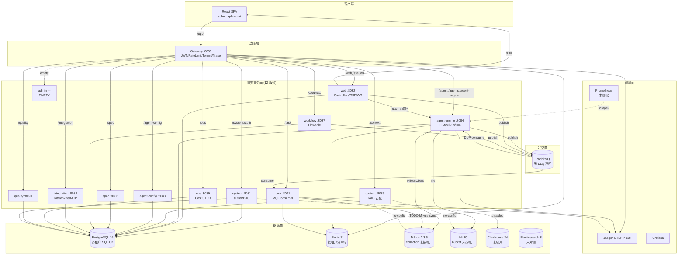
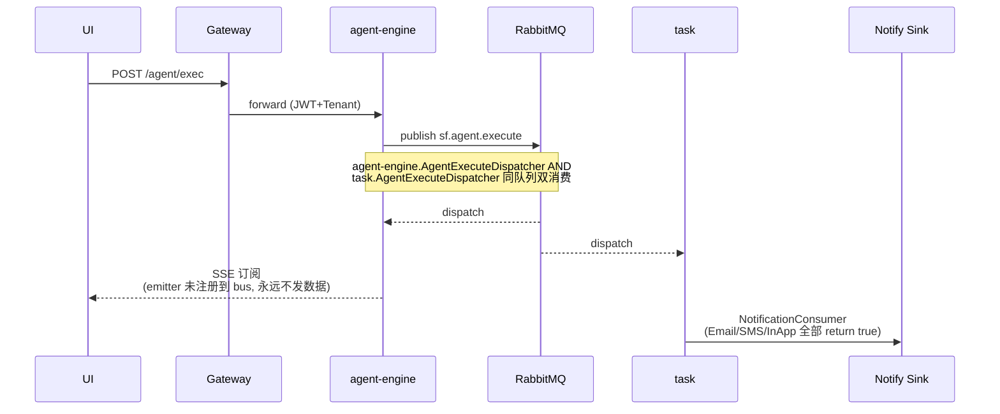

> 一句话结论：脚手架完整、ADR 与代码错位、关键数据流（Cost/SSE/Notify/Milvus）尚未闭环，多租户在 OLTP 之外（MQ/Vector/Cache/Object）几乎裸奔，可观测性只剩一根 OTLP 出口。距 v1 生产可用大约还差 4-6 周硬骨头。

## 1. 0-10 评分表

| 子维度 | 当前分 | 10 分定义 | 证据 |
|---|---|---|---|
| 模块边界清晰度 | 5 | 16 模块 ADR 全 + C4-L2 图 + 强制依赖检查 | `pom.xml:21-38` 16 模块 vs ADR-001:28 仍写「13 个 Maven 模块」；`schemaplexai-admin` 空壳；`AgentExecuteDispatcher` 在 agent-engine 与 task 各存在一份（同 RK 队列） |
| 数据流契约 | 4 | 同步/异步/降级路径全图 + DLQ + 幂等 ADR | `MilvusSyncConsumer.java:14-31` 整个类全是 TODO；`NotificationConsumer.java:103-164` Email/SMS/InApp 三桩；agent-engine 与 task 都有 `@RabbitListener` 无契约 owner |
| 失败补偿策略 | 3 | 每个异步路径有补偿 ADR + 死信队列 + Saga | task 模块有 `sf_message_fail_log` 表但 NotificationConsumer 直接 `return true` 跳过失败重试；MilvusSync 注释说「nack 走 DLQ」但 DLQ 未声明；CostSync 无补偿 |
| 多租户隔离 | 5 | DB/MQ/Vector/Cache/Object 五处全打通 | `TenantLineInterceptor` 仅覆盖 SQL；RateLimit `RateLimitFilter.java:60-69` 用 tenantId 做 key 但 Redis key、Milvus collection、MinIO bucket、RabbitMQ 队列均未按 tenant 隔离 |
| 可观测性 | 4 | OTel + 三轨链路 (metrics/logs/traces) + 业务埋点 | 13 个 application.yml 全部只配 `otlp.tracing` 一根线；无 metrics exporter、无 log appender 到 ES；Prometheus 容器存在但服务未暴露 `/actuator/prometheus`；ClickHouse 在 `ops/application.yml:37` 显式 `enabled: false` |
| 测试金字塔 | 4 | unit/integration/e2e/contract 4 层 + Testcontainers + Pact | jacoco 强制 80%/60% (pom.xml:289-294) 但全局只有 78 后端 + 14 前端测试文件；ops/quality/spec/workflow/integration/task 零测试；contract 测试缺失；E2E 框架未选型 |

**总分 25/60 ≈ 4.2/10**。脚手架到位，业务回路尚未关环。

## 2. 当前架构 C4-L2 视图

## 3. 隐藏假设清单（17 条）

1. **我们假设 16 模块设计已锁定**，实际 ADR-001:28 仍写「13 个 Maven 模块 + 1 Gateway + 1 Web 接入层」，admin/spec 三个模块没有任何 ADR 解释为何存在；证据：`docs/decisions/ADR-001:28`、`pom.xml:21-38`；影响：拆分理由只在脑子里，新人无法决策何时新建模块。
2. **我们假设 Cost 已经统计**，实际 `CostService.java:29-31` 三个值硬编码为 `BigDecimal.valueOf(0)`，`ops/application.yml:37` ClickHouse 直接 `enabled: false`；影响：所有 Token 预算告警建立在零基线上。
3. **我们假设 SSE 能推执行进度**，实际 `AgentExecutionController.java:81-83` `new SseEmitter(Long.MAX_VALUE)` 之后只 `// TODO: Register emitter`，emitter 永远不会发数据；影响：前端长连接挂着拉不到任何事件。
4. **我们假设异步通知会送达**，实际 `NotificationConsumer.java:103-164` Email/SMS/InApp 全部 `// TODO: Integrate` 然后 `return true` 把消息 ack 掉；影响：重要审批通知静默丢失。
5. **我们假设一个执行消息只被处理一次**，实际 agent-engine 与 task 各自注册了 `AgentExecuteDispatcher` 监听同一个 RK 队列（`AgentExecuteDispatcher.java:20`，`task/mq/AgentExecuteDispatcher.java`）；影响：同一个 LLM 调用可能被双跑双计费。
6. **我们假设 RabbitMQ 有 DLQ**，实际 `docker-compose.yml:44-63` 没声明任何 exchange/queue/DLX，`MilvusSyncConsumer.java:29` 注释里说「nack 路由到 DLQ」但 DLQ 不存在；影响：失败消息原地无限 requeue 或被静默丢弃。
7. **我们假设 RAG 在 context 模块**，实际 Milvus 客户端落在 `schemaplexai-agent-engine/.../rag/MilvusClient.java`，`schemaplexai-context/application.yml` 没有任何 milvus/minio 配置；影响：context 服务名不副实，RAG 业务被绑死在 agent-engine 上。
8. **我们假设多租户已隔离**，实际只有 `TenantLineInterceptor` 在 SQL 层注入；MQ 队列单一、Milvus collection 共用、MinIO bucket 共用、Redis key 部分按 tenant、JWT 与 SSE token 验证不强制 tenant 一致性；影响：跨租户数据泄漏面巨大。
9. **我们假设 Gateway 限流可用**，实际 `RateLimitFilter.java:30-31` 把 `MAX_REQUESTS=100` 写死，`application.yml:78-81` 的 `rate-limit.default-limit` 完全未读；影响：所有租户共用同一阈值，VIP 客户和爬虫一视同仁。
10. **我们假设全链路 Trace 通**，实际 13 个 application.yml 全部只配 `otlp.tracing.endpoint`，没有 `management.metrics.export.prometheus`、没有 logs OTLP exporter；影响：Prometheus / ELK 容器在跑但服务侧没数据上报。
11. **我们假设 Gateway 路由在一处**，实际 `GatewayConfig.java`（Java Config，`lb://`）与 `application.yml:9-53`（硬编码 `http://localhost`）双套路由，前者 spec 路由缺失、后者 admin 路由缺失；影响：环境一切换路由表口径就分裂。
12. **我们假设 web 与 agent-engine 内调有契约**，实际全是「内部 REST」靠默契；既无 OpenFeign 也无 OpenAPI 共享 SDK，控制器分散在 web 模块；影响：服务边界靠口头传承。
13. **我们假设 Flowable 数据库与业务表共用 tenant**，实际 `act_*` 表被 `data-model.md:65` 显式排除多租户；影响：跨租户 BPMN 流程实例混在一张表，权限要靠业务码补打。
14. **我们假设 schemaplexai-admin 是后台门户**，实际 `pom.xml:37` 注册了模块但目录基本为空；影响：路由 `/admin/**` 在 GatewayConfig 里登记但无后端，是僵尸路由。
15. **我们假设 80%/60% 测试覆盖率会被强制**，实际 jacoco `check` 在 `pom.xml:277-300`，但 ops/quality/spec/workflow/integration/task 6 个模块零测试，`mvn verify` 一旦在 CI 全量跑会立刻挂；影响：没人开 verify，门槛形同虚设。
16. **我们假设 Redis 能做分布式锁**，实际 `data-model.md:61` 引用了 `shedlock` 表，docker-compose 也起了 Redis，但定时任务由 PostgreSQL `shedlock` 锁、缓存由 Redis、限流由 Reactive Redis，三处锁来源未统一；影响：故障切换时定时任务可能多机并发。
17. **我们假设 JWT secret 已注入**，实际 `gateway/application.yml:75` 与 `agent-engine/application.yml:67` 同写 `${JWT_SECRET}` 无默认值，docker-compose 未传环境变量；影响：本地启动直接 NPE。

## 4. 关键发现（≥ 8 条带 file:line）

1. **路由双源分裂**：`schemaplexai-gateway/src/main/resources/application.yml:9-53` 与 `GatewayConfig.java`（Java）路由不一致，YAML 缺 spec/admin，Java Config 缺 spec，agent-engine 的 path 一处 `/agent/**` 一处 `/agents/**,/agent-engine/**`。
2. **MQ 双消费同队列**：`schemaplexai-agent-engine/src/main/java/com/schemaplexai/agent/engine/mq/AgentExecuteDispatcher.java:20` 与 `schemaplexai-task/src/main/java/com/schemaplexai/task/mq/AgentExecuteDispatcher.java` 监听同一 `RK_AGENT_EXECUTE`，归属未拆。
3. **Cost 三零**：`schemaplexai-ops/src/main/java/com/schemaplexai/ops/service/CostService.java:29-31` 硬编码零；`schemaplexai-ops/src/main/resources/application.yml:37` `clickhouse.enabled: false`。
4. **SSE 不发数**：`schemaplexai-agent-engine/.../controller/AgentExecutionController.java:81-83` emitter 创建后 TODO 注册到 event bus，无生产路径。
5. **Notify 三桩**：`schemaplexai-task/.../mq/NotificationConsumer.java:103-164` Email/SMS/InApp 全 `return true`。
6. **RateLimit 配置失联**：`schemaplexai-gateway/.../filter/RateLimitFilter.java:30-31` 静态常量 `MAX_REQUESTS=100`，未读 `rate-limit.default-limit`。
7. **Milvus Sync 全 TODO**：`schemaplexai-task/.../mq/MilvusSyncConsumer.java:14-31` 类注释 6 步全是「TODO: Implement」。
8. **RAG 错位**：`schemaplexai-agent-engine/.../rag/MilvusClient.java`、`MilvusIsolationService.java`、`InMemoryVectorMemoryStore.java` 都在 agent-engine，而 `schemaplexai-context/application.yml` 不含 milvus/minio。
9. **ADR 与现状脱钩**：`docs/decisions/ADR-001-service-decomposition.md:28` 写「13 个 Maven 模块」，`pom.xml:21-38` 实际 16 个，admin/agent-config 拆分无对应 ADR。
10. **JWT secret 强依赖**：`schemaplexai-gateway/src/main/resources/application.yml:75` `secret: ${JWT_SECRET}`（无默认值），docker-compose 未传，本地起服务即崩。

## 5. 边界情况与失败模式（未覆盖 8 个）

1. **RabbitMQ 不可用**：所有 publisher 现在直接 `convertAndSend`，无 publisher confirm、无本地 outbox 表、无 retry/backoff；MQ 抖动期间事件全丢。
2. **Milvus 索引重建中**：`MilvusSyncConsumer` REBUILD 操作未与查询路径互斥，在线 RAG 查询会读到不一致向量空间。
3. **ClickHouse 慢查询/未启用**：`ops` 服务在 `enabled:false` 下走 placeholder，监控大屏看到永远的 0 值，无法区分「成本真为 0」与「指标管道断裂」。
4. **Gateway 限流穿透**：RateLimit 用 Redis 计数，Redis 不可用时 `onErrorResume` 直接 429（fail-closed），但同时 SSE 长连接也会 429，导致正常用户被限。
5. **多租户跨流泄漏**：用户 A 拿到的执行 ID 通过 `/sse/.../{execId}` 订阅时，sseTokenValidator 验签但不校 tenantId 与 SecurityContext 一致性（仅 `validate(token, executionId)`），跨租户拿到 token 即可订阅。
6. **Flowable BPMN 与业务事务边界**：workflow 服务发起 AI 节点 → 通过 MQ 触发 agent-engine → 流程实例与 agent_execution 各自一套幂等键，回滚语义未定义。
7. **Token 预算超限**：`CostService.checkBudgetAlerts` 仅 log.warn，未触发熔断、未通知 agent-engine 停止后续调用，超支只能事后看日志。
8. **schemaplexai-admin 路由暴露**：Gateway 注册了 `/admin/**` 但目标服务不存在，外部请求会得到 5xx，攻击者可借此探测后台。

## 6. 改造方案

| 优先级 | 改造项 | 落到第几周 | 验收 KPI |
|---|---|---|---|
| P0 | 拉齐 ADR-001 到 16 模块、补 ADR-011 (admin)/ADR-012 (agent-config 拆分理由) | W1 | ADR 与 pom modules 一一对应；审计脚本 CI 校验 |
| P0 | RabbitMQ 引入 topology config（exchange + queue + DLX），并删 task 与 agent-engine 重复 dispatcher（保留 task 一处） | W1-W2 | 同队列单一 consumer；DLQ 监控告警；publisher confirm 开启 |
| P0 | SSE event bus：用 Redis Stream 或 Reactor Sink，AgentExecutionEventPublisher → SseEmitterRegistry → 前端 | W2 | execId 触发 → 前端 1s 内可见 token 流 |
| P0 | NotificationConsumer：接 SendGrid/SES + Twilio + 写 sf_notification 表；失败 nack→DLQ；幂等 key=messageId | W2-W3 | 重发率 <0.1%；DLQ 周巡检 |
| P0 | CostService：开启 ClickHouse + 实现 sum/avg；TokenUsage 事件经 CostSyncConsumer 入库；预算超限触发熔断回 Agent | W3 | 仪表盘可见每租户每模型实时成本；超额 30s 内停 Agent |
| P1 | Gateway 路由收敛到 Java Config + spec route + 删 admin route（或交付 admin 后端） | W2 | 单源真理；E2E 测试 12 个 path 全通 |
| P1 | RateLimit 读配置 + 按 path 分桶 + 租户级配额表（sf_rate_limit_quota） | W3 | 配置改一处即生效；VIP 桶生效 |
| P1 | Milvus collection 命名 `sf_{tenant}_{biz}`，MinIO bucket 同；CTX 模块持有 MilvusClient，agent-engine 通过 REST/Feign 调 | W4 | 跨租户隔离 SOC 自查通过 |
| P1 | OTel 三轨：metrics → Prometheus、logs → ES (loki/fluentbit)、tracing → Jaeger；业务自定义指标（agent.exec.duration、llm.token.in/out） | W4 | Grafana 看板 5 张以上；P95 latency 可见 |
| P2 | Contract 测试（Spring Cloud Contract or Pact）覆盖 Gateway↔Service、Service↔MQ；6 个零测试模块补单测到 60% | W5-W6 | jacoco 全模块 60%+；CI verify 通过 |

## 7. 给用户的关键问题

> 1. **schemaplexai-task 异步通知失败时由谁补偿？现在 `NotificationConsumer.handleEmail/Sms/InApp` 直接 `return true` 把消息 ack 掉，没有 sf_message_fail_log 写入路径，也没有 DLQ 回流；运营出问题时责任人是谁？**
> 2. agent-engine 与 task 同时注册 `AgentExecuteDispatcher` 监听同一队列，是有意做主从备份还是历史遗留？如果是后者，删哪个？这关系到 LLM 计费是否会双扣。
> 3. schemaplexai-admin 模块是否准备砍掉？若不砍掉，Gateway 的 `/admin/**` 路由建议在交付后端前加 503 maintenance 拦截，避免对外暴露空路径成为漏洞。
> 4. Milvus / MinIO / RabbitMQ 是否准备走「物理多租户」（per-tenant cluster）？还是停留在「逻辑多租户」（shared infra + naming convention）？这决定 ADR-004 是否需要修订并影响后续 6-8 周的容量规划。
