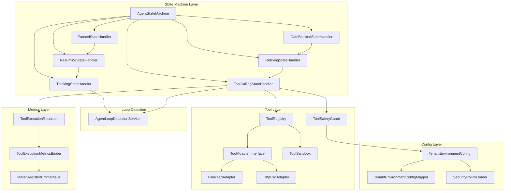
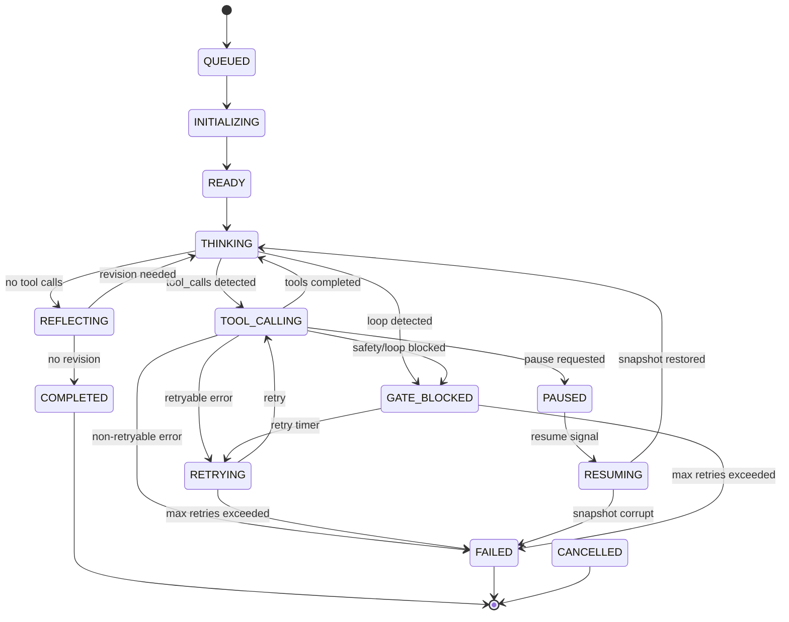

# Agent Engine Core Completion Spec

> 将 `schemaplexai-agent-engine` 模块中 4 个优先级的 Stub/缺失实现补充为生产级代码，涵盖 ToolRegistry 工具注册体系、剩余状态处理器（PAUSED/RETRYING/GATE_BLOCKED，含 RESUME）、Prometheus 指标管道和租户环境安全配置。

## 1. 概述

### 1.1 问题陈述

- `ToolCallingStateHandler.parseToolCalls()` — 启发式解析（仅匹配 `"calling "` 前缀），无结构化 OpenAI/Anthropic 格式支持
- `ToolCallingStateHandler.executeToolStub()` — 存根，实现缺失
- `PausedStateHandler.handle()` — 仅记录日志，不持久化快照，不等待外部 Resume 信号
- `GateBlockedStateHandler.handle()` — 仅设置 state + completedAt，缺重试/通知机制
- `AgentLoopDetectionService` — 已完整实现但未集成到 ThinkingStateHandler 和 ToolCallingStateHandler
- `ToolExecutionRecorder` — 持久化审计日志，但无 Prometheus 指标暴露
- `ToolSafetyGuard.check()` — 缺 TenantEnvironmentConfig 实体
- `ToolErrorCategory` — 缺少 `securityRelated` 和 `retryable` 标志
- `RETRYING` 状态 — 在枚举中定义但无对应 RetryingStateHandler

### 1.2 范围

**In Scope**:
- ToolRegistry + ToolAdapter 接口体系 + FileReadAdapter, HttpCallAdapter
- 结构化工具调用解析：OpenAI `tool_calls` JSON + Anthropic `tool_use` XML
- RetryingStateHandler（指数退避 + 熔断器）
- PausedStateHandler（快照持久化 + Resume API）
- ResumingStateHandler（加载快照恢复状态）
- GateBlockedStateHandler（AdmissionResult 反馈 + 重试倒计时）
- AgentLoopDetectionService 集成
- ToolErrorCategory 枚举扩展
- Prometheus MeterRegistry + ToolExecutionMetricsBinder
- TenantEnvironmentConfig 实体 + SecurityPolicyLoader
- SSRF 防护 + 路径遍历防护

**Out of Scope**:
- 前端 UI 变更
- 其他服务模块修改
- 数据库 Migration 脚本
- Milvus/ClickHouse/Redis 数据面变更

## 2. 架构视图

### 2.1 组件关系



**关键设计决策**：
- **ToolRegistry vs ToolSandbox**：ToolRegistry 负责注册/发现/解析，ToolSandbox 负责沙箱执行安全。调用链：ToolCallingStateHandler → ToolRegistry.resolve() → ToolSandbox.execute()
- **ToolAdapter 接口**：`ToolResult execute(ToolCall call, ExecutionContext ctx)`，FileReadAdapter 和 HttpCallAdapter 为首批实现
- **AgentLoopDetectionService 作为独立 Service**：注入到 ThinkingStateHandler 和 ToolCallingStateHandler

### 2.2 数据流

```
1. LLM Response → AgentRuntimeOrchestrator
2. Orchestrator → AgentStateMachine.transition(TOOL_CALLING)
3. ToolCallingStateHandler.handle():
   a. chatMemoryStore.loadMessages() → 获取最后一条 assistant 消息
   b. ToolRegistry.parse(message.content) → List<ToolCall>
   c. AgentLoopDetectionService.detectLoop() → LoopDetectionResult
   d. 若 loop detected → transition(GATE_BLOCKED)
   e. 对每个 ToolCall:
      - ToolRegistry.resolve(toolCall.name) → ToolAdapter
      - ToolSafetyGuard.check(name, args, env) → SafetyCheckResult
      - ToolAdapter.execute(toolCall, ctx) → ToolResult
      - ToolExecutionRecorder.record(executionId, result)
   f. transition(THINKING)
```

## 3. API 列表

### `POST /agent/execution/{executionId}/resume`

恢复暂停的执行。

**Request**:
```json
{
  "resumedBy": "admin-user-id",
  "reason": "Manual resume after issue resolution"
}
```

**Response (200)**:
```json
{
  "code": 200,
  "data": {
    "executionId": 12345,
    "previousState": "PAUSED",
    "newState": "RESUMING"
  },
  "message": "success"
}
```

### `GET /actuator/prometheus`

Prometheus 指标端点。

**自定义指标**（ToolExecutionMetricsBinder）：

| 指标名 | 类型 | 标签 | 说明 |
|--------|------|------|------|
| `agent_tool_execution_total` | Counter | status(success/failure/blocked) | 工具执行总数 |
| `agent_tool_execution_latency_seconds` | Histogram | — | 工具执行延迟分布 (P50/P95/P99) |
| `agent_tool_keep_rate` | Gauge | — | 工具执行成功率 |
| `agent_tool_blocked_rate` | Gauge | — | 工具执行阻塞率 |
| `agent_tool_error_by_category` | Counter | errorCategory | 按错误类别分组的失败计数 |
| `agent_tool_retry_total` | Counter | — | 重试总次数 |

## 4. 数据模型

### 4.1 新增表

| 表名 | 操作 | 说明 |
|------|------|------|
| `sf_tenant_environment_config` | CREATE | 租户环境安全配置表（**全局表** — 不通过 TenantLineInterceptor 过滤） |

### 4.2 TenantEnvironmentConfig Entity

```java
@Data
@EqualsAndHashCode(callSuper = true)
@TableName("sf_tenant_environment_config")
public class TenantEnvironmentConfig extends BaseEntity {
    private String tenantId;
    private String environment;       // dev / staging / prod
    private String allowedTools;      // JSON array
    private String securityLevel;     // LOW / MEDIUM / HIGH / CRITICAL
    private Boolean allowHttpCalls;
    private Boolean allowFileRead;
    private Boolean allowIrreversibleOps;
    private Integer maxConcurrentToolCalls;
    private String extraConfig;       // JSON
}
```

## 5. 状态机

### 5.1 完整状态图



### 5.2 新增状态处理器

#### RetryingStateHandler

基于 `ToolErrorCategory.retryable()` 判定是否可重试。指数退避 `min(100ms * 2^n, 30s)`，最大 3 次重试，3 次连续失败触发熔断器。仅重放失败的 ToolCall（非完整对话历史）。

#### ResumingStateHandler

加载 SfAgentExecutionSnapshot 快照，恢复 chatMemoryStore 状态，validate snapshot belongs to execution（防止跨租户注入）。路径：PAUSED → RESUMING → THINKING。

#### PausedStateHandler（完善）

创建 ExecutionSnapshot，持久化到 DB，等待外部 Resume API 信号。

#### GateBlockedStateHandler（完善）

记录 AdmissionResult，可配置重试倒计时，发布 AgentBlockedEvent。

### 5.3 ToolErrorCategory 扩展

```java
public enum ToolErrorCategory {
    PERMISSION_DENIED(true, false),
    INVALID_ARGUMENT(false, false),
    TIMEOUT(false, true),
    INTERNAL_ERROR(false, true),
    RATE_LIMITED(false, true),
    RESOURCE_EXHAUSTED(false, true),
    IRREVERSIBLE_OPERATION(true, false),
    ENVIRONMENT_MISMATCH(true, false),
    UNEXPECTED_ENVIRONMENT(true, false);

    private final boolean securityRelated;
    private final boolean retryable;
}
```

## 6. 安全

- **HttpCall SSRF 防护**：IPv4/IPv6 内网 IP 过滤、DNS rebinding guard（双重解析比对）、重定向深度限制（最大 3 次）、HTTP 方法白名单
- **FileRead 路径遍历防护**：路径规范化 + workspace root 验证、所有路径组件检查隐藏文件、符号链接检测（NOFOLLOW_LINKS）
- **输入验证**：复用 ToolSafetyGuard.normalizeInput()（Unicode homoglyph + HTML entity + JSON escape 解码）
- **工具白名单**：ToolRegistry.resolve() 返回 null → INVALID_ARGUMENT
- **全局表安全**：TenantEnvironmentConfig 不经过 TenantLineInterceptor，deny-by-default 默认策略

## 7. 非功能需求

### 7.1 性能

- QPS: ToolRegistry.resolve() < 1ms（纯内存 ConcurrentHashMap）
- P99: 单次工具执行 < 5s（不含工具自身网络延迟）
- 并发: 100 并发 execution
- 缓存: SecurityPolicyLoader Caffeine Cache (maximumSize=1000, expireAfterWrite=5min)

### 7.2 兼容性

- 不破坏现有 API
- 需要 `sf_tenant_environment_config` 新表 DDL
- 不需要前端配合
- 不修改现有 ToolSandbox 接口

## 8. 风险与回退

| 风险 | 缓解 | 回退 |
|------|------|------|
| 重试风暴 | 指数退避 + 熔断器 + 硬限制 | `agent.retry.enabled=false` |
| LoopDetection 内存泄漏 | clearRecords() + TTL 驱逐 | 重启服务 |
| Prometheus 基数爆炸 | Top-10 toolName 策略 | 动态调整 Top-N |
| SecurityPolicyLoader 缓存失效 | Caffeine TTL + 手动刷新 API | 手动 refresh |

## 9. 实现文件清单

| 文件 | 类型 | 说明 |
|------|------|------|
| `ToolRegistry.java` | 新增 | 工具注册中心 |
| `ToolAdapter.java` | 新增 | 工具适配器接口 |
| `FileReadAdapter.java` | 新增 | 文件读取适配器 |
| `HttpCallAdapter.java` | 新增 | HTTP 调用适配器 |
| `RetryingStateHandler.java` | 新增 | 重试状态处理器 |
| `ResumingStateHandler.java` | 新增 | 恢复状态处理器 |
| `PausedStateHandler.java` | 修改 | 完善快照持久化 |
| `GateBlockedStateHandler.java` | 修改 | 完善重试/通知 |
| `ToolExecutionMetricsBinder.java` | 新增 | Prometheus 指标绑定 |
| `SecurityPolicyLoader.java` | 新增 | 租户安全策略加载 |
| `TenantEnvironmentConfig.java` | 新增 | 租户环境配置实体 |
| `ToolErrorCategory.java` | 修改 | 添加 securityRelated/retryable |
| `TokenEstimator.java` | 新增 | 共享 Token 估算工具 |
| `ThinkingStateHandler.java` | 修改 | 集成 LoopDetection |
| `ToolCallingStateHandler.java` | 修改 | 集成 ToolRegistry + LoopDetection |

## 10. 相关文档

- Proposal: `.claude/changes/agent-engine-core-completion/proposal.md`
- Review Report: `.claude/changes/agent-engine-core-completion/review-report.md`
- Design: `.claude/changes/agent-engine-core-completion/design.md`
- Plan: `.claude/changes/agent-engine-core-completion/tasks.md`
- Reflexion Report: `.claude/changes/agent-engine-core-completion/reflexion-report.md`
