# Database Schema Overview

> One-sentence summary: PostgreSQL 16 OLTP schema with 35+ tables across 10 domains, all tables include tenant_id for multi-tenant isolation except global tables.

## Entity Relationship Diagram

```mermaid
erDiagram
    SF_TENANT ||--o{ SF_USER : contains
    SF_TENANT ||--o{ SF_ROLE : contains
    SF_TENANT ||--o{ SF_SPEC : contains
    SF_TENANT ||--o{ SF_AGENT : contains
    SF_USER ||--o{ SF_USER_ROLE : has
    SF_ROLE ||--o{ SF_USER_ROLE : assigned
    SF_ROLE ||--o{ SF_ROLE_PERMISSION : has
    SF_PERMISSION ||--o{ SF_ROLE_PERMISSION : assigned
    SF_AGENT ||--o{ SF_AGENT_CONFIG : configures
    SF_AGENT ||--o{ SF_AGENT_TOOL_BINDING : binds
    SF_AGENT ||--o{ SF_AGENT_EXECUTION : runs
    SF_AGENT_EXECUTION ||--o{ SF_AGENT_EXECUTION_LOG : logs
    SF_AGENT_EXECUTION ||--o{ SF_AGENT_EXECUTION_SNAPSHOT : snapshots
    SF_AGENT ||--o{ SF_AGENT_MEMORY : remembers
    SF_SPEC ||--o{ SF_SPEC_DOCUMENT : contains
    SF_SPEC ||--o{ SF_SPEC_VERSION : versions
    SF_SPEC ||--o{ SF_SPEC_STEERING : steers
    SF_SPEC ||--o{ SF_SPEC_REVIEW : reviews
    SF_WORKFLOW_TEMPLATE ||--o{ SF_WORKFLOW_INSTANCE : instantiates
    SF_WORKFLOW_INSTANCE ||--o{ SF_WORKFLOW_NODE_EXECUTION : executes
    SF_WORKSPACE ||--o{ SF_CONTEXT : contains
    SF_CONTEXT ||--o{ SF_CONTEXT_ITEM : items
    SF_CONTEXT ||--o{ SF_CONTEXT_SNAPSHOT : snapshots
    SF_KNOWLEDGE_DOC ||--o{ SF_KNOWLEDGE_DOC_VERSION : versions
    SF_QUALITY_GATE ||--o{ SF_QUALITY_ISSUE : detects
    SF_INTEGRATION ||--o{ SF_SKILL : provides
```

## Table Count by Domain

| Domain | Tables | Key Tables |
|--------|--------|-----------|
| Core Governance | 7 | sf_tenant, sf_user, sf_role, sf_permission, sf_user_role, sf_role_permission, sf_config |
| AI Model | 2 | sf_model_provider, sf_ai_model |
| Spec | 5 | sf_spec, sf_spec_document, sf_spec_version, sf_spec_template, sf_spec_steering, sf_spec_review |
| Agent | 7 | sf_agent, sf_agent_config, sf_agent_shadow_config, sf_agent_tool_binding, sf_agent_execution, sf_agent_execution_log, sf_agent_execution_snapshot, sf_agent_memory |
| Chat | 2 | sf_chat_message (hash-partitioned x16), sf_chat_message_archive |
| Workflow | 3 | sf_workflow_template, sf_workflow_instance, sf_workflow_node_execution |
| Context | 5 | sf_workspace, sf_context, sf_context_item, sf_context_snapshot, sf_knowledge_doc, sf_knowledge_doc_version |
| Quality | 5 | sf_quality_gate, sf_quality_issue, sf_security_policy, sf_audit_event, sf_review_record, sf_tool_approval_amendment |
| Integration | 3 | sf_integration, sf_skill, sf_mcp_server |
| Ops | 5 | sf_artifact, sf_delivery_record, sf_notification, sf_budget, sf_eval_dataset, sf_eval_task |
| Infrastructure | 5 | shedlock, sf_sync_cursor, sf_sync_batch_log, sf_idempotency_key, sf_message_fail_log |

## Key Design Patterns

- **Multi-tenant**: Every table has `tenant_id` except `sf_tenant` and `act_*` (Flowable) and `shedlock`
- **Logic delete**: All entities have `deleted INT DEFAULT 0` (MyBatis-Plus @TableLogic)
- **Audit fields**: `created_at`, `updated_at`, `created_by`, `updated_by` on all entities via [[entities/base-entity|BaseEntity]]
- **JSON config**: Flexible config stored in `*_json` TEXT columns (agent_config_json, token_budget_json, etc.)
- **Partitioning**: `sf_chat_message` partitioned by HASH(conversation_id) into 16 partitions for scale
- **Archive**: `sf_chat_message_archive` for cold data retention

## Backlinks

- See individual entity pages in [[index#Data Layer|Entities]]
- Schema evolution tracked in [[schema-evolution]]
- See [[architecture]] for how domains map to services
